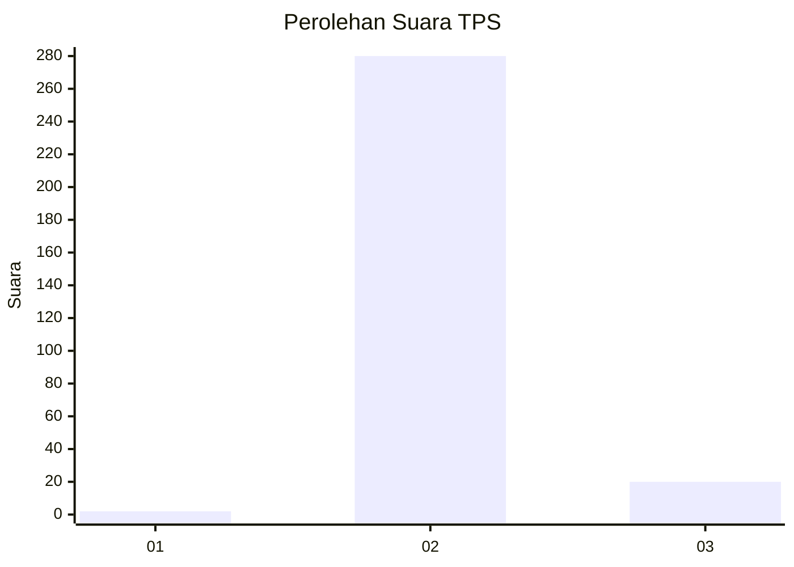
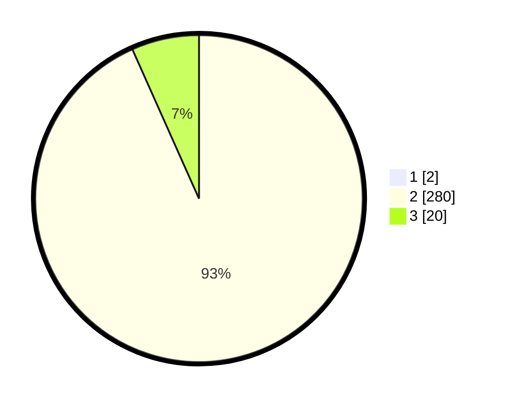

# Hasil

## Grafik

## Tabel

| No. | Nama Paslon    | Suara | Suara (raw) | Persentase |
|:--- |:-------------- | -----:| -----------:| ----------:|
| 1   | ANIES MUHAIMIN | 2     | [2][p-1]    | 0,66       |
| 2   | PRABOWO GIBRAN | 280   | [280][p-2]  | 92,72      |
| 3   | GANJAR MAHFUD  | 20    | [20][p-3]   | 6,62       |

[p-1]: https://github.com/gigit-pemilu/pemilu-2024-51-bali/blob/main/pilpres/hitung-suara/sub/51-bali/sub/05-klungkung/sub/01-nusa-penida/sub/2014-pejukutan/sub/005-tps/sub/paslon-1.txt
[p-2]: https://github.com/gigit-pemilu/pemilu-2024-51-bali/blob/main/pilpres/hitung-suara/sub/51-bali/sub/05-klungkung/sub/01-nusa-penida/sub/2014-pejukutan/sub/005-tps/sub/paslon-2.txt
[p-3]: https://github.com/gigit-pemilu/pemilu-2024-51-bali/blob/main/pilpres/hitung-suara/sub/51-bali/sub/05-klungkung/sub/01-nusa-penida/sub/2014-pejukutan/sub/005-tps/sub/paslon-3.txt

## Foto C Plano

https://sirekap-obj-formc.kpu.go.id/5e7f/pemilu/ppwp/51/05/01/20/14/5105012014005-20240214-195904--3e23385b-c517-4f24-b3fb-32edcf632999.jpg

https://sirekap-obj-formc.kpu.go.id/5e7f/pemilu/ppwp/51/05/01/20/14/5105012014005-20240214-195922--7d33de2c-897d-4818-ac86-66e136916800.jpg

https://sirekap-obj-formc.kpu.go.id/5e7f/pemilu/ppwp/51/05/01/20/14/5105012014005-20240214-195950--8fa3453e-7f98-4ef6-99df-547afda9d039.jpg

## Metadata

| Key        | Value               |
| ---------- | ------------------- |
| Time Stamp | 2024-02-15 09:00:24 |

