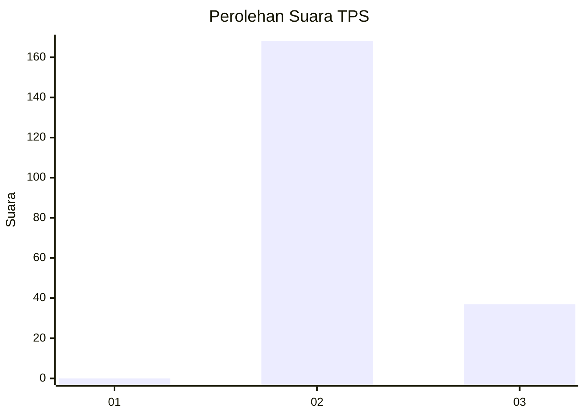
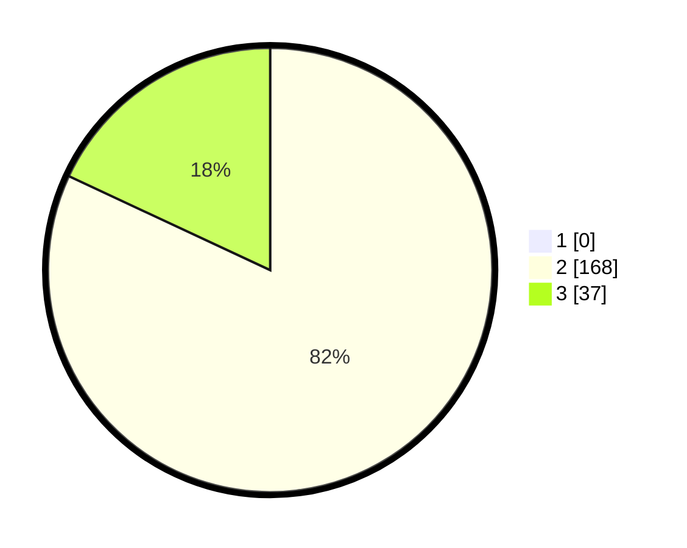

# Hasil

## Grafik

## Tabel

| No. | Nama Paslon    | Suara | Suara (raw) | Persentase |
|:--- |:-------------- | -----:| -----------:| ----------:|
| 1   | ANIES MUHAIMIN | 0     | [0][p-1]    | 0,00       |
| 2   | PRABOWO GIBRAN | 168   | [168][p-2]  | 81,95      |
| 3   | GANJAR MAHFUD  | 37    | [37][p-3]   | 18,05      |

[p-1]: https://github.com/gigit-pemilu/pemilu-2024-51-bali/blob/main/pilpres/hitung-suara/sub/51-bali/sub/05-klungkung/sub/01-nusa-penida/sub/2014-pejukutan/sub/006-tps/sub/paslon-1.txt
[p-2]: https://github.com/gigit-pemilu/pemilu-2024-51-bali/blob/main/pilpres/hitung-suara/sub/51-bali/sub/05-klungkung/sub/01-nusa-penida/sub/2014-pejukutan/sub/006-tps/sub/paslon-2.txt
[p-3]: https://github.com/gigit-pemilu/pemilu-2024-51-bali/blob/main/pilpres/hitung-suara/sub/51-bali/sub/05-klungkung/sub/01-nusa-penida/sub/2014-pejukutan/sub/006-tps/sub/paslon-3.txt

## Foto C Plano

https://sirekap-obj-formc.kpu.go.id/bedc/pemilu/ppwp/51/05/01/20/14/5105012014006-20240215-083705--a6a558ff-fd3f-4087-9b21-86c9524907d2.jpg

https://sirekap-obj-formc.kpu.go.id/bedc/pemilu/ppwp/51/05/01/20/14/5105012014006-20240215-083942--afa7b7ca-fe35-4456-89b9-6baf6d77745c.jpg

https://sirekap-obj-formc.kpu.go.id/bedc/pemilu/ppwp/51/05/01/20/14/5105012014006-20240215-084047--f8b68754-7639-47a6-88cd-54af4aece94d.jpg

## Metadata

| Key        | Value               |
| ---------- | ------------------- |
| Time Stamp | 2024-02-15 15:00:29 |

