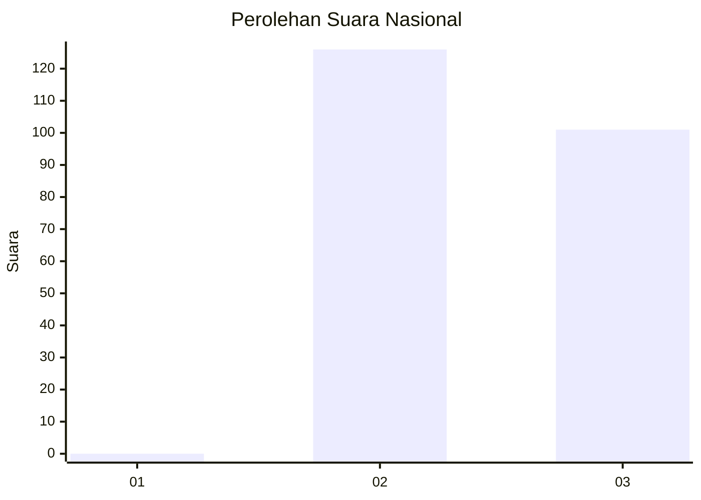
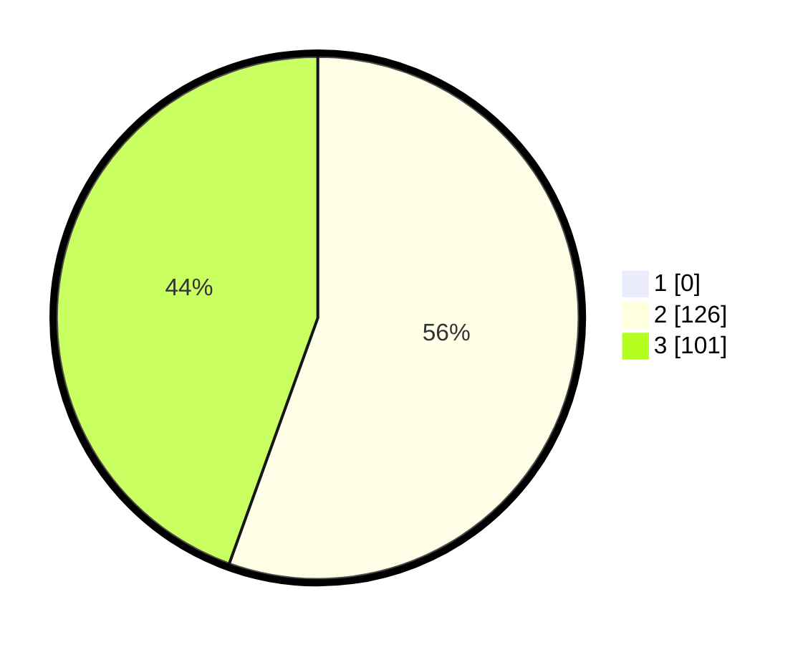

# Hasil

## Grafik

## Tabel

| No. | Nama Paslon    | Suara | Suara (raw) | Persentase |
|:--- |:-------------- | -----:| -----------:| ----------:|
| 1   | ANIES MUHAIMIN | 0     | [0][p-1]    | 0,00       |
| 2   | PRABOWO GIBRAN | 126   | [126][p-2]  | 55,51      |
| 3   | GANJAR MAHFUD  | 101   | [101][p-3]  | 44,49      |

[p-1]: https://github.com/gigit-pemilu/pemilu-2024/blob/main/pilpres/hitung-suara/sub/51-bali/sub/05-klungkung/sub/01-nusa-penida/sub/2014-pejukutan/sub/009-tps/sub/paslon-1.txt
[p-2]: https://github.com/gigit-pemilu/pemilu-2024/blob/main/pilpres/hitung-suara/sub/51-bali/sub/05-klungkung/sub/01-nusa-penida/sub/2014-pejukutan/sub/009-tps/sub/paslon-2.txt
[p-3]: https://github.com/gigit-pemilu/pemilu-2024/blob/main/pilpres/hitung-suara/sub/51-bali/sub/05-klungkung/sub/01-nusa-penida/sub/2014-pejukutan/sub/009-tps/sub/paslon-3.txt

## Foto C Plano

https://sirekap-obj-formc.kpu.go.id/db24/pemilu/ppwp/51/05/01/20/14/5105012014009-20240215-090201--2927cc06-df41-4f20-b602-888b87090a3d.jpg

https://sirekap-obj-formc.kpu.go.id/db24/pemilu/ppwp/51/05/01/20/14/5105012014009-20240215-090348--c45aa89f-dcf4-47a6-b330-17254c290fc2.jpg

https://sirekap-obj-formc.kpu.go.id/db24/pemilu/ppwp/51/05/01/20/14/5105012014009-20240215-090738--d2fc5fb3-6b42-48a2-90e2-d1bdfcec0d11.jpg

## Metadata

| Key        | Value               |
| ---------- | ------------------- |
| Time Stamp | 2024-02-15 15:00:29 |

