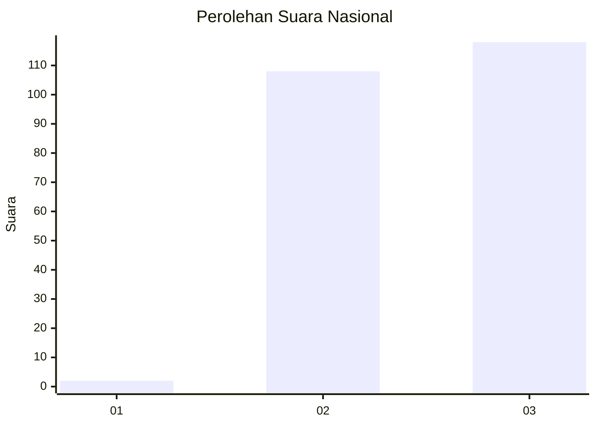
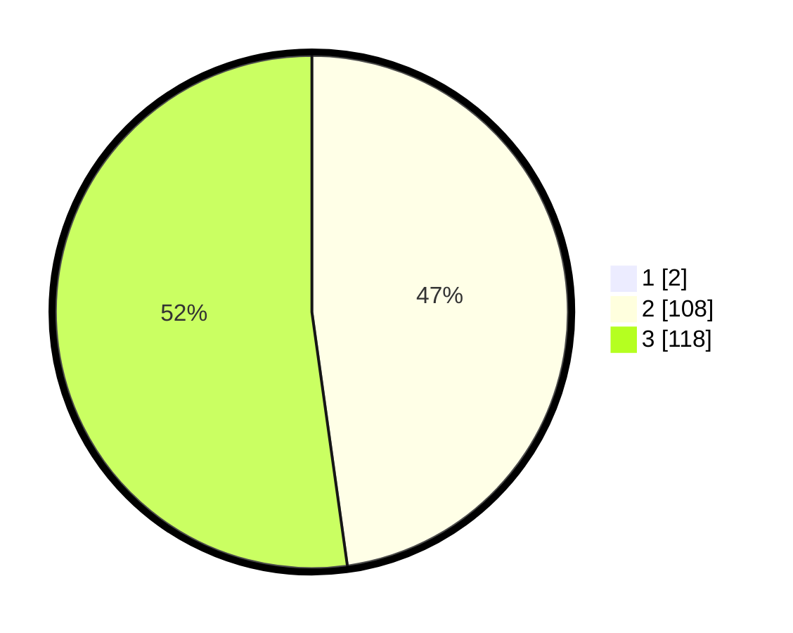

# Hasil

## Grafik

## Tabel

| No. | Nama Paslon    | Suara | Suara (raw) | Persentase |
|:--- |:-------------- | -----:| -----------:| ----------:|
| 1   | ANIES MUHAIMIN | 2     | [2][p-1]    | 0,88       |
| 2   | PRABOWO GIBRAN | 108   | [108][p-2]  | 47,37      |
| 3   | GANJAR MAHFUD  | 118   | [118][p-3]  | 51,75      |

[p-1]: https://github.com/gigit-pemilu/pemilu-2024/blob/main/pilpres/hitung-suara/sub/51-bali/sub/05-klungkung/sub/01-nusa-penida/sub/2014-pejukutan/sub/010-tps/sub/paslon-1.txt
[p-2]: https://github.com/gigit-pemilu/pemilu-2024/blob/main/pilpres/hitung-suara/sub/51-bali/sub/05-klungkung/sub/01-nusa-penida/sub/2014-pejukutan/sub/010-tps/sub/paslon-2.txt
[p-3]: https://github.com/gigit-pemilu/pemilu-2024/blob/main/pilpres/hitung-suara/sub/51-bali/sub/05-klungkung/sub/01-nusa-penida/sub/2014-pejukutan/sub/010-tps/sub/paslon-3.txt

## Foto C Plano

https://sirekap-obj-formc.kpu.go.id/18a4/pemilu/ppwp/51/05/01/20/14/5105012014010-20240215-072036--479aa6c6-5afa-4726-a013-df07d7ceeb3f.jpg

https://sirekap-obj-formc.kpu.go.id/18a4/pemilu/ppwp/51/05/01/20/14/5105012014010-20240215-072135--2c4bda87-f82a-4e09-9f29-9b65fab4cd5c.jpg

https://sirekap-obj-formc.kpu.go.id/18a4/pemilu/ppwp/51/05/01/20/14/5105012014010-20240215-072227--5317fc8c-962f-4fb7-a9ce-78a237643542.jpg

## Metadata

| Key        | Value               |
| ---------- | ------------------- |
| Time Stamp | 2024-02-15 20:30:46 |

