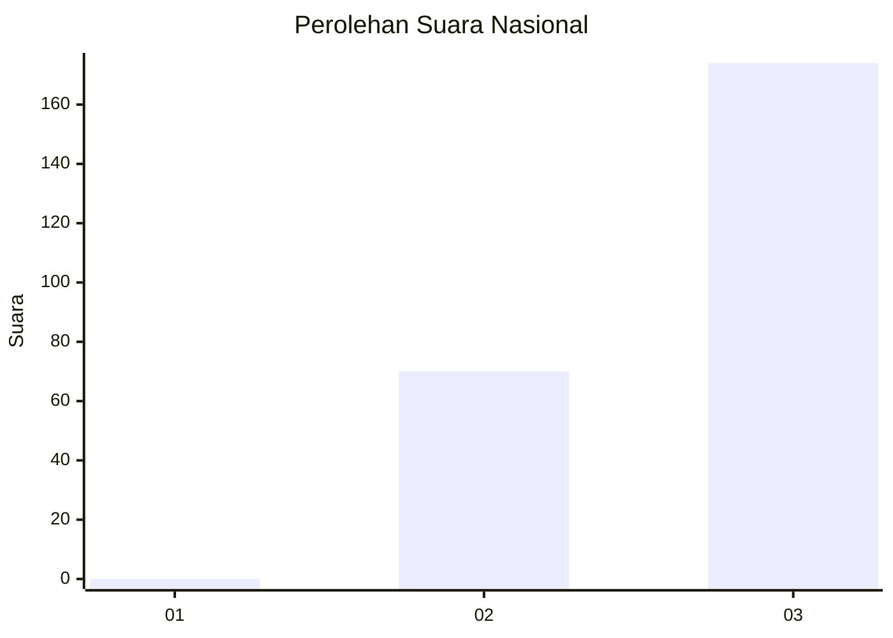
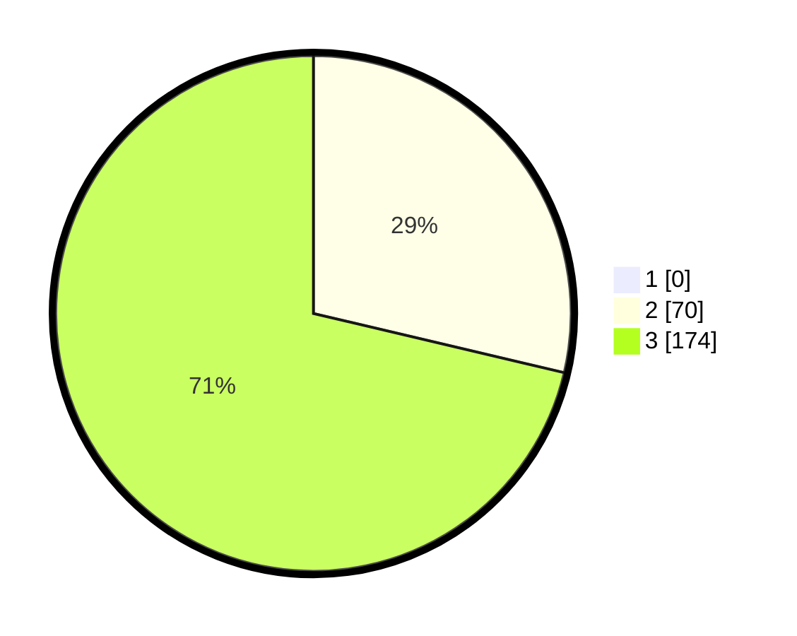

# Hasil

## Grafik

## Tabel

| No. | Nama Paslon    | Suara | Suara (raw) | Persentase |
|:--- |:-------------- | -----:| -----------:| ----------:|
| 1   | ANIES MUHAIMIN | 0     | [0][p-1]    | 0,00       |
| 2   | PRABOWO GIBRAN | 70    | [70][p-2]   | 28,69      |
| 3   | GANJAR MAHFUD  | 174   | [174][p-3]  | 71,31      |

[p-1]: https://github.com/gigit-pemilu/pemilu-2024/blob/main/pilpres/hitung-suara/sub/51-bali/sub/05-klungkung/sub/01-nusa-penida/sub/2014-pejukutan/sub/012-tps/sub/paslon-1.txt
[p-2]: https://github.com/gigit-pemilu/pemilu-2024/blob/main/pilpres/hitung-suara/sub/51-bali/sub/05-klungkung/sub/01-nusa-penida/sub/2014-pejukutan/sub/012-tps/sub/paslon-2.txt
[p-3]: https://github.com/gigit-pemilu/pemilu-2024/blob/main/pilpres/hitung-suara/sub/51-bali/sub/05-klungkung/sub/01-nusa-penida/sub/2014-pejukutan/sub/012-tps/sub/paslon-3.txt

## Foto C Plano

https://sirekap-obj-formc.kpu.go.id/1374/pemilu/ppwp/51/05/01/20/14/5105012014012-20240215-104548--c2a88a91-bc51-4aaf-b5f3-483927875aa6.jpg

https://sirekap-obj-formc.kpu.go.id/1374/pemilu/ppwp/51/05/01/20/14/5105012014012-20240215-104528--60416b87-4dfd-4aac-9964-385fa039f256.jpg

https://sirekap-obj-formc.kpu.go.id/1374/pemilu/ppwp/51/05/01/20/14/5105012014012-20240215-104713--412752ee-4b85-4579-9a80-d0968a226b50.jpg

## Metadata

| Key        | Value               |
| ---------- | ------------------- |
| Time Stamp | 2024-02-15 15:00:29 |

