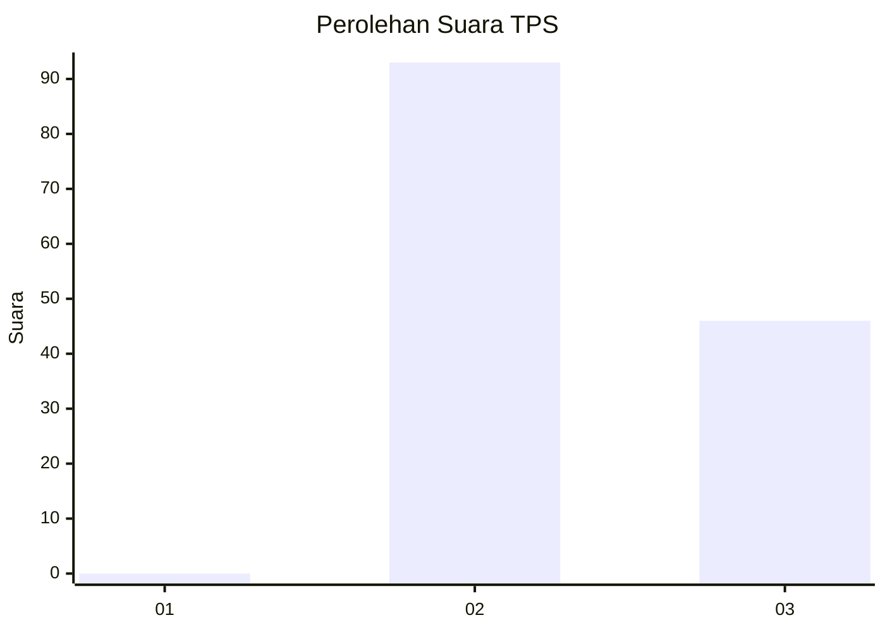
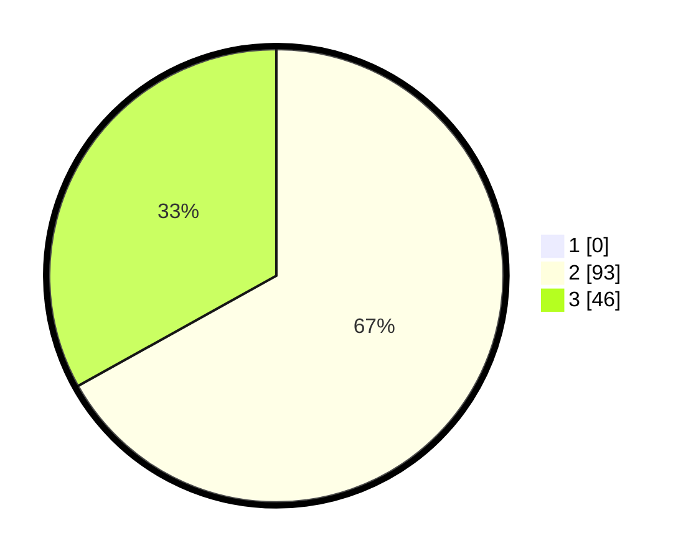

# Hasil

## Grafik

## Tabel

| No. | Nama Paslon    | Suara | Suara (raw) | Persentase |
|:--- |:-------------- | -----:| -----------:| ----------:|
| 1   | ANIES MUHAIMIN | 0     | [0][p-1]    | 0,00       |
| 2   | PRABOWO GIBRAN | 93    | [93][p-2]   | 66,91      |
| 3   | GANJAR MAHFUD  | 46    | [46][p-3]   | 33,09      |

[p-1]: https://github.com/gigit-pemilu/pemilu-2024-51-bali/blob/main/pilpres/hitung-suara/sub/51-bali/sub/05-klungkung/sub/01-nusa-penida/sub/2014-pejukutan/sub/013-tps/sub/paslon-1.txt
[p-2]: https://github.com/gigit-pemilu/pemilu-2024-51-bali/blob/main/pilpres/hitung-suara/sub/51-bali/sub/05-klungkung/sub/01-nusa-penida/sub/2014-pejukutan/sub/013-tps/sub/paslon-2.txt
[p-3]: https://github.com/gigit-pemilu/pemilu-2024-51-bali/blob/main/pilpres/hitung-suara/sub/51-bali/sub/05-klungkung/sub/01-nusa-penida/sub/2014-pejukutan/sub/013-tps/sub/paslon-3.txt

## Foto C Plano

https://sirekap-obj-formc.kpu.go.id/608a/pemilu/ppwp/51/05/01/20/14/5105012014013-20240215-091519--76bd80f7-c9c7-4b0d-9b40-29f61b47f950.jpg

https://sirekap-obj-formc.kpu.go.id/608a/pemilu/ppwp/51/05/01/20/14/5105012014013-20240222-095837--bd6e8142-393c-4549-9460-0aabc90f1dd9.jpg

https://sirekap-obj-formc.kpu.go.id/608a/pemilu/ppwp/51/05/01/20/14/5105012014013-20240222-100040--b752567e-3825-48a7-a63e-6556e662743c.jpg

## Metadata

| Key        | Value               |
| ---------- | ------------------- |
| Time Stamp | 2024-02-24 22:31:28 |

## DATA PEMILIH TETAP

Jumlah pemilih dalam DPT: **137**.
 * L: **67**.
 * P: **70**.

## DATA PENGGUNA HAK PILIH

Jumlah pengguna hak pilih dalam DPT: **134**.
 * L: **66**.
 * P: **68**.

Jumlah pengguna hak pilih dalam DPTb: **3**.
 * L: **2**.
 * P: **1**.

Jumlah pengguna hak pilih dalam DPK: **2**.
 * L: **2**.
 * P: **0**.

Jumlah pengguna hak pilih: **139**.
 * L: **70**.
 * P: **69**.

## JUMLAH SUARA SAH DAN TIDAK SAH

JUMLAH SELURUH SUARA SAH: **139**.

JUMLAH SUARA TIDAK SAH: **0**.

JUMLAH SELURUH SUARA SAH DAN SUARA TIDAK SAH: **139**.

