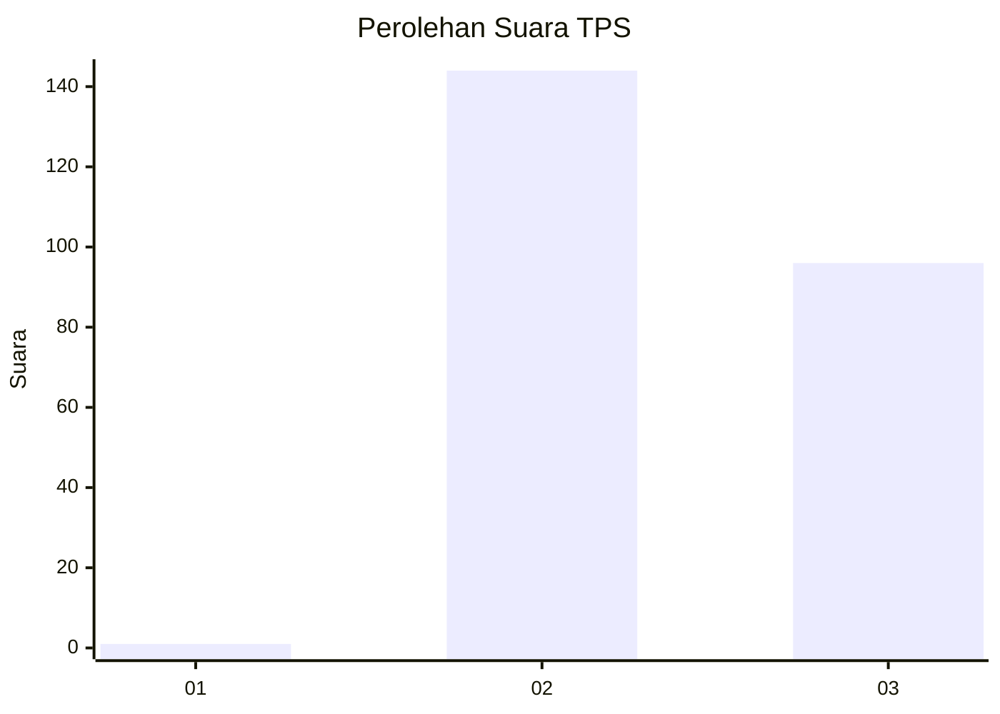
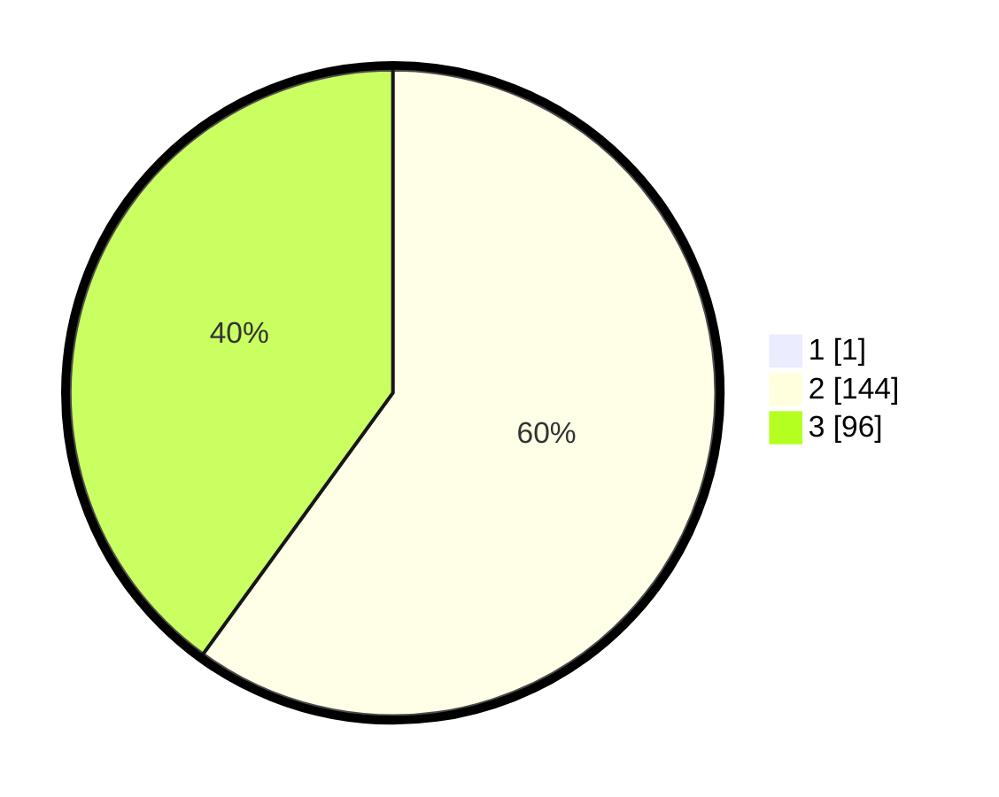

# Hasil

## Grafik

## Tabel

| No. | Nama Paslon    | Suara | Suara (raw) | Persentase |
|:--- |:-------------- | -----:| -----------:| ----------:|
| 1   | ANIES MUHAIMIN | 1     | [1][p-1]    | 0,41       |
| 2   | PRABOWO GIBRAN | 144   | [144][p-2]  | 59,75      |
| 3   | GANJAR MAHFUD  | 96    | [96][p-3]   | 39,83      |

[p-1]: https://github.com/gigit-pemilu/pemilu-2024-51-bali/blob/main/pilpres/hitung-suara/sub/51-bali/sub/05-klungkung/sub/01-nusa-penida/sub/2015-kutampi-kaler/sub/001-tps/sub/paslon-1.txt
[p-2]: https://github.com/gigit-pemilu/pemilu-2024-51-bali/blob/main/pilpres/hitung-suara/sub/51-bali/sub/05-klungkung/sub/01-nusa-penida/sub/2015-kutampi-kaler/sub/001-tps/sub/paslon-2.txt
[p-3]: https://github.com/gigit-pemilu/pemilu-2024-51-bali/blob/main/pilpres/hitung-suara/sub/51-bali/sub/05-klungkung/sub/01-nusa-penida/sub/2015-kutampi-kaler/sub/001-tps/sub/paslon-3.txt

## Foto C Plano

https://sirekap-obj-formc.kpu.go.id/c3f0/pemilu/ppwp/51/05/01/20/15/5105012015001-20240215-012325--8c71e1ea-8a7e-458f-8c14-dfc696a4b3f3.jpg

https://sirekap-obj-formc.kpu.go.id/c3f0/pemilu/ppwp/51/05/01/20/15/5105012015001-20240215-012506--6a168725-2f16-4c51-8f25-661fb25e77ce.jpg

https://sirekap-obj-formc.kpu.go.id/c3f0/pemilu/ppwp/51/05/01/20/15/5105012015001-20240215-012651--e4558862-fd68-4629-8e34-a08d9fc73ace.jpg

## Metadata

| Key        | Value               |
| ---------- | ------------------- |
| Time Stamp | 2024-02-15 09:00:24 |

