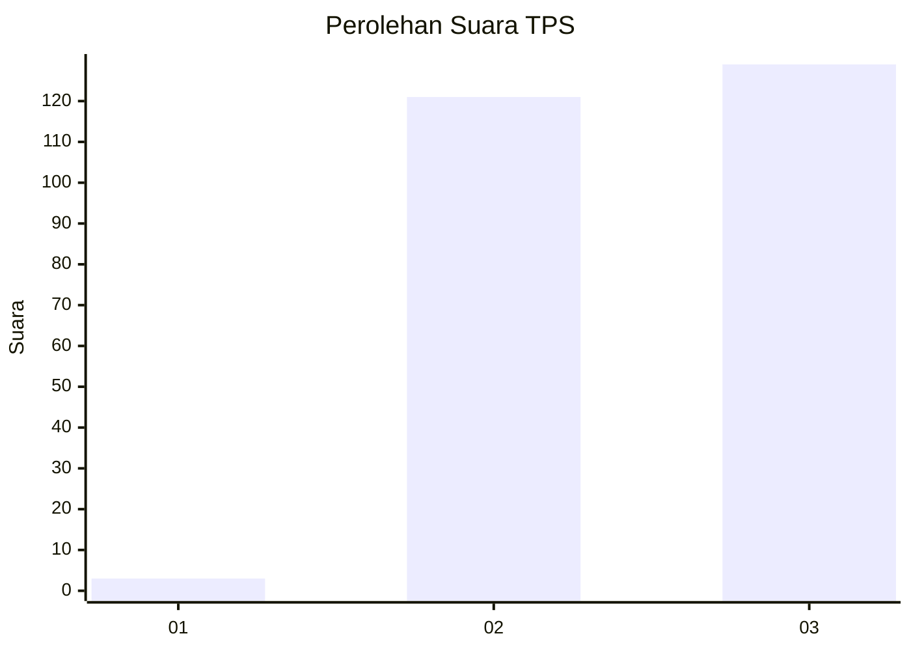
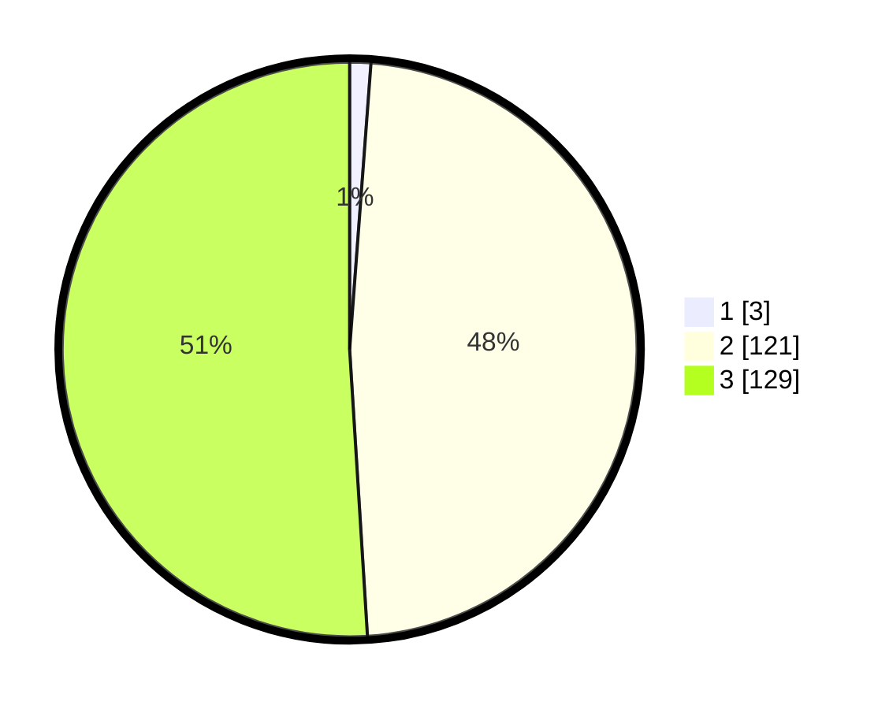

# Hasil

## Grafik

## Tabel

| No. | Nama Paslon    | Suara | Suara (raw) | Persentase |
|:--- |:-------------- | -----:| -----------:| ----------:|
| 1   | ANIES MUHAIMIN | 3     | [3][p-1]    | 1,19       |
| 2   | PRABOWO GIBRAN | 121   | [121][p-2]  | 47,83      |
| 3   | GANJAR MAHFUD  | 129   | [129][p-3]  | 50,99      |

[p-1]: https://github.com/gigit-pemilu/pemilu-2024-51-bali/blob/main/pilpres/hitung-suara/sub/51-bali/sub/05-klungkung/sub/01-nusa-penida/sub/2015-kutampi-kaler/sub/003-tps/sub/paslon-1.txt
[p-2]: https://github.com/gigit-pemilu/pemilu-2024-51-bali/blob/main/pilpres/hitung-suara/sub/51-bali/sub/05-klungkung/sub/01-nusa-penida/sub/2015-kutampi-kaler/sub/003-tps/sub/paslon-2.txt
[p-3]: https://github.com/gigit-pemilu/pemilu-2024-51-bali/blob/main/pilpres/hitung-suara/sub/51-bali/sub/05-klungkung/sub/01-nusa-penida/sub/2015-kutampi-kaler/sub/003-tps/sub/paslon-3.txt

## Foto C Plano

https://sirekap-obj-formc.kpu.go.id/fca7/pemilu/ppwp/51/05/01/20/15/5105012015003-20240214-194142--9ce666c5-6b33-41b2-a659-4f14e3eca9b9.jpg

https://sirekap-obj-formc.kpu.go.id/fca7/pemilu/ppwp/51/05/01/20/15/5105012015003-20240214-194339--413f1fd9-fa09-49d8-aea9-c1fed41e374d.jpg

## Metadata

| Key        | Value               |
| ---------- | ------------------- |
| Time Stamp | 2024-02-24 22:31:28 |

