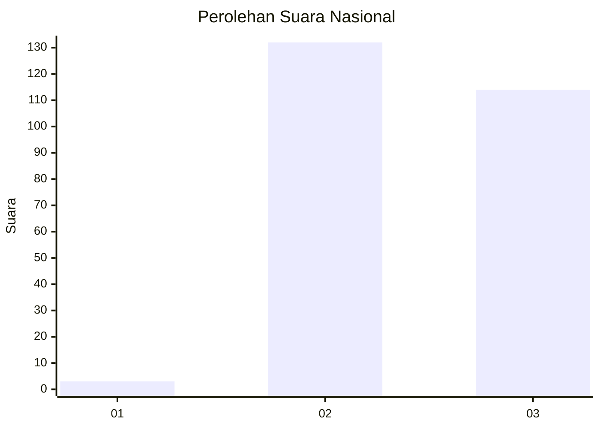
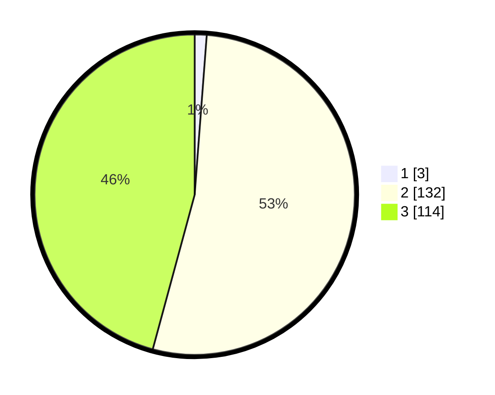

# Hasil

## Grafik

## Tabel

| No. | Nama Paslon    | Suara | Suara (raw) | Persentase |
|:--- |:-------------- | -----:| -----------:| ----------:|
| 1   | ANIES MUHAIMIN | 3     | [3][p-1]    | 1,20       |
| 2   | PRABOWO GIBRAN | 132   | [132][p-2]  | 53,01      |
| 3   | GANJAR MAHFUD  | 114   | [114][p-3]  | 45,78      |

[p-1]: https://github.com/gigit-pemilu/pemilu-2024/blob/main/pilpres/hitung-suara/sub/51-bali/sub/05-klungkung/sub/01-nusa-penida/sub/2015-kutampi-kaler/sub/004-tps/sub/paslon-1.txt
[p-2]: https://github.com/gigit-pemilu/pemilu-2024/blob/main/pilpres/hitung-suara/sub/51-bali/sub/05-klungkung/sub/01-nusa-penida/sub/2015-kutampi-kaler/sub/004-tps/sub/paslon-2.txt
[p-3]: https://github.com/gigit-pemilu/pemilu-2024/blob/main/pilpres/hitung-suara/sub/51-bali/sub/05-klungkung/sub/01-nusa-penida/sub/2015-kutampi-kaler/sub/004-tps/sub/paslon-3.txt

## Foto C Plano

https://sirekap-obj-formc.kpu.go.id/456a/pemilu/ppwp/51/05/01/20/15/5105012015004-20240214-191236--ca994d02-d6bc-4c0d-8a9d-521e641a7f3c.jpg

https://sirekap-obj-formc.kpu.go.id/456a/pemilu/ppwp/51/05/01/20/15/5105012015004-20240214-190827--783e06b8-12af-4f0c-adb5-0d35b5ca426d.jpg

https://sirekap-obj-formc.kpu.go.id/456a/pemilu/ppwp/51/05/01/20/15/5105012015004-20240214-191439--4bb46c5e-33fe-437a-a7d5-f36225ce7474.jpg

## Metadata

| Key        | Value               |
| ---------- | ------------------- |
| Time Stamp | 2024-02-15 09:00:24 |

