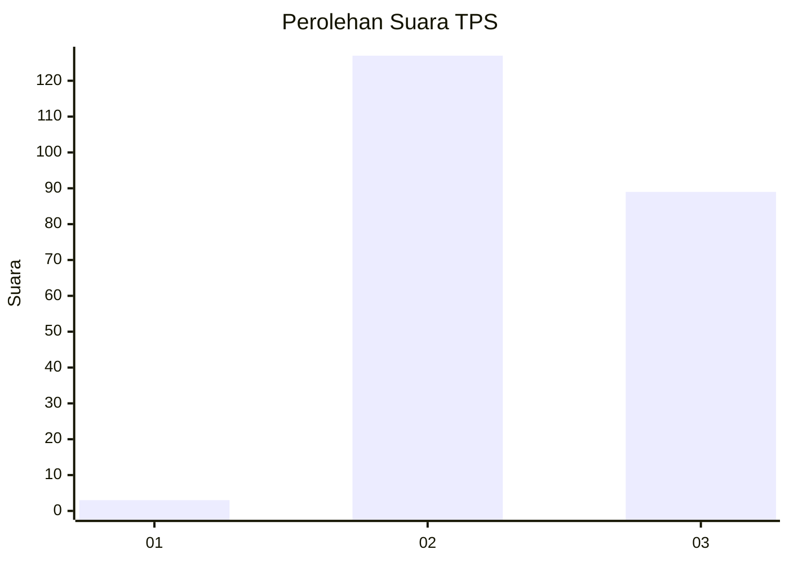
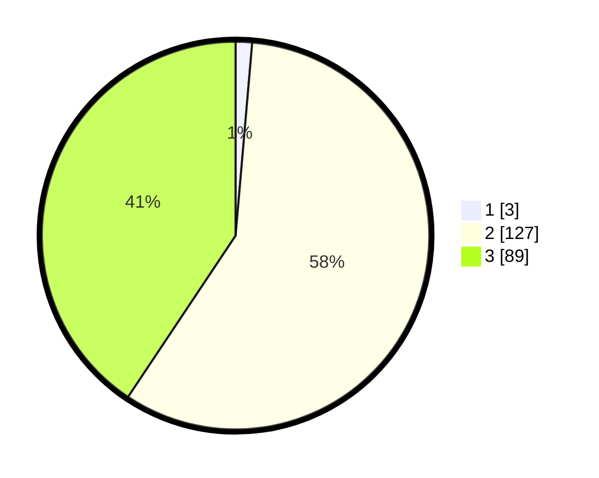

# Hasil

## Grafik

## Tabel

| No. | Nama Paslon    | Suara | Suara (raw) | Persentase |
|:--- |:-------------- | -----:| -----------:| ----------:|
| 1   | ANIES MUHAIMIN | 3     | [3][p-1]    | 1,37       |
| 2   | PRABOWO GIBRAN | 127   | [127][p-2]  | 57,99      |
| 3   | GANJAR MAHFUD  | 89    | [89][p-3]   | 40,64      |

[p-1]: https://github.com/gigit-pemilu/pemilu-2024-51-bali/blob/main/pilpres/hitung-suara/sub/51-bali/sub/05-klungkung/sub/01-nusa-penida/sub/2015-kutampi-kaler/sub/007-tps/sub/paslon-1.txt
[p-2]: https://github.com/gigit-pemilu/pemilu-2024-51-bali/blob/main/pilpres/hitung-suara/sub/51-bali/sub/05-klungkung/sub/01-nusa-penida/sub/2015-kutampi-kaler/sub/007-tps/sub/paslon-2.txt
[p-3]: https://github.com/gigit-pemilu/pemilu-2024-51-bali/blob/main/pilpres/hitung-suara/sub/51-bali/sub/05-klungkung/sub/01-nusa-penida/sub/2015-kutampi-kaler/sub/007-tps/sub/paslon-3.txt

## Foto C Plano

https://sirekap-obj-formc.kpu.go.id/ad2d/pemilu/ppwp/51/05/01/20/15/5105012015007-20240214-212609--fc59a084-bfad-41e2-bb43-d4137b932f94.jpg

https://sirekap-obj-formc.kpu.go.id/ad2d/pemilu/ppwp/51/05/01/20/15/5105012015007-20240214-212748--33082ebc-d93a-4a4e-bf6d-76df967a5257.jpg

https://sirekap-obj-formc.kpu.go.id/ad2d/pemilu/ppwp/51/05/01/20/15/5105012015007-20240214-212842--4a33705c-9239-41d2-8a33-f9b7eb946bc9.jpg

## Metadata

| Key        | Value               |
| ---------- | ------------------- |
| Time Stamp | 2024-02-15 18:00:26 |

