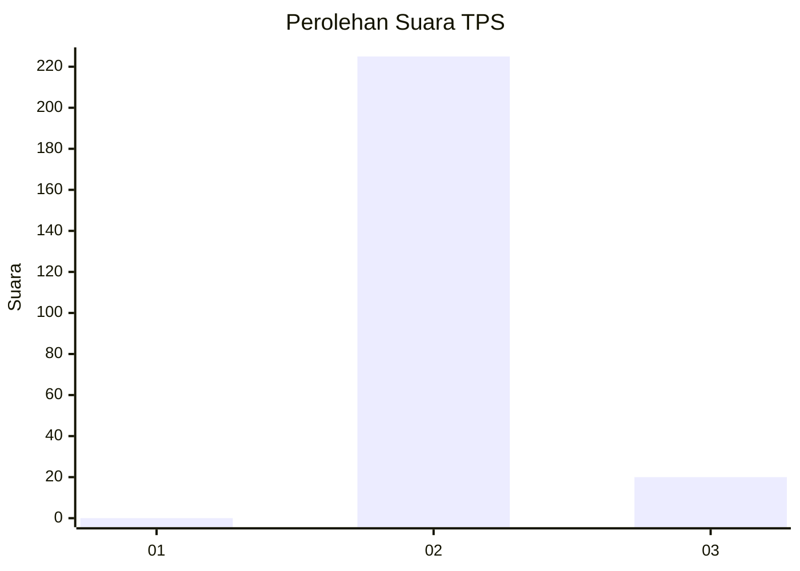
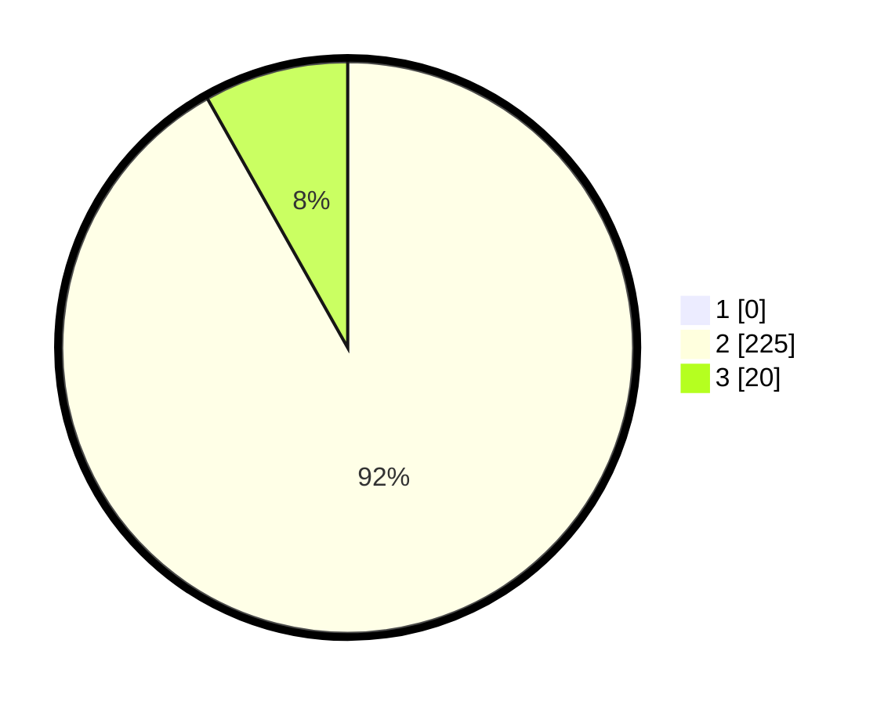

# Hasil

## Grafik

## Tabel

| No. | Nama Paslon    | Suara | Suara (raw) | Persentase |
|:--- |:-------------- | -----:| -----------:| ----------:|
| 1   | ANIES MUHAIMIN | 0     | [0][p-1]    | 0,00       |
| 2   | PRABOWO GIBRAN | 225   | [225][p-2]  | 91,84      |
| 3   | GANJAR MAHFUD  | 20    | [20][p-3]   | 8,16       |

[p-1]: https://github.com/gigit-pemilu/pemilu-2024-51-bali/blob/main/pilpres/hitung-suara/sub/51-bali/sub/05-klungkung/sub/01-nusa-penida/sub/2015-kutampi-kaler/sub/009-tps/sub/paslon-1.txt
[p-2]: https://github.com/gigit-pemilu/pemilu-2024-51-bali/blob/main/pilpres/hitung-suara/sub/51-bali/sub/05-klungkung/sub/01-nusa-penida/sub/2015-kutampi-kaler/sub/009-tps/sub/paslon-2.txt
[p-3]: https://github.com/gigit-pemilu/pemilu-2024-51-bali/blob/main/pilpres/hitung-suara/sub/51-bali/sub/05-klungkung/sub/01-nusa-penida/sub/2015-kutampi-kaler/sub/009-tps/sub/paslon-3.txt

## Foto C Plano

https://sirekap-obj-formc.kpu.go.id/f493/pemilu/ppwp/51/05/01/20/15/5105012015009-20240214-233235--d60f2c6e-38a7-4c73-9cd4-c461bf0a56cd.jpg

https://sirekap-obj-formc.kpu.go.id/f493/pemilu/ppwp/51/05/01/20/15/5105012015009-20240214-233242--63378a4c-0f77-43e6-9875-c2e17cf5c86d.jpg

https://sirekap-obj-formc.kpu.go.id/f493/pemilu/ppwp/51/05/01/20/15/5105012015009-20240214-233246--9b510b7f-cd47-430f-baf5-55ecd6d946c9.jpg

## Metadata

| Key        | Value               |
| ---------- | ------------------- |
| Time Stamp | 2024-02-15 15:00:29 |

