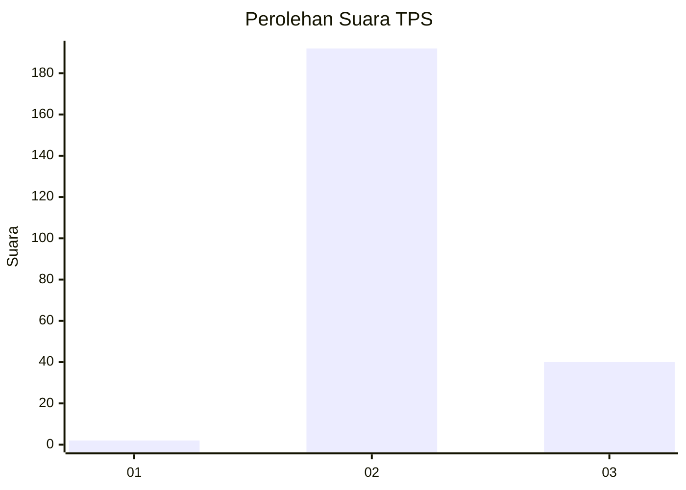
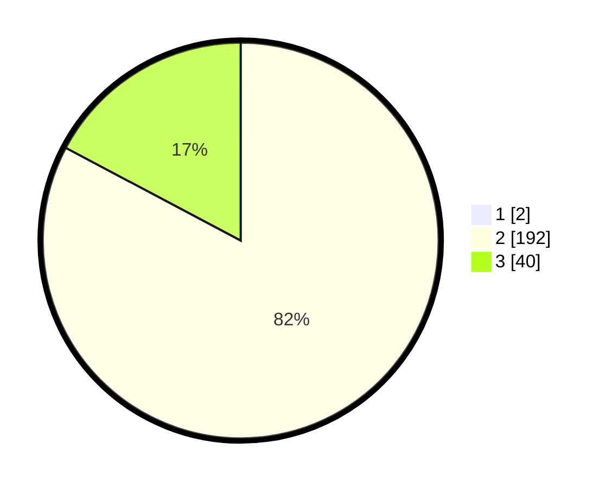

# Hasil

## Grafik

## Tabel

| No. | Nama Paslon    | Suara | Suara (raw) | Persentase |
|:--- |:-------------- | -----:| -----------:| ----------:|
| 1   | ANIES MUHAIMIN | 2     | [2][p-1]    | 0,85       |
| 2   | PRABOWO GIBRAN | 192   | [192][p-2]  | 82,05      |
| 3   | GANJAR MAHFUD  | 40    | [40][p-3]   | 17,09      |

[p-1]: https://github.com/gigit-pemilu/pemilu-2024-51-bali/blob/main/pilpres/hitung-suara/sub/51-bali/sub/05-klungkung/sub/01-nusa-penida/sub/2015-kutampi-kaler/sub/010-tps/sub/paslon-1.txt
[p-2]: https://github.com/gigit-pemilu/pemilu-2024-51-bali/blob/main/pilpres/hitung-suara/sub/51-bali/sub/05-klungkung/sub/01-nusa-penida/sub/2015-kutampi-kaler/sub/010-tps/sub/paslon-2.txt
[p-3]: https://github.com/gigit-pemilu/pemilu-2024-51-bali/blob/main/pilpres/hitung-suara/sub/51-bali/sub/05-klungkung/sub/01-nusa-penida/sub/2015-kutampi-kaler/sub/010-tps/sub/paslon-3.txt

## Foto C Plano

https://sirekap-obj-formc.kpu.go.id/8278/pemilu/ppwp/51/05/01/20/15/5105012015010-20240214-234716--75c0ec01-ad86-4f0b-b6cb-dca39d39af8e.jpg

https://sirekap-obj-formc.kpu.go.id/8278/pemilu/ppwp/51/05/01/20/15/5105012015010-20240214-234818--bfabcd8d-6f97-4ed3-a24d-3061056060ee.jpg

https://sirekap-obj-formc.kpu.go.id/8278/pemilu/ppwp/51/05/01/20/15/5105012015010-20240214-234917--eb95fa38-d8bd-4c2f-861d-8368536067ae.jpg

## Metadata

| Key        | Value               |
| ---------- | ------------------- |
| Time Stamp | 2024-02-15 09:00:24 |

