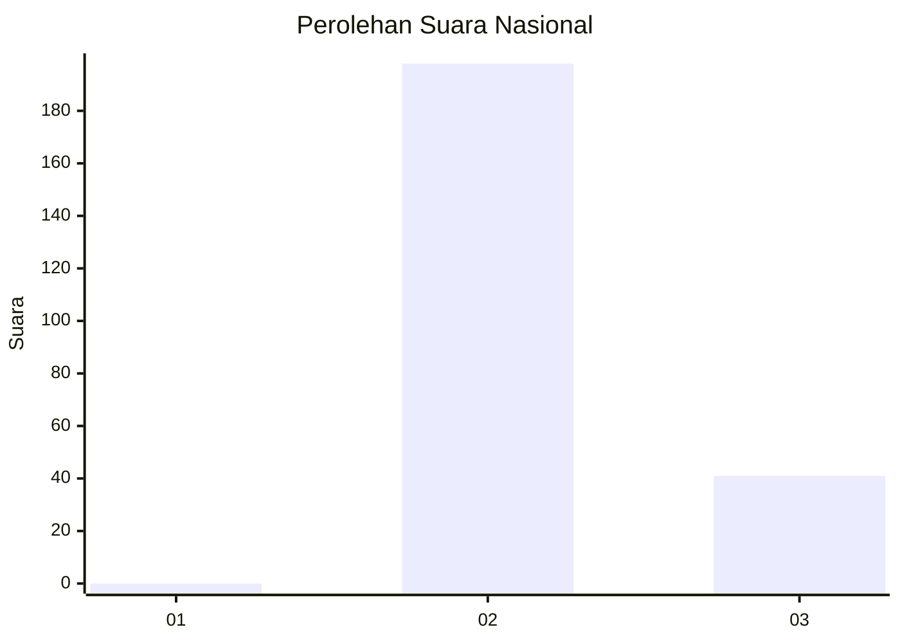
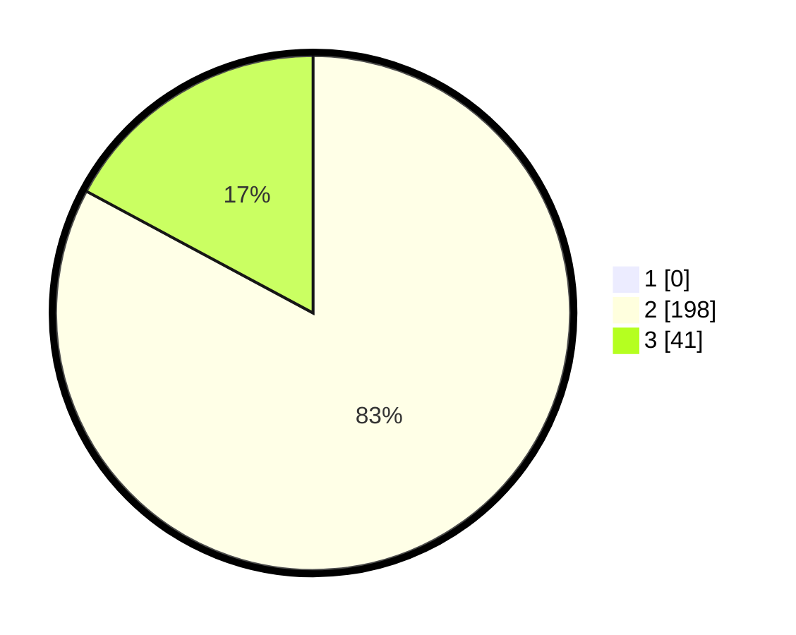

# Hasil

## Grafik

## Tabel

| No. | Nama Paslon    | Suara | Suara (raw) | Persentase |
|:--- |:-------------- | -----:| -----------:| ----------:|
| 1   | ANIES MUHAIMIN | 0     | [0][p-1]    | 0,00       |
| 2   | PRABOWO GIBRAN | 198   | [198][p-2]  | 82,85      |
| 3   | GANJAR MAHFUD  | 41    | [41][p-3]   | 17,15      |

[p-1]: https://github.com/gigit-pemilu/pemilu-2024/blob/main/pilpres/hitung-suara/sub/51-bali/sub/05-klungkung/sub/01-nusa-penida/sub/2016-bunga-mekar/sub/004-tps/sub/paslon-1.txt
[p-2]: https://github.com/gigit-pemilu/pemilu-2024/blob/main/pilpres/hitung-suara/sub/51-bali/sub/05-klungkung/sub/01-nusa-penida/sub/2016-bunga-mekar/sub/004-tps/sub/paslon-2.txt
[p-3]: https://github.com/gigit-pemilu/pemilu-2024/blob/main/pilpres/hitung-suara/sub/51-bali/sub/05-klungkung/sub/01-nusa-penida/sub/2016-bunga-mekar/sub/004-tps/sub/paslon-3.txt

## Foto C Plano

https://sirekap-obj-formc.kpu.go.id/d54f/pemilu/ppwp/51/05/01/20/16/5105012016004-20240215-061407--762ae4f3-ba99-4760-86ff-0962e7ab4a02.jpg

https://sirekap-obj-formc.kpu.go.id/d54f/pemilu/ppwp/51/05/01/20/16/5105012016004-20240215-061606--ad23d836-03ca-4dc6-b917-ba38e248e10d.jpg

https://sirekap-obj-formc.kpu.go.id/d54f/pemilu/ppwp/51/05/01/20/16/5105012016004-20240215-061803--14e79f43-ba4b-4878-9b88-c2311d9ecbc1.jpg

## Metadata

| Key        | Value               |
| ---------- | ------------------- |
| Time Stamp | 2024-02-15 18:00:26 |

