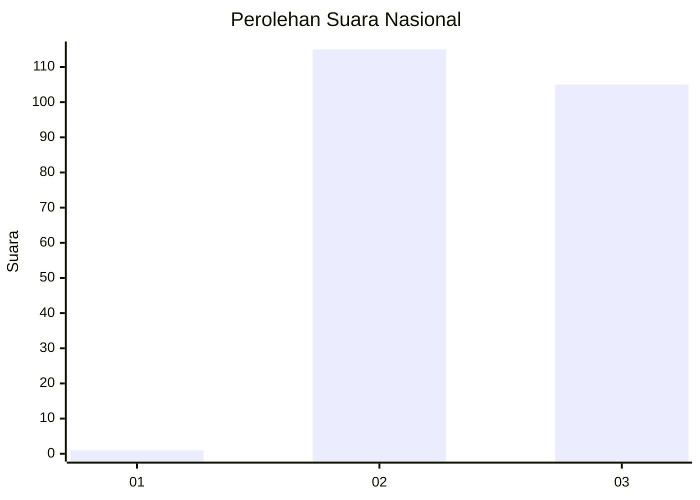
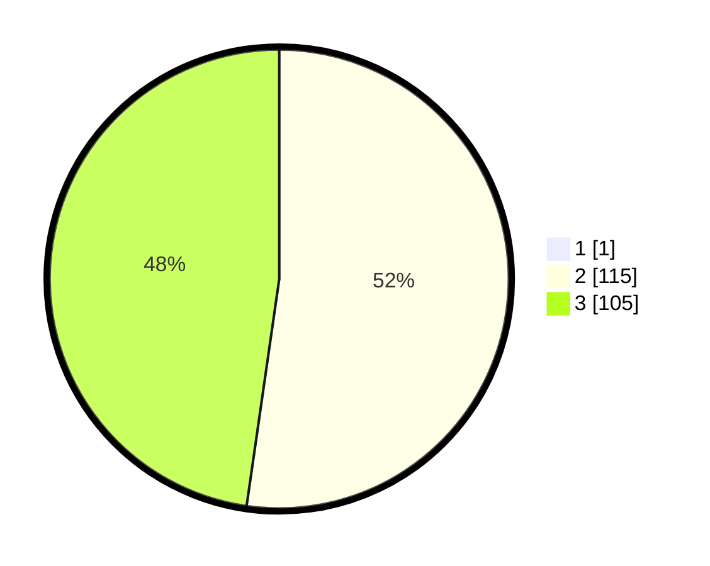

# Hasil

## Grafik

## Tabel

| No. | Nama Paslon    | Suara | Suara (raw) | Persentase |
|:--- |:-------------- | -----:| -----------:| ----------:|
| 1   | ANIES MUHAIMIN | 1     | [1][p-1]    | 0,45       |
| 2   | PRABOWO GIBRAN | 115   | [115][p-2]  | 52,04      |
| 3   | GANJAR MAHFUD  | 105   | [105][p-3]  | 47,51      |

[p-1]: https://github.com/gigit-pemilu/pemilu-2024/blob/main/pilpres/hitung-suara/sub/51-bali/sub/05-klungkung/sub/01-nusa-penida/sub/2016-bunga-mekar/sub/007-tps/sub/paslon-1.txt
[p-2]: https://github.com/gigit-pemilu/pemilu-2024/blob/main/pilpres/hitung-suara/sub/51-bali/sub/05-klungkung/sub/01-nusa-penida/sub/2016-bunga-mekar/sub/007-tps/sub/paslon-2.txt
[p-3]: https://github.com/gigit-pemilu/pemilu-2024/blob/main/pilpres/hitung-suara/sub/51-bali/sub/05-klungkung/sub/01-nusa-penida/sub/2016-bunga-mekar/sub/007-tps/sub/paslon-3.txt

## Foto C Plano

https://sirekap-obj-formc.kpu.go.id/a5fb/pemilu/ppwp/51/05/01/20/16/5105012016007-20240215-094143--5ebc9098-d833-4340-9932-f28f038eeb49.jpg

https://sirekap-obj-formc.kpu.go.id/a5fb/pemilu/ppwp/51/05/01/20/16/5105012016007-20240215-071319--a08c0bd8-f545-4eec-9667-ead8338af5d8.jpg

https://sirekap-obj-formc.kpu.go.id/a5fb/pemilu/ppwp/51/05/01/20/16/5105012016007-20240215-113502--300db6bf-972a-4ad3-ae44-64aaded39646.jpg

## Metadata

| Key        | Value               |
| ---------- | ------------------- |
| Time Stamp | 2024-02-19 13:00:00 |

