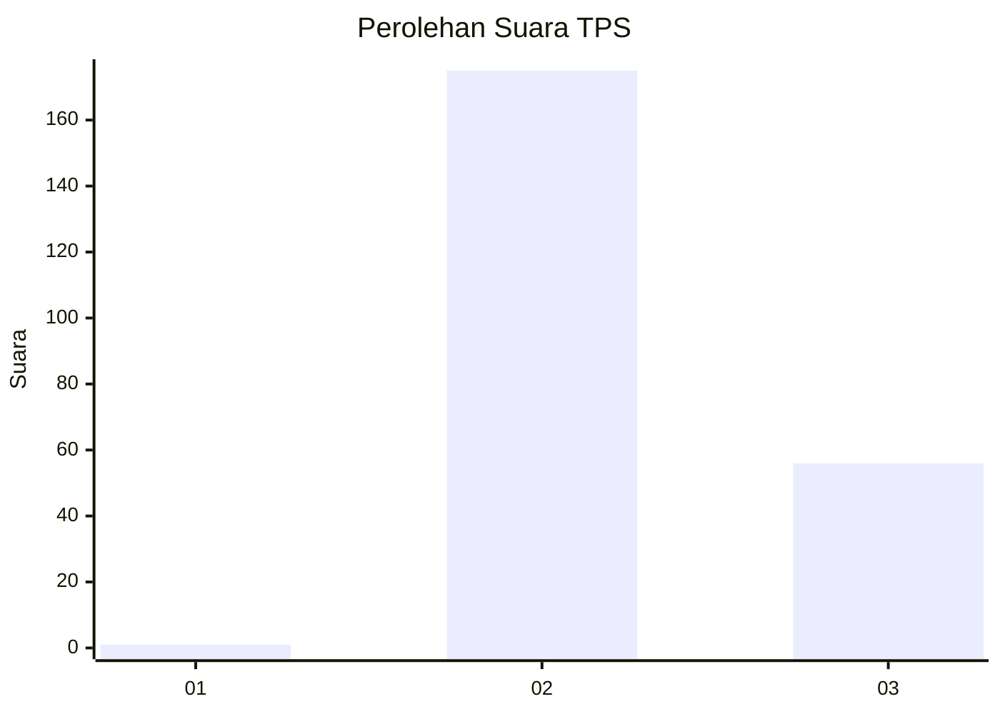
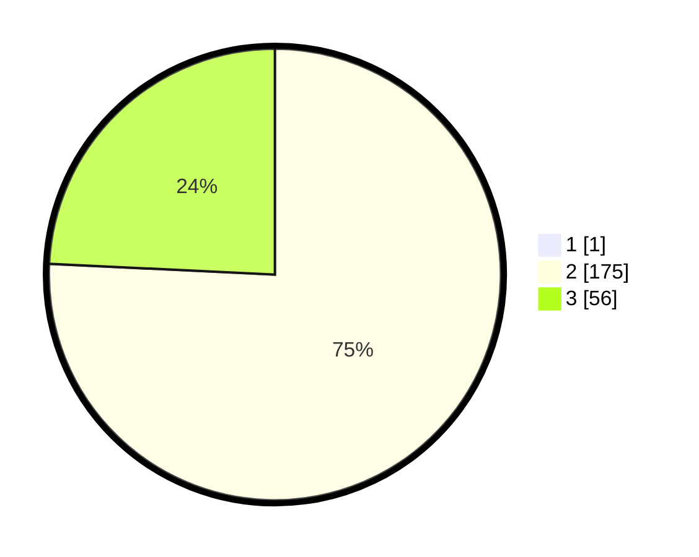

# Hasil

## Grafik

## Tabel

| No. | Nama Paslon    | Suara | Suara (raw) | Persentase |
|:--- |:-------------- | -----:| -----------:| ----------:|
| 1   | ANIES MUHAIMIN | 1     | [1][p-1]    | 0,43       |
| 2   | PRABOWO GIBRAN | 175   | [175][p-2]  | 75,43      |
| 3   | GANJAR MAHFUD  | 56    | [56][p-3]   | 24,14      |

[p-1]: https://github.com/gigit-pemilu/pemilu-2024-51-bali/blob/main/pilpres/hitung-suara/sub/51-bali/sub/05-klungkung/sub/01-nusa-penida/sub/2016-bunga-mekar/sub/008-tps/sub/paslon-1.txt
[p-2]: https://github.com/gigit-pemilu/pemilu-2024-51-bali/blob/main/pilpres/hitung-suara/sub/51-bali/sub/05-klungkung/sub/01-nusa-penida/sub/2016-bunga-mekar/sub/008-tps/sub/paslon-2.txt
[p-3]: https://github.com/gigit-pemilu/pemilu-2024-51-bali/blob/main/pilpres/hitung-suara/sub/51-bali/sub/05-klungkung/sub/01-nusa-penida/sub/2016-bunga-mekar/sub/008-tps/sub/paslon-3.txt

## Foto C Plano

https://sirekap-obj-formc.kpu.go.id/1408/pemilu/ppwp/51/05/01/20/16/5105012016008-20240215-105525--f60d9643-7c98-4164-9303-ab7c1a9babf3.jpg

https://sirekap-obj-formc.kpu.go.id/1408/pemilu/ppwp/51/05/01/20/16/5105012016008-20240215-110006--c68a7bb6-366d-49dc-a919-503f65c9bec2.jpg

https://sirekap-obj-formc.kpu.go.id/1408/pemilu/ppwp/51/05/01/20/16/5105012016008-20240215-110246--f2aee2d1-a851-416f-8074-a0842398ca89.jpg

## Metadata

| Key        | Value               |
| ---------- | ------------------- |
| Time Stamp | 2024-02-19 13:00:00 |

