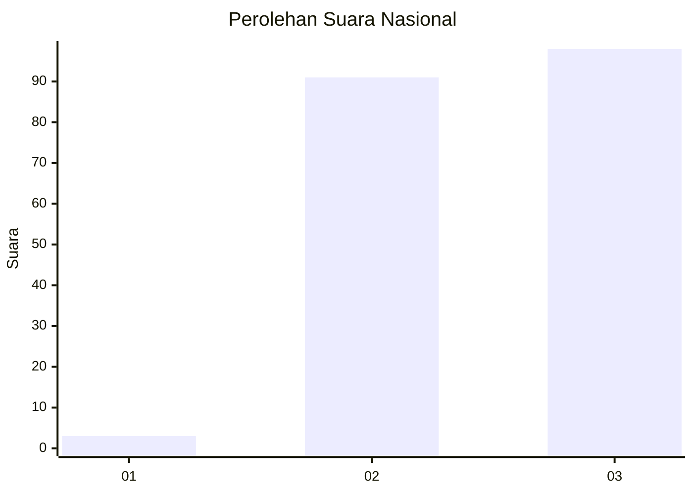
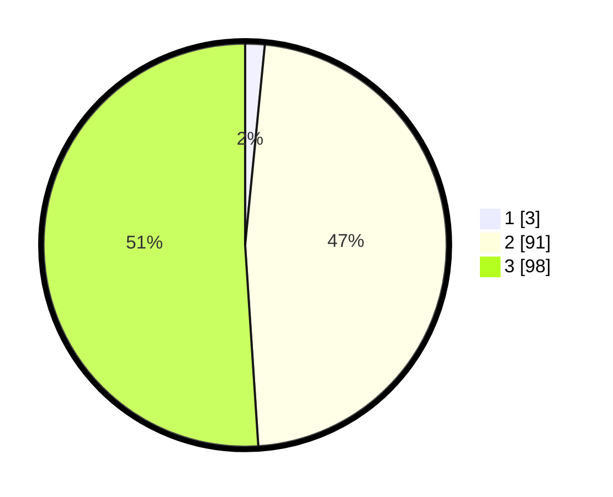

# Hasil

## Grafik

## Tabel

| No. | Nama Paslon    | Suara | Suara (raw) | Persentase |
|:--- |:-------------- | -----:| -----------:| ----------:|
| 1   | ANIES MUHAIMIN | 3     | [3][p-1]    | 1,56       |
| 2   | PRABOWO GIBRAN | 91    | [91][p-2]   | 47,40      |
| 3   | GANJAR MAHFUD  | 98    | [98][p-3]   | 51,04      |

[p-1]: https://github.com/gigit-pemilu/pemilu-2024/blob/main/pilpres/hitung-suara/sub/51-bali/sub/05-klungkung/sub/01-nusa-penida/sub/2016-bunga-mekar/sub/009-tps/sub/paslon-1.txt
[p-2]: https://github.com/gigit-pemilu/pemilu-2024/blob/main/pilpres/hitung-suara/sub/51-bali/sub/05-klungkung/sub/01-nusa-penida/sub/2016-bunga-mekar/sub/009-tps/sub/paslon-2.txt
[p-3]: https://github.com/gigit-pemilu/pemilu-2024/blob/main/pilpres/hitung-suara/sub/51-bali/sub/05-klungkung/sub/01-nusa-penida/sub/2016-bunga-mekar/sub/009-tps/sub/paslon-3.txt

## Foto C Plano

https://sirekap-obj-formc.kpu.go.id/dc2d/pemilu/ppwp/51/05/01/20/16/5105012016009-20240215-055546--a86036bc-0fcc-43f7-9862-295fc4efccab.jpg

https://sirekap-obj-formc.kpu.go.id/dc2d/pemilu/ppwp/51/05/01/20/16/5105012016009-20240215-055612--d843de9c-8053-4a96-8066-b859ea84f765.jpg

https://sirekap-obj-formc.kpu.go.id/dc2d/pemilu/ppwp/51/05/01/20/16/5105012016009-20240215-055623--17fb598b-5504-4aae-96f9-c180ee77c5ca.jpg

## Metadata

| Key        | Value               |
| ---------- | ------------------- |
| Time Stamp | 2024-02-19 13:00:00 |

