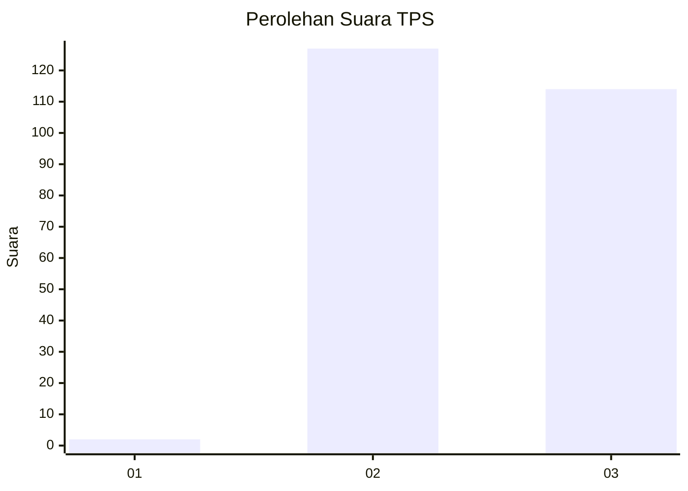
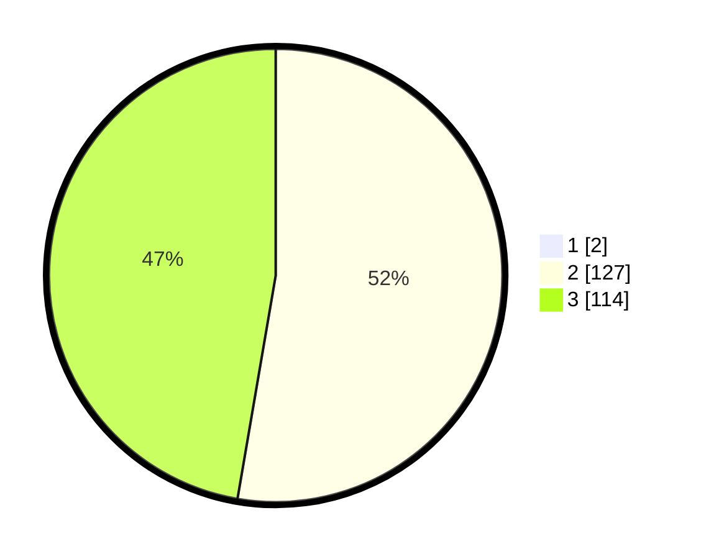

# Hasil

## Grafik

## Tabel

| No. | Nama Paslon    | Suara | Suara (raw) | Persentase |
|:--- |:-------------- | -----:| -----------:| ----------:|
| 1   | ANIES MUHAIMIN | 2     | [2][p-1]    | 0,82       |
| 2   | PRABOWO GIBRAN | 127   | [127][p-2]  | 52,26      |
| 3   | GANJAR MAHFUD  | 114   | [114][p-3]  | 46,91      |

[p-1]: https://github.com/gigit-pemilu/pemilu-2024-51-bali/blob/main/pilpres/hitung-suara/sub/51-bali/sub/05-klungkung/sub/02-banjarangkan/sub/2001-negari/sub/001-tps/sub/paslon-1.txt
[p-2]: https://github.com/gigit-pemilu/pemilu-2024-51-bali/blob/main/pilpres/hitung-suara/sub/51-bali/sub/05-klungkung/sub/02-banjarangkan/sub/2001-negari/sub/001-tps/sub/paslon-2.txt
[p-3]: https://github.com/gigit-pemilu/pemilu-2024-51-bali/blob/main/pilpres/hitung-suara/sub/51-bali/sub/05-klungkung/sub/02-banjarangkan/sub/2001-negari/sub/001-tps/sub/paslon-3.txt

## Foto C Plano

https://sirekap-obj-formc.kpu.go.id/d600/pemilu/ppwp/51/05/02/20/01/5105022001001-20240214-224430--7b3bfbb8-ab6e-46d5-b331-94a5d982c1d4.jpg

https://sirekap-obj-formc.kpu.go.id/d600/pemilu/ppwp/51/05/02/20/01/5105022001001-20240214-224555--7ecae2e4-2b08-4425-a662-9cc7cd0b5402.jpg

https://sirekap-obj-formc.kpu.go.id/d600/pemilu/ppwp/51/05/02/20/01/5105022001001-20240214-224648--a0d707ed-2831-404c-9767-f0427bd2fdcd.jpg

## Metadata

| Key        | Value               |
| ---------- | ------------------- |
| Time Stamp | 2024-02-15 19:00:26 |

