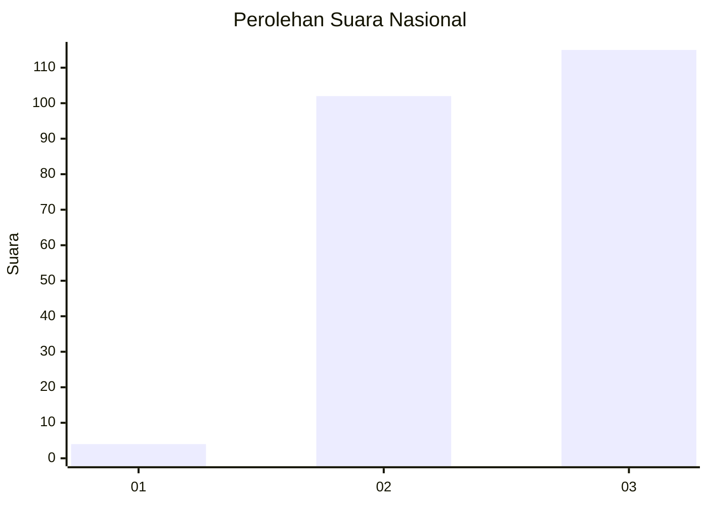
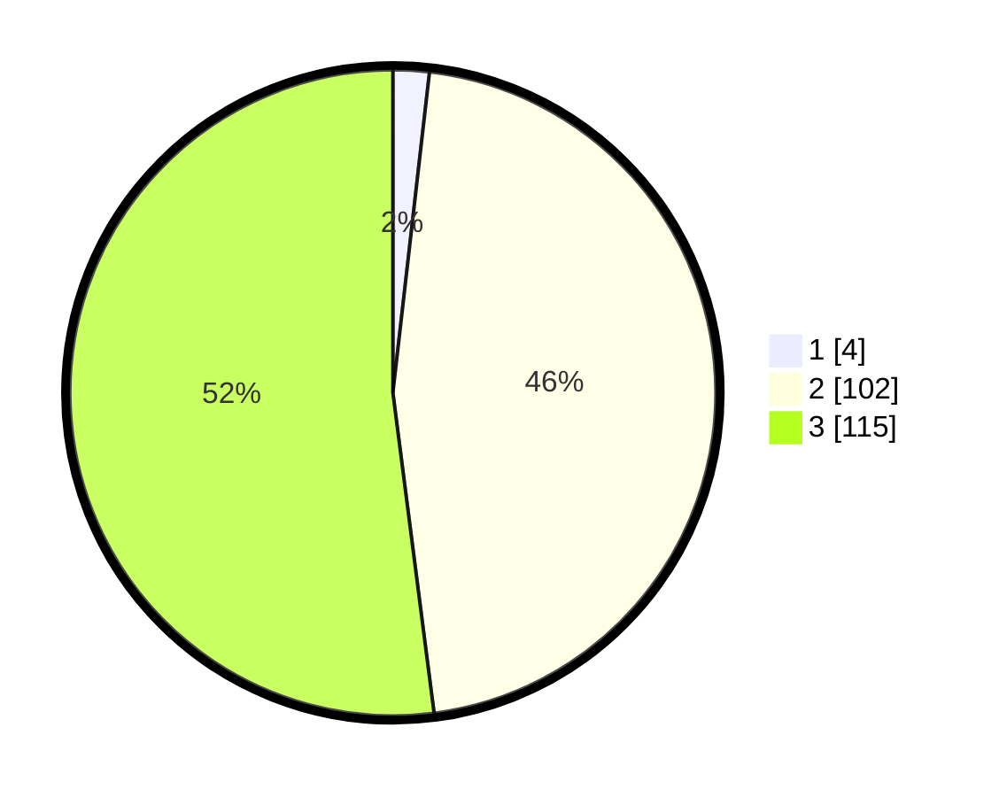

# Hasil

## Grafik

## Tabel

| No. | Nama Paslon    | Suara | Suara (raw) | Persentase |
|:--- |:-------------- | -----:| -----------:| ----------:|
| 1   | ANIES MUHAIMIN | 4     | [4][p-1]    | 1,81       |
| 2   | PRABOWO GIBRAN | 102   | [102][p-2]  | 46,15      |
| 3   | GANJAR MAHFUD  | 115   | [115][p-3]  | 52,04      |

[p-1]: https://github.com/gigit-pemilu/pemilu-2024/blob/main/pilpres/hitung-suara/sub/51-bali/sub/05-klungkung/sub/02-banjarangkan/sub/2001-negari/sub/002-tps/sub/paslon-1.txt
[p-2]: https://github.com/gigit-pemilu/pemilu-2024/blob/main/pilpres/hitung-suara/sub/51-bali/sub/05-klungkung/sub/02-banjarangkan/sub/2001-negari/sub/002-tps/sub/paslon-2.txt
[p-3]: https://github.com/gigit-pemilu/pemilu-2024/blob/main/pilpres/hitung-suara/sub/51-bali/sub/05-klungkung/sub/02-banjarangkan/sub/2001-negari/sub/002-tps/sub/paslon-3.txt

## Foto C Plano

https://sirekap-obj-formc.kpu.go.id/7509/pemilu/ppwp/51/05/02/20/01/5105022001002-20240216-005611--ced57dd3-4a7e-4b2a-800c-dae4b0c2864f.jpg

https://sirekap-obj-formc.kpu.go.id/7509/pemilu/ppwp/51/05/02/20/01/5105022001002-20240216-005616--e642a783-0959-42b4-9bd0-7a2439c9c8a0.jpg

https://sirekap-obj-formc.kpu.go.id/7509/pemilu/ppwp/51/05/02/20/01/5105022001002-20240216-005614--7e7325fe-aca6-4fb5-8f72-4f2c171968c2.jpg

## Metadata

| Key        | Value               |
| ---------- | ------------------- |
| Time Stamp | 2024-02-16 09:30:28 |

## DATA PEMILIH TETAP

Jumlah pemilih dalam DPT: **229**.
 * L: **117**.
 * P: **112**.

## DATA PENGGUNA HAK PILIH

Jumlah pengguna hak pilih dalam DPT: **229**.
 * L: **117**.
 * P: **112**.

Jumlah pengguna hak pilih dalam DPTb: **0**.
 * L: **0**.
 * P: **0**.

Jumlah pengguna hak pilih dalam DPK: **0**.
 * L: **0**.
 * P: **0**.

Jumlah pengguna hak pilih: **229**.
 * L: **117**.
 * P: **112**.

## JUMLAH SUARA SAH DAN TIDAK SAH

JUMLAH SELURUH SUARA SAH: **221**.

JUMLAH SUARA TIDAK SAH: **8**.

JUMLAH SELURUH SUARA SAH DAN SUARA TIDAK SAH: **229**.

