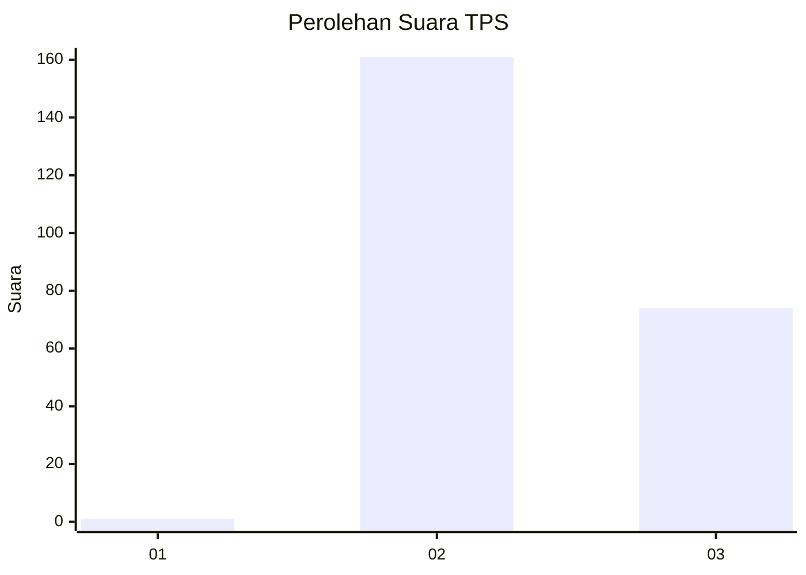
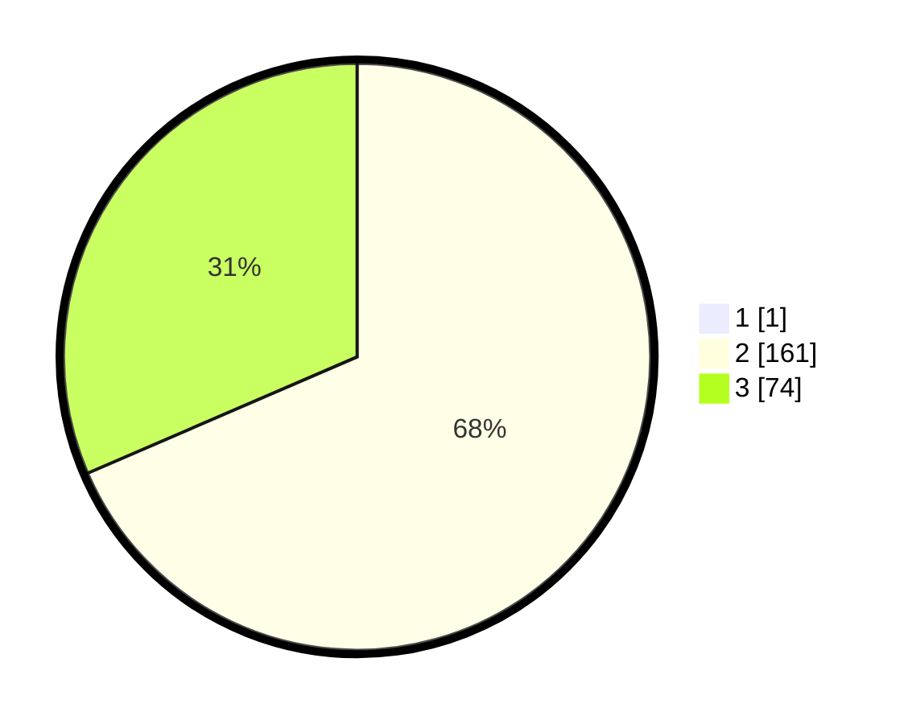

# Hasil

## Grafik

## Tabel

| No. | Nama Paslon    | Suara | Suara (raw) | Persentase |
|:--- |:-------------- | -----:| -----------:| ----------:|
| 1   | ANIES MUHAIMIN | 1     | [1][p-1]    | 0,42       |
| 2   | PRABOWO GIBRAN | 161   | [161][p-2]  | 68,22      |
| 3   | GANJAR MAHFUD  | 74    | [74][p-3]   | 31,36      |

[p-1]: https://github.com/gigit-pemilu/pemilu-2024-51-bali/blob/main/pilpres/hitung-suara/sub/51-bali/sub/05-klungkung/sub/02-banjarangkan/sub/2001-negari/sub/005-tps/sub/paslon-1.txt
[p-2]: https://github.com/gigit-pemilu/pemilu-2024-51-bali/blob/main/pilpres/hitung-suara/sub/51-bali/sub/05-klungkung/sub/02-banjarangkan/sub/2001-negari/sub/005-tps/sub/paslon-2.txt
[p-3]: https://github.com/gigit-pemilu/pemilu-2024-51-bali/blob/main/pilpres/hitung-suara/sub/51-bali/sub/05-klungkung/sub/02-banjarangkan/sub/2001-negari/sub/005-tps/sub/paslon-3.txt

## Foto C Plano

https://sirekap-obj-formc.kpu.go.id/49bd/pemilu/ppwp/51/05/02/20/01/5105022001005-20240214-224607--d38fcfe6-e381-4f00-a4cf-fe08d1a891ee.jpg

https://sirekap-obj-formc.kpu.go.id/49bd/pemilu/ppwp/51/05/02/20/01/5105022001005-20240214-232002--9545fc9d-acd1-45bd-9a37-16fc95696da2.jpg

https://sirekap-obj-formc.kpu.go.id/49bd/pemilu/ppwp/51/05/02/20/01/5105022001005-20240214-232308--f4dda50a-ba7e-4b46-82d3-6e41d0b48fad.jpg

## Metadata

| Key        | Value               |
| ---------- | ------------------- |
| Time Stamp | 2024-02-24 22:31:28 |

