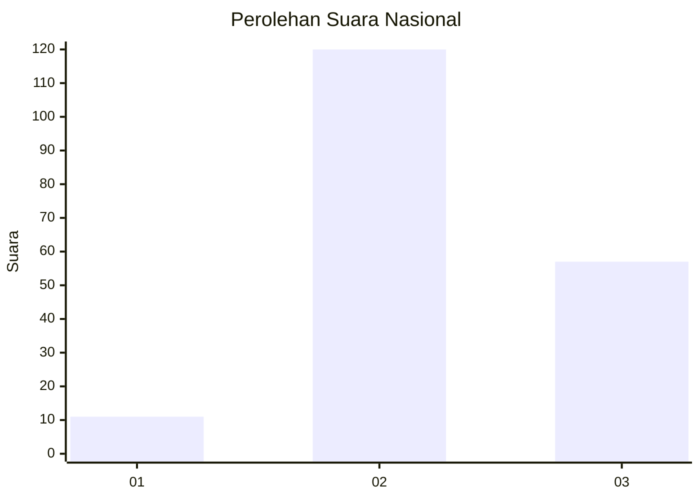
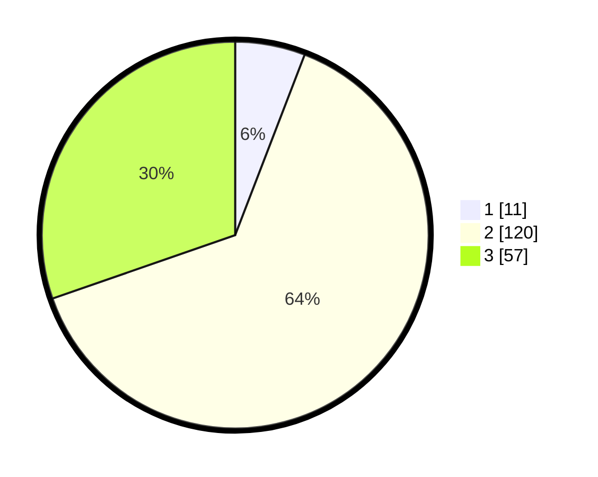

# Hasil

## Grafik

## Tabel

| No. | Nama Paslon    | Suara | Suara (raw) | Persentase |
|:--- |:-------------- | -----:| -----------:| ----------:|
| 1   | ANIES MUHAIMIN | 11    | [11][p-1]   | 5,85       |
| 2   | PRABOWO GIBRAN | 120   | [120][p-2]  | 63,83      |
| 3   | GANJAR MAHFUD  | 57    | [57][p-3]   | 30,32      |

[p-1]: https://github.com/gigit-pemilu/pemilu-2024/blob/main/pilpres/hitung-suara/sub/51-bali/sub/05-klungkung/sub/02-banjarangkan/sub/2001-negari/sub/007-tps/sub/paslon-1.txt
[p-2]: https://github.com/gigit-pemilu/pemilu-2024/blob/main/pilpres/hitung-suara/sub/51-bali/sub/05-klungkung/sub/02-banjarangkan/sub/2001-negari/sub/007-tps/sub/paslon-2.txt
[p-3]: https://github.com/gigit-pemilu/pemilu-2024/blob/main/pilpres/hitung-suara/sub/51-bali/sub/05-klungkung/sub/02-banjarangkan/sub/2001-negari/sub/007-tps/sub/paslon-3.txt

## Foto C Plano

https://sirekap-obj-formc.kpu.go.id/a5c3/pemilu/ppwp/51/05/02/20/01/5105022001007-20240216-145835--418856e6-66ef-42d9-a5d7-51236fdc420a.jpg

https://sirekap-obj-formc.kpu.go.id/a5c3/pemilu/ppwp/51/05/02/20/01/5105022001007-20240216-145837--1b105534-cd81-4f54-8144-79aaae83f4d7.jpg

https://sirekap-obj-formc.kpu.go.id/a5c3/pemilu/ppwp/51/05/02/20/01/5105022001007-20240216-145836--70437f4f-bea3-4a92-a30a-7138402ae895.jpg

## Metadata

| Key        | Value               |
| ---------- | ------------------- |
| Time Stamp | 2024-02-16 21:01:00 |

## DATA PEMILIH TETAP

Jumlah pemilih dalam DPT: **225**.
 * L: **109**.
 * P: **116**.

## DATA PENGGUNA HAK PILIH

Jumlah pengguna hak pilih dalam DPT: **191**.
 * L: **94**.
 * P: **97**.

Jumlah pengguna hak pilih dalam DPTb: **0**.
 * L: **0**.
 * P: **0**.

Jumlah pengguna hak pilih dalam DPK: **2**.
 * L: **2**.
 * P: **0**.

Jumlah pengguna hak pilih: **193**.
 * L: **96**.
 * P: **97**.

## JUMLAH SUARA SAH DAN TIDAK SAH

JUMLAH SELURUH SUARA SAH: **188**.

JUMLAH SUARA TIDAK SAH: **5**.

JUMLAH SELURUH SUARA SAH DAN SUARA TIDAK SAH: **193**.

