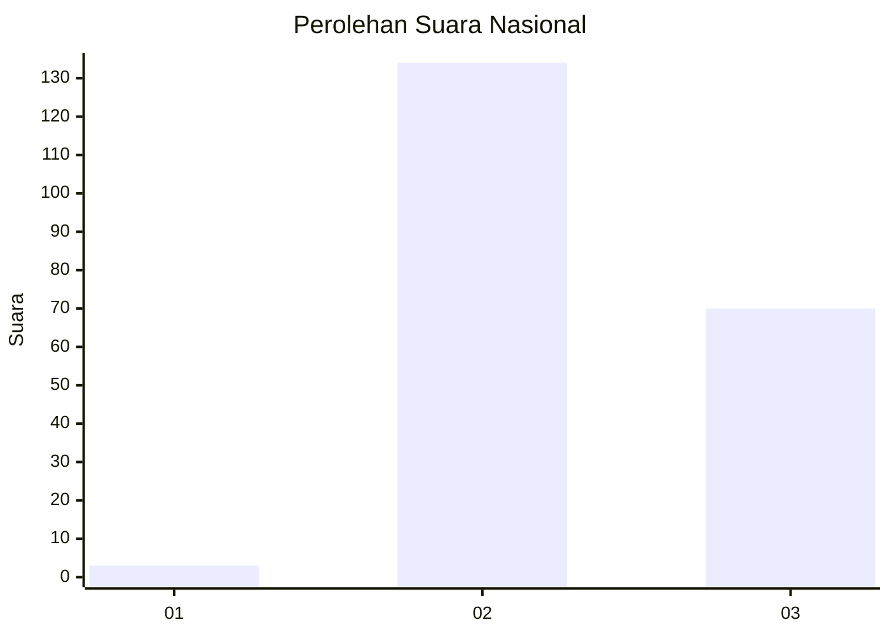
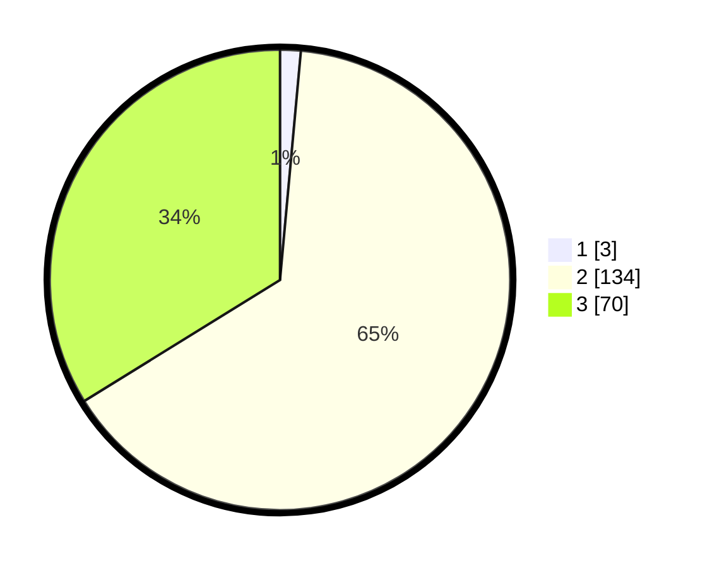

# Hasil

## Grafik

## Tabel

| No. | Nama Paslon    | Suara | Suara (raw) | Persentase |
|:--- |:-------------- | -----:| -----------:| ----------:|
| 1   | ANIES MUHAIMIN | 3     | [3][p-1]    | 1,45       |
| 2   | PRABOWO GIBRAN | 134   | [134][p-2]  | 64,73      |
| 3   | GANJAR MAHFUD  | 70    | [70][p-3]   | 33,82      |

[p-1]: https://github.com/gigit-pemilu/pemilu-2024/blob/main/pilpres/hitung-suara/sub/51-bali/sub/05-klungkung/sub/02-banjarangkan/sub/2001-negari/sub/008-tps/sub/paslon-1.txt
[p-2]: https://github.com/gigit-pemilu/pemilu-2024/blob/main/pilpres/hitung-suara/sub/51-bali/sub/05-klungkung/sub/02-banjarangkan/sub/2001-negari/sub/008-tps/sub/paslon-2.txt
[p-3]: https://github.com/gigit-pemilu/pemilu-2024/blob/main/pilpres/hitung-suara/sub/51-bali/sub/05-klungkung/sub/02-banjarangkan/sub/2001-negari/sub/008-tps/sub/paslon-3.txt

## Foto C Plano

https://sirekap-obj-formc.kpu.go.id/d127/pemilu/ppwp/51/05/02/20/01/5105022001008-20240216-151217--16c6874f-6f93-4f14-9ba1-5a22bc1b9866.jpg

https://sirekap-obj-formc.kpu.go.id/d127/pemilu/ppwp/51/05/02/20/01/5105022001008-20240216-151218--36e25b1b-1935-4bc3-99b9-f7aebd617d60.jpg

https://sirekap-obj-formc.kpu.go.id/d127/pemilu/ppwp/51/05/02/20/01/5105022001008-20240216-151217--108a9990-fe52-4e6f-8552-31021fdd81dc.jpg

## Metadata

| Key        | Value               |
| ---------- | ------------------- |
| Time Stamp | 2024-02-16 21:01:00 |

## DATA PEMILIH TETAP

Jumlah pemilih dalam DPT: **236**.
 * L: **112**.
 * P: **124**.

## DATA PENGGUNA HAK PILIH

Jumlah pengguna hak pilih dalam DPT: **212**.
 * L: **100**.
 * P: **112**.

Jumlah pengguna hak pilih dalam DPTb: **2**.
 * L: **1**.
 * P: **1**.

Jumlah pengguna hak pilih dalam DPK: **1**.
 * L: **1**.
 * P: **0**.

Jumlah pengguna hak pilih: **215**.
 * L: **102**.
 * P: **113**.

## JUMLAH SUARA SAH DAN TIDAK SAH

JUMLAH SELURUH SUARA SAH: **207**.

JUMLAH SUARA TIDAK SAH: **8**.

JUMLAH SELURUH SUARA SAH DAN SUARA TIDAK SAH: **215**.

