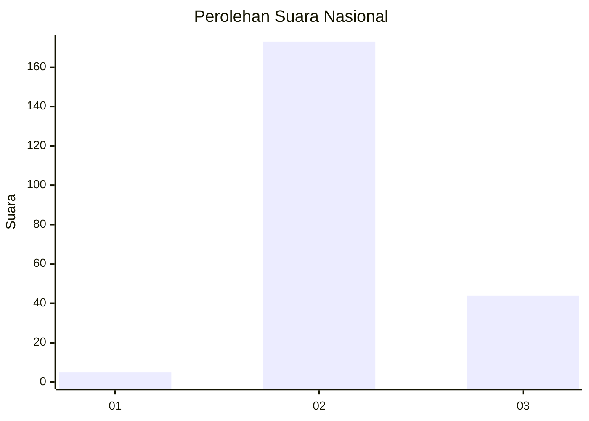

# Hasil

## Grafik

## Tabel

| No. | Nama Paslon    | Suara | Suara (raw) | Persentase |
|:--- |:-------------- | -----:| -----------:| ----------:|
| 1   | ANIES MUHAIMIN | 5     | [5][p-1]    | 2,25       |
| 2   | PRABOWO GIBRAN | 173   | [173][p-2]  | 77,93      |
| 3   | GANJAR MAHFUD  | 44    | [44][p-3]   | 19,82      |

[p-1]: https://github.com/gigit-pemilu/pemilu-2024/blob/main/pilpres/hitung-suara/sub/51-bali/sub/05-klungkung/sub/02-banjarangkan/sub/2002-takmung/sub/005-tps/sub/paslon-1.txt
[p-2]: https://github.com/gigit-pemilu/pemilu-2024/blob/main/pilpres/hitung-suara/sub/51-bali/sub/05-klungkung/sub/02-banjarangkan/sub/2002-takmung/sub/005-tps/sub/paslon-2.txt
[p-3]: https://github.com/gigit-pemilu/pemilu-2024/blob/main/pilpres/hitung-suara/sub/51-bali/sub/05-klungkung/sub/02-banjarangkan/sub/2002-takmung/sub/005-tps/sub/paslon-3.txt

## Foto C Plano

https://sirekap-obj-formc.kpu.go.id/f1a3/pemilu/ppwp/51/05/02/20/02/5105022002005-20240214-220942--5a8be8ab-e466-4ca3-968b-bd9849a45856.jpg

https://sirekap-obj-formc.kpu.go.id/f1a3/pemilu/ppwp/51/05/02/20/02/5105022002005-20240214-221127--44f0a6ff-0d16-4261-ac5c-c3c8efd10a83.jpg

https://sirekap-obj-formc.kpu.go.id/f1a3/pemilu/ppwp/51/05/02/20/02/5105022002005-20240214-221329--a82adec3-0162-4571-be9a-380bf62e9ba2.jpg

## Metadata

| Key        | Value               |
| ---------- | ------------------- |
| Time Stamp | 2024-02-16 12:51:22 |

## DATA PEMILIH TETAP

Jumlah pemilih dalam DPT: **295**.
 * L: **150**.
 * P: **145**.

## DATA PENGGUNA HAK PILIH

Jumlah pengguna hak pilih dalam DPT: **233**.
 * L: **118**.
 * P: **115**.

Jumlah pengguna hak pilih dalam DPTb: **0**.
 * L: **200**.
 * P: **0**.

Jumlah pengguna hak pilih dalam DPK: **0**.
 * L: **0**.
 * P: **0**.

Jumlah pengguna hak pilih: **233**.
 * L: **118**.
 * P: **115**.

## JUMLAH SUARA SAH DAN TIDAK SAH

JUMLAH SELURUH SUARA SAH: **222**.

JUMLAH SUARA TIDAK SAH: **11**.

JUMLAH SELURUH SUARA SAH DAN SUARA TIDAK SAH: **233**.

