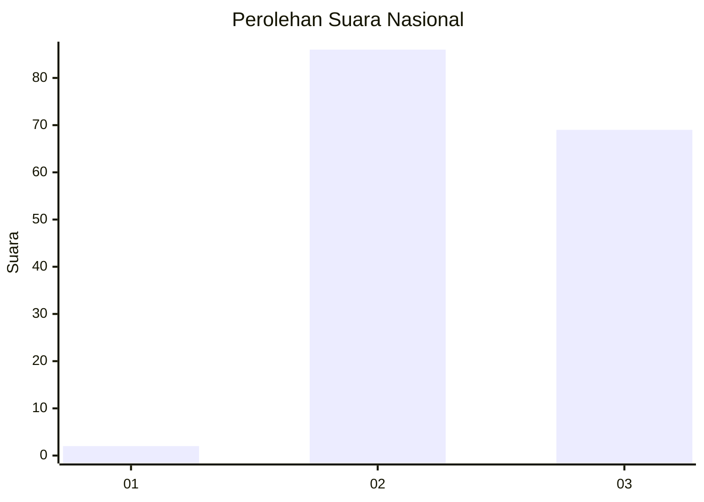
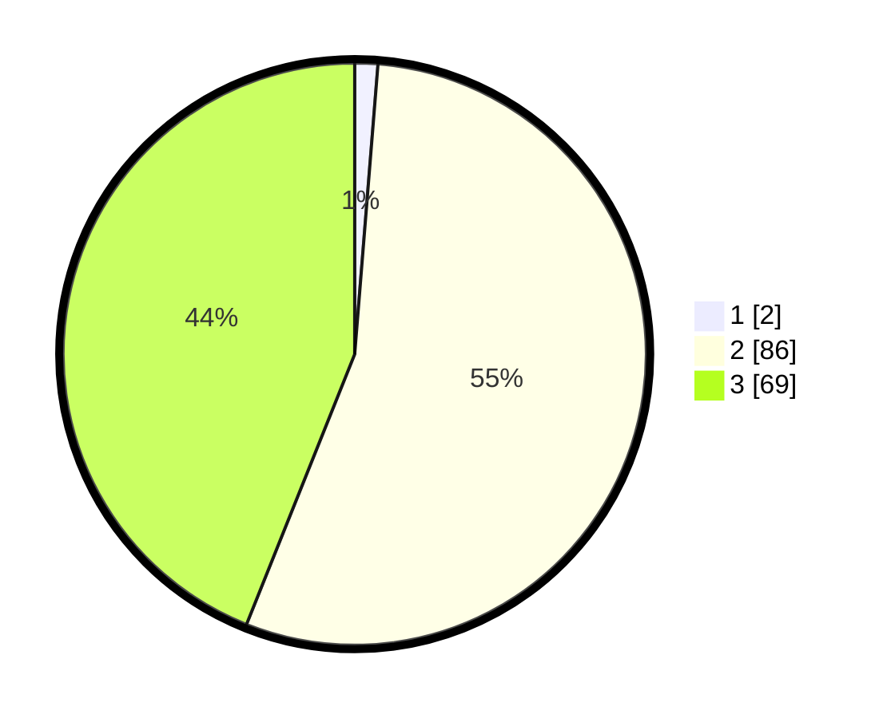

# Hasil

## Grafik

## Tabel

| No. | Nama Paslon    | Suara | Suara (raw) | Persentase |
|:--- |:-------------- | -----:| -----------:| ----------:|
| 1   | ANIES MUHAIMIN | 2     | [2][p-1]    | 1,27       |
| 2   | PRABOWO GIBRAN | 86    | [86][p-2]   | 54,78      |
| 3   | GANJAR MAHFUD  | 69    | [69][p-3]   | 43,95      |

[p-1]: https://github.com/gigit-pemilu/pemilu-2024/blob/main/pilpres/hitung-suara/sub/51-bali/sub/05-klungkung/sub/02-banjarangkan/sub/2002-takmung/sub/009-tps/sub/paslon-1.txt
[p-2]: https://github.com/gigit-pemilu/pemilu-2024/blob/main/pilpres/hitung-suara/sub/51-bali/sub/05-klungkung/sub/02-banjarangkan/sub/2002-takmung/sub/009-tps/sub/paslon-2.txt
[p-3]: https://github.com/gigit-pemilu/pemilu-2024/blob/main/pilpres/hitung-suara/sub/51-bali/sub/05-klungkung/sub/02-banjarangkan/sub/2002-takmung/sub/009-tps/sub/paslon-3.txt

## Foto C Plano

https://sirekap-obj-formc.kpu.go.id/96f3/pemilu/ppwp/51/05/02/20/02/5105022002009-20240214-131836--d41f8a5f-bd1a-4271-aaad-6bc959521d68.jpg

https://sirekap-obj-formc.kpu.go.id/96f3/pemilu/ppwp/51/05/02/20/02/5105022002009-20240214-131925--e29053d6-db39-4094-abf8-58e29dbc9549.jpg

https://sirekap-obj-formc.kpu.go.id/96f3/pemilu/ppwp/51/05/02/20/02/5105022002009-20240216-163019--76a37f85-ade0-43c3-88c4-296460897c62.jpg

## Metadata

| Key        | Value               |
| ---------- | ------------------- |
| Time Stamp | 2024-02-16 17:00:00 |

## DATA PEMILIH TETAP

Jumlah pemilih dalam DPT: **203**.
 * L: **106**.
 * P: **97**.

## DATA PENGGUNA HAK PILIH

Jumlah pengguna hak pilih dalam DPT: **158**.
 * L: **81**.
 * P: **77**.

Jumlah pengguna hak pilih dalam DPTb: **0**.
 * L: **0**.
 * P: **0**.

Jumlah pengguna hak pilih dalam DPK: **3**.
 * L: **1**.
 * P: **2**.

Jumlah pengguna hak pilih: **161**.
 * L: **82**.
 * P: **79**.

## JUMLAH SUARA SAH DAN TIDAK SAH

JUMLAH SELURUH SUARA SAH: **157**.

JUMLAH SUARA TIDAK SAH: **4**.

JUMLAH SELURUH SUARA SAH DAN SUARA TIDAK SAH: **161**.

