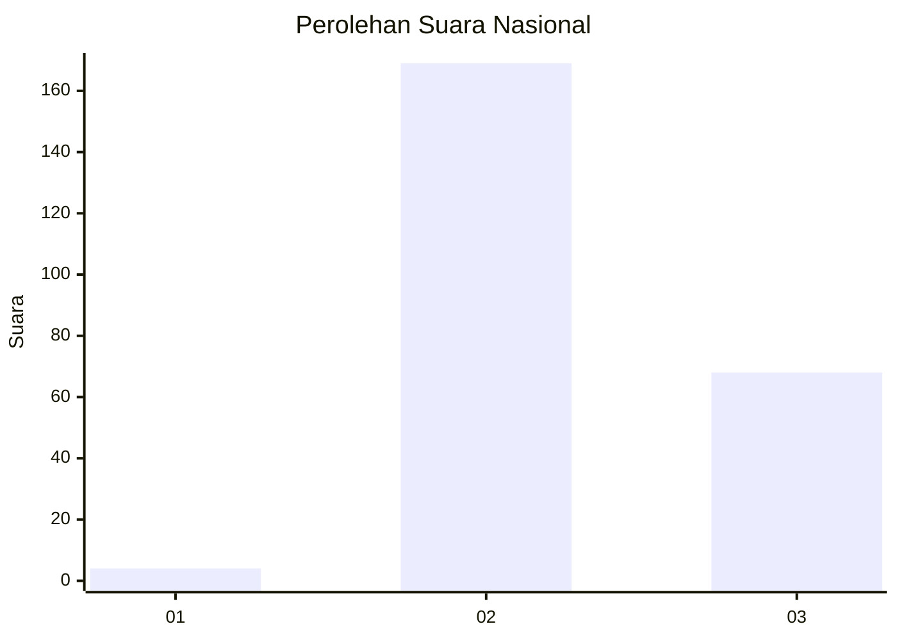
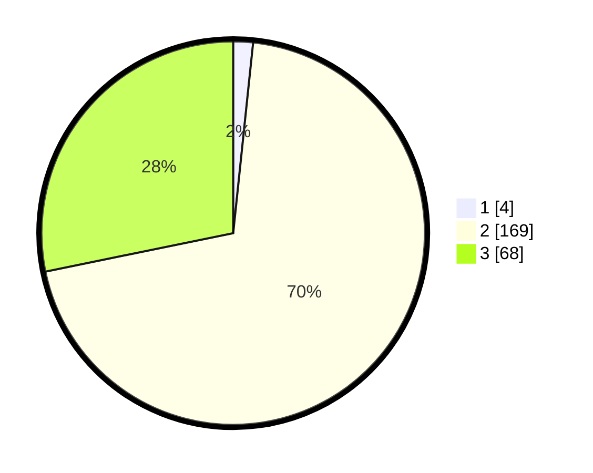

# Hasil

## Grafik

## Tabel

| No. | Nama Paslon    | Suara | Suara (raw) | Persentase |
|:--- |:-------------- | -----:| -----------:| ----------:|
| 1   | ANIES MUHAIMIN | 4     | [4][p-1]    | 1,66       |
| 2   | PRABOWO GIBRAN | 169   | [169][p-2]  | 70,12      |
| 3   | GANJAR MAHFUD  | 68    | [68][p-3]   | 28,22      |

[p-1]: https://github.com/gigit-pemilu/pemilu-2024/blob/main/pilpres/hitung-suara/sub/51-bali/sub/05-klungkung/sub/02-banjarangkan/sub/2003-banjarangkan/sub/009-tps/sub/paslon-1.txt
[p-2]: https://github.com/gigit-pemilu/pemilu-2024/blob/main/pilpres/hitung-suara/sub/51-bali/sub/05-klungkung/sub/02-banjarangkan/sub/2003-banjarangkan/sub/009-tps/sub/paslon-2.txt
[p-3]: https://github.com/gigit-pemilu/pemilu-2024/blob/main/pilpres/hitung-suara/sub/51-bali/sub/05-klungkung/sub/02-banjarangkan/sub/2003-banjarangkan/sub/009-tps/sub/paslon-3.txt

## Foto C Plano

https://sirekap-obj-formc.kpu.go.id/e4a0/pemilu/ppwp/51/05/02/20/03/5105022003009-20240214-141240--1c7abba8-e281-4a30-9091-6c1e765f7e3e.jpg

https://sirekap-obj-formc.kpu.go.id/e4a0/pemilu/ppwp/51/05/02/20/03/5105022003009-20240214-141144--1b0014af-0839-4d22-9c79-7d648407de9c.jpg

https://sirekap-obj-formc.kpu.go.id/e4a0/pemilu/ppwp/51/05/02/20/03/5105022003009-20240214-224854--c9510af4-0ea6-4d07-a1ce-21185d75ebe7.jpg

## Metadata

| Key        | Value               |
| ---------- | ------------------- |
| Time Stamp | 2024-02-15 15:00:29 |

