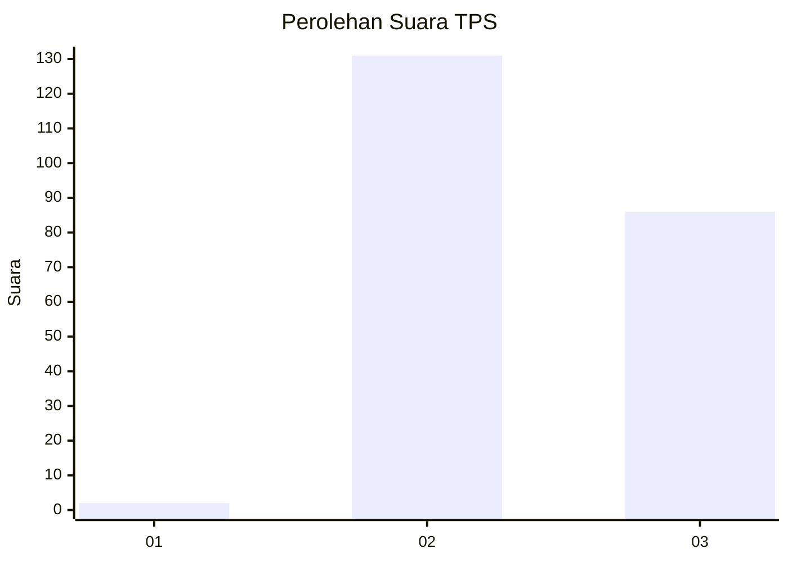
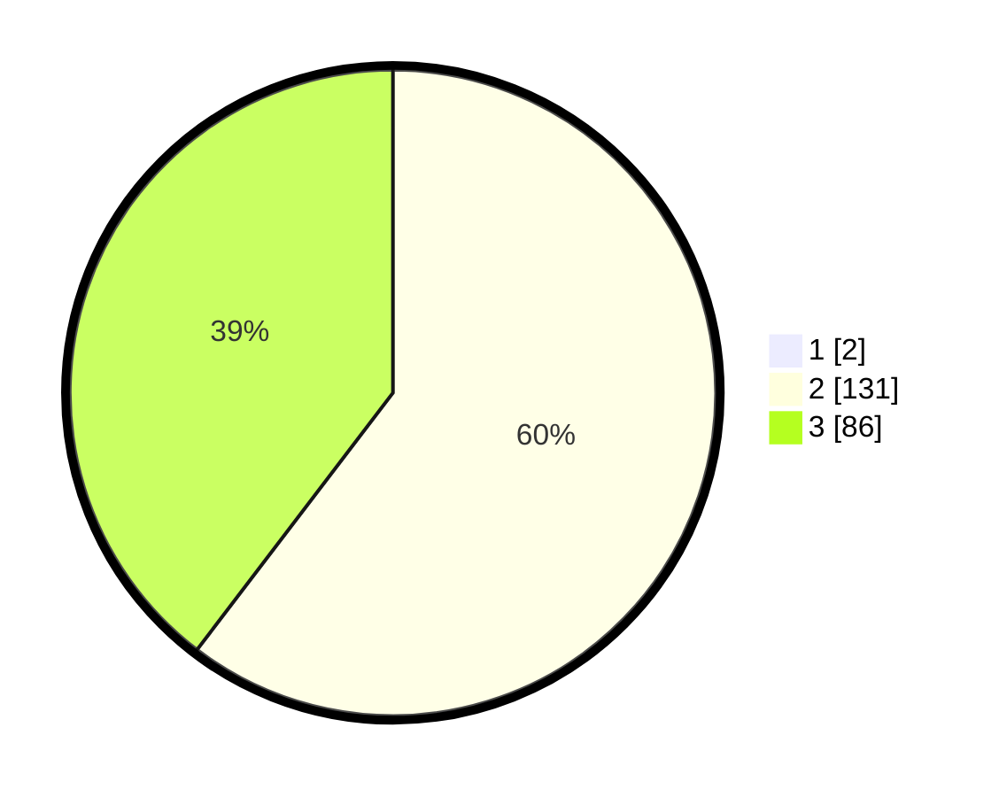

# Hasil

## Grafik

## Tabel

| No. | Nama Paslon    | Suara | Suara (raw) | Persentase |
|:--- |:-------------- | -----:| -----------:| ----------:|
| 1   | ANIES MUHAIMIN | 2     | [2][p-1]    | 0,91       |
| 2   | PRABOWO GIBRAN | 131   | [131][p-2]  | 59,82      |
| 3   | GANJAR MAHFUD  | 86    | [86][p-3]   | 39,27      |

[p-1]: https://github.com/gigit-pemilu/pemilu-2024-51-bali/blob/main/pilpres/hitung-suara/sub/51-bali/sub/05-klungkung/sub/02-banjarangkan/sub/2004-tusan/sub/003-tps/sub/paslon-1.txt
[p-2]: https://github.com/gigit-pemilu/pemilu-2024-51-bali/blob/main/pilpres/hitung-suara/sub/51-bali/sub/05-klungkung/sub/02-banjarangkan/sub/2004-tusan/sub/003-tps/sub/paslon-2.txt
[p-3]: https://github.com/gigit-pemilu/pemilu-2024-51-bali/blob/main/pilpres/hitung-suara/sub/51-bali/sub/05-klungkung/sub/02-banjarangkan/sub/2004-tusan/sub/003-tps/sub/paslon-3.txt

## Foto C Plano

https://sirekap-obj-formc.kpu.go.id/cbc9/pemilu/ppwp/51/05/02/20/04/5105022004003-20240214-205144--4e4e593e-a8bd-49f0-9398-cac11fd50bc5.jpg

https://sirekap-obj-formc.kpu.go.id/cbc9/pemilu/ppwp/51/05/02/20/04/5105022004003-20240214-205301--b7114ba2-11d6-4448-9b7b-009558e54c58.jpg

https://sirekap-obj-formc.kpu.go.id/cbc9/pemilu/ppwp/51/05/02/20/04/5105022004003-20240214-205313--3ce2990a-c787-42f4-890c-204d2575ce83.jpg

## Metadata

| Key        | Value               |
| ---------- | ------------------- |
| Time Stamp | 2024-02-15 15:00:29 |

