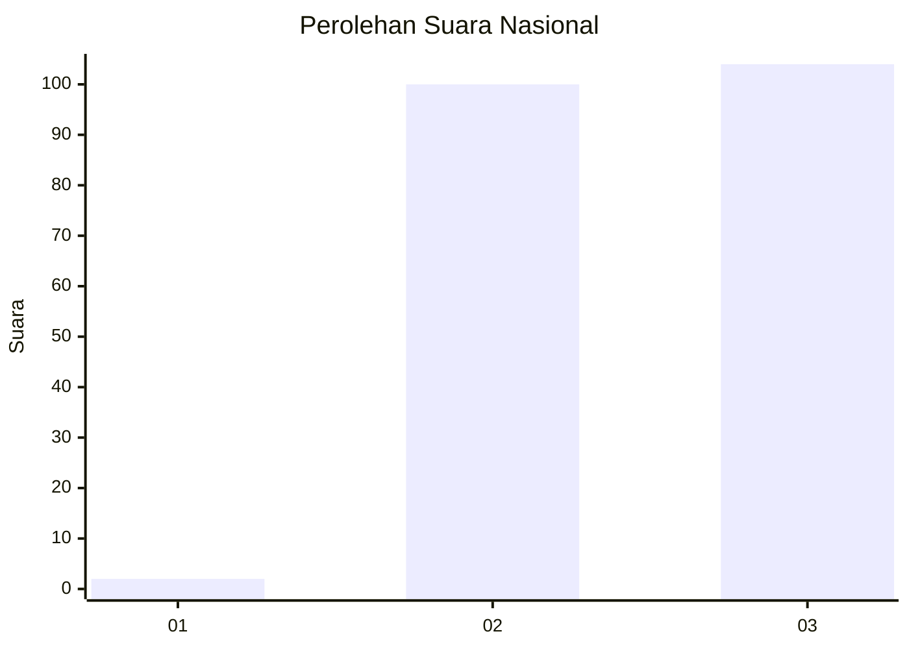
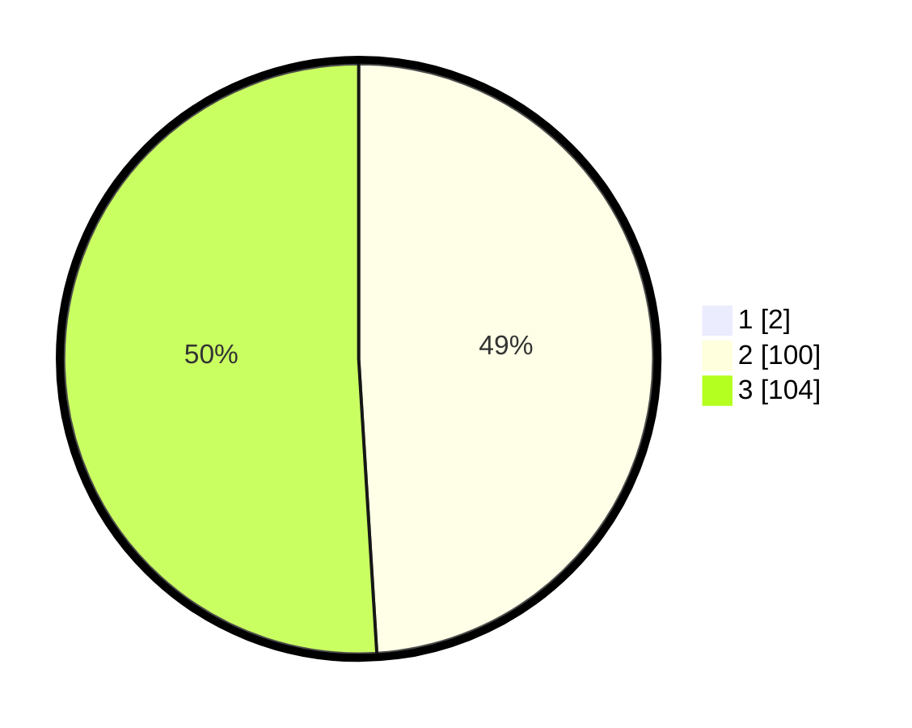

# Hasil

## Grafik

## Tabel

| No. | Nama Paslon    | Suara | Suara (raw) | Persentase |
|:--- |:-------------- | -----:| -----------:| ----------:|
| 1   | ANIES MUHAIMIN | 2     | [2][p-1]    | 0,97       |
| 2   | PRABOWO GIBRAN | 100   | [100][p-2]  | 48,54      |
| 3   | GANJAR MAHFUD  | 104   | [104][p-3]  | 50,49      |

[p-1]: https://github.com/gigit-pemilu/pemilu-2024/blob/main/pilpres/hitung-suara/sub/51-bali/sub/05-klungkung/sub/02-banjarangkan/sub/2004-tusan/sub/007-tps/sub/paslon-1.txt
[p-2]: https://github.com/gigit-pemilu/pemilu-2024/blob/main/pilpres/hitung-suara/sub/51-bali/sub/05-klungkung/sub/02-banjarangkan/sub/2004-tusan/sub/007-tps/sub/paslon-2.txt
[p-3]: https://github.com/gigit-pemilu/pemilu-2024/blob/main/pilpres/hitung-suara/sub/51-bali/sub/05-klungkung/sub/02-banjarangkan/sub/2004-tusan/sub/007-tps/sub/paslon-3.txt

## Foto C Plano

https://sirekap-obj-formc.kpu.go.id/078f/pemilu/ppwp/51/05/02/20/04/5105022004007-20240214-155216--d0916281-dddd-4758-b298-662bec27daf8.jpg

https://sirekap-obj-formc.kpu.go.id/078f/pemilu/ppwp/51/05/02/20/04/5105022004007-20240214-155223--38bf88f8-521d-461d-951f-1b4033b9f78d.jpg

https://sirekap-obj-formc.kpu.go.id/078f/pemilu/ppwp/51/05/02/20/04/5105022004007-20240214-155229--6f2a9458-ee3a-40d9-b06f-6a4602857a34.jpg

## Metadata

| Key        | Value               |
| ---------- | ------------------- |
| Time Stamp | 2024-02-16 21:01:00 |

