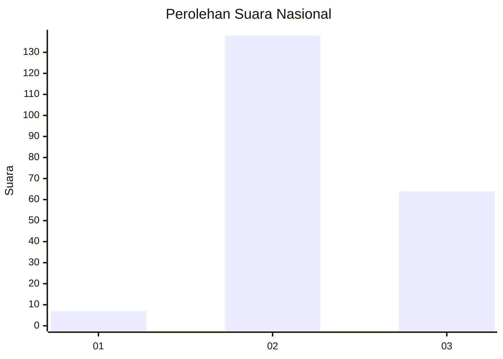

# Hasil

## Grafik

## Tabel

| No. | Nama Paslon    | Suara | Suara (raw) | Persentase |
|:--- |:-------------- | -----:| -----------:| ----------:|
| 1   | ANIES MUHAIMIN | 7     | [7][p-1]    | 3,35       |
| 2   | PRABOWO GIBRAN | 138   | [138][p-2]  | 66,03      |
| 3   | GANJAR MAHFUD  | 64    | [64][p-3]   | 30,62      |

[p-1]: https://github.com/gigit-pemilu/pemilu-2024/blob/main/pilpres/hitung-suara/sub/51-bali/sub/05-klungkung/sub/02-banjarangkan/sub/2006-getakan/sub/005-tps/sub/paslon-1.txt
[p-2]: https://github.com/gigit-pemilu/pemilu-2024/blob/main/pilpres/hitung-suara/sub/51-bali/sub/05-klungkung/sub/02-banjarangkan/sub/2006-getakan/sub/005-tps/sub/paslon-2.txt
[p-3]: https://github.com/gigit-pemilu/pemilu-2024/blob/main/pilpres/hitung-suara/sub/51-bali/sub/05-klungkung/sub/02-banjarangkan/sub/2006-getakan/sub/005-tps/sub/paslon-3.txt

## Foto C Plano

https://sirekap-obj-formc.kpu.go.id/af78/pemilu/ppwp/51/05/02/20/06/5105022006005-20240214-191623--3361e6ae-ecc7-482f-a550-fe71a9e3a517.jpg

https://sirekap-obj-formc.kpu.go.id/af78/pemilu/ppwp/51/05/02/20/06/5105022006005-20240214-194020--c1eaebd6-8e62-4983-8dfd-ba3d61958a86.jpg

## Metadata

| Key        | Value               |
| ---------- | ------------------- |
| Time Stamp | 2024-02-25 14:00:00 |

