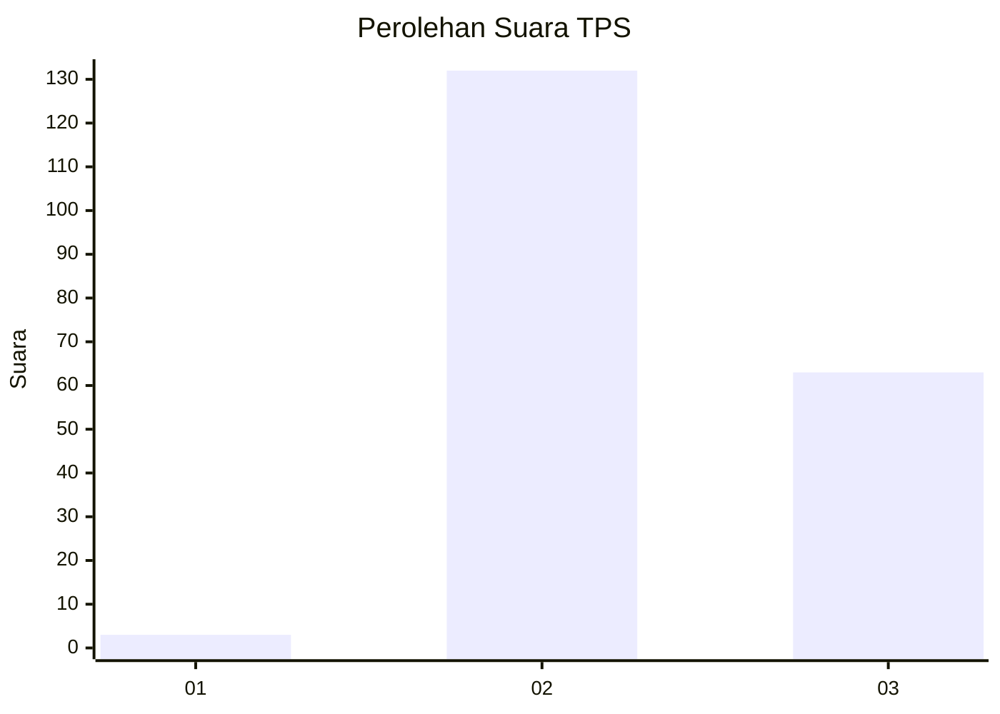
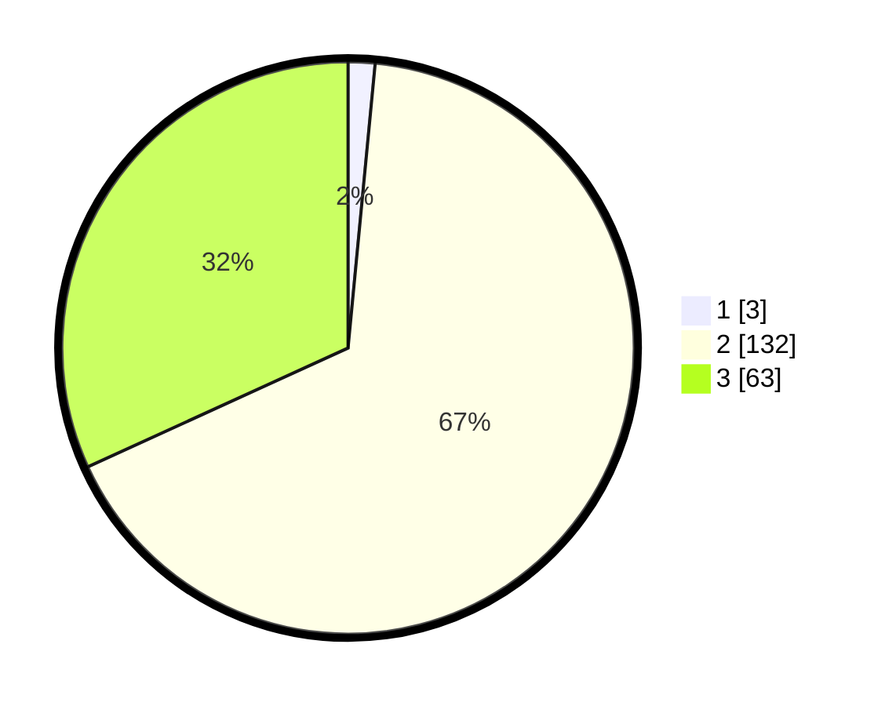

# Hasil

## Grafik

## Tabel

| No. | Nama Paslon    | Suara | Suara (raw) | Persentase |
|:--- |:-------------- | -----:| -----------:| ----------:|
| 1   | ANIES MUHAIMIN | 3     | [3][p-1]    | 1,52       |
| 2   | PRABOWO GIBRAN | 132   | [132][p-2]  | 66,67      |
| 3   | GANJAR MAHFUD  | 63    | [63][p-3]   | 31,82      |

[p-1]: https://github.com/gigit-pemilu/pemilu-2024-51-bali/blob/main/pilpres/hitung-suara/sub/51-bali/sub/05-klungkung/sub/02-banjarangkan/sub/2006-getakan/sub/007-tps/sub/paslon-1.txt
[p-2]: https://github.com/gigit-pemilu/pemilu-2024-51-bali/blob/main/pilpres/hitung-suara/sub/51-bali/sub/05-klungkung/sub/02-banjarangkan/sub/2006-getakan/sub/007-tps/sub/paslon-2.txt
[p-3]: https://github.com/gigit-pemilu/pemilu-2024-51-bali/blob/main/pilpres/hitung-suara/sub/51-bali/sub/05-klungkung/sub/02-banjarangkan/sub/2006-getakan/sub/007-tps/sub/paslon-3.txt

## Foto C Plano

https://sirekap-obj-formc.kpu.go.id/ed38/pemilu/ppwp/51/05/02/20/06/5105022006007-20240214-141542--374f54ae-f922-4f30-87be-5ef53e925c98.jpg

https://sirekap-obj-formc.kpu.go.id/ed38/pemilu/ppwp/51/05/02/20/06/5105022006007-20240214-141734--3b5c66dc-e647-4552-b404-8fddaecfcfb9.jpg

https://sirekap-obj-formc.kpu.go.id/ed38/pemilu/ppwp/51/05/02/20/06/5105022006007-20240214-141821--801eefc9-b1e9-4d3e-a693-748fd10b9420.jpg

## Metadata

| Key        | Value               |
| ---------- | ------------------- |
| Time Stamp | 2024-02-15 19:00:26 |

