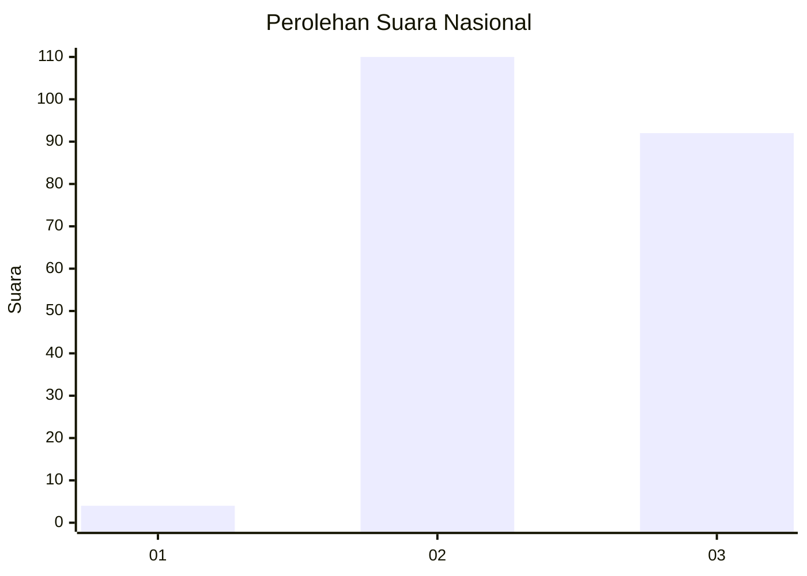
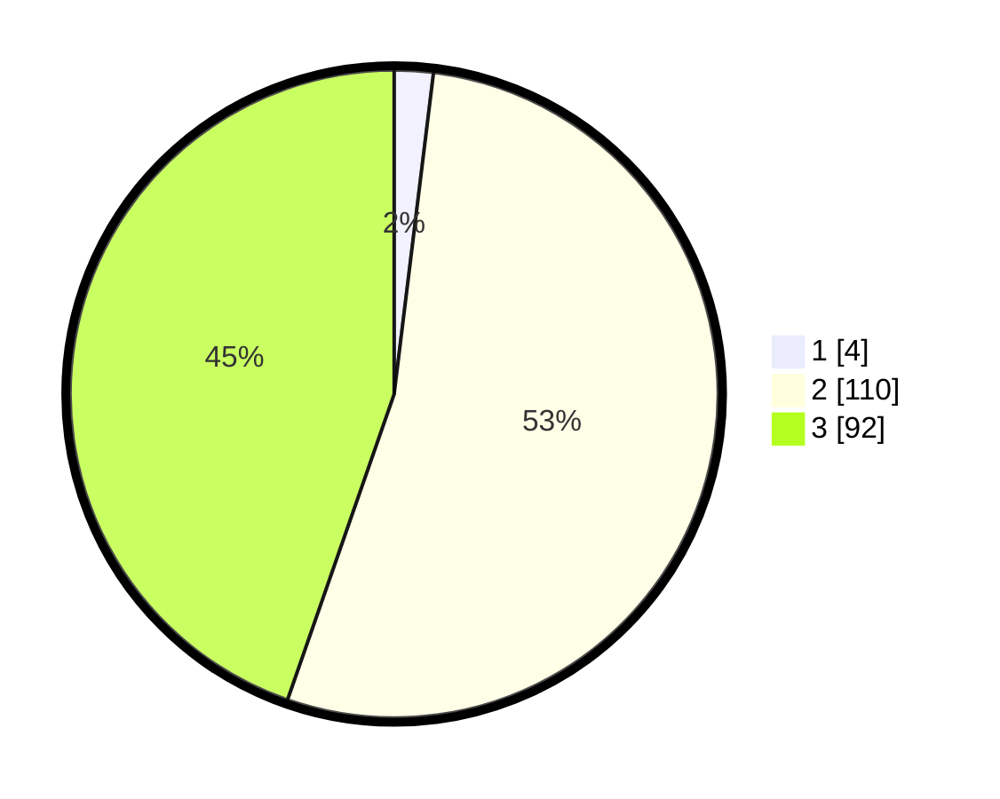

# Hasil

## Grafik

## Tabel

| No. | Nama Paslon    | Suara | Suara (raw) | Persentase |
|:--- |:-------------- | -----:| -----------:| ----------:|
| 1   | ANIES MUHAIMIN | 4     | [4][p-1]    | 1,94       |
| 2   | PRABOWO GIBRAN | 110   | [110][p-2]  | 53,40      |
| 3   | GANJAR MAHFUD  | 92    | [92][p-3]   | 44,66      |

[p-1]: https://github.com/gigit-pemilu/pemilu-2024/blob/main/pilpres/hitung-suara/sub/51-bali/sub/05-klungkung/sub/02-banjarangkan/sub/2007-tihingan/sub/003-tps/sub/paslon-1.txt
[p-2]: https://github.com/gigit-pemilu/pemilu-2024/blob/main/pilpres/hitung-suara/sub/51-bali/sub/05-klungkung/sub/02-banjarangkan/sub/2007-tihingan/sub/003-tps/sub/paslon-2.txt
[p-3]: https://github.com/gigit-pemilu/pemilu-2024/blob/main/pilpres/hitung-suara/sub/51-bali/sub/05-klungkung/sub/02-banjarangkan/sub/2007-tihingan/sub/003-tps/sub/paslon-3.txt

## Foto C Plano

https://sirekap-obj-formc.kpu.go.id/9735/pemilu/ppwp/51/05/02/20/07/5105022007003-20240214-193012--0a87ebfa-f540-4390-a07a-2a42f733a436.jpg

https://sirekap-obj-formc.kpu.go.id/9735/pemilu/ppwp/51/05/02/20/07/5105022007003-20240214-192844--e74c405f-adb2-4c67-af5a-2c515617a265.jpg

## Metadata

| Key        | Value               |
| ---------- | ------------------- |
| Time Stamp | 2024-02-15 19:00:26 |

