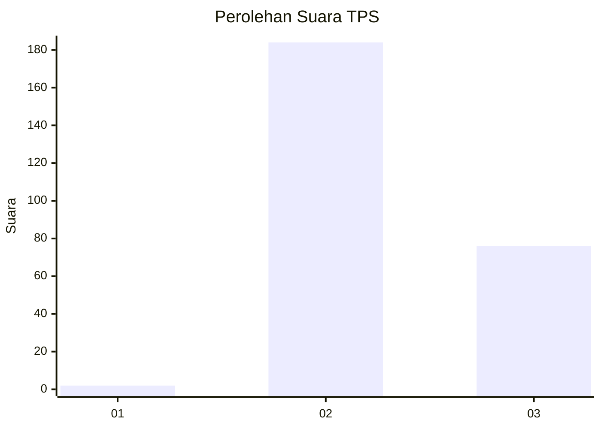
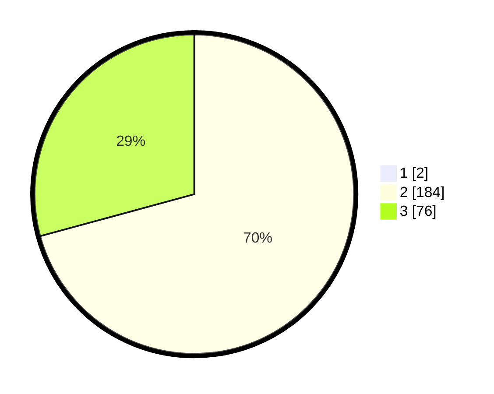

# Hasil

## Grafik

## Tabel

| No. | Nama Paslon    | Suara | Suara (raw) | Persentase |
|:--- |:-------------- | -----:| -----------:| ----------:|
| 1   | ANIES MUHAIMIN | 2     | [2][p-1]    | 0,76       |
| 2   | PRABOWO GIBRAN | 184   | [184][p-2]  | 70,23      |
| 3   | GANJAR MAHFUD  | 76    | [76][p-3]   | 29,01      |

[p-1]: https://github.com/gigit-pemilu/pemilu-2024-51-bali/blob/main/pilpres/hitung-suara/sub/51-bali/sub/05-klungkung/sub/02-banjarangkan/sub/2007-tihingan/sub/007-tps/sub/paslon-1.txt
[p-2]: https://github.com/gigit-pemilu/pemilu-2024-51-bali/blob/main/pilpres/hitung-suara/sub/51-bali/sub/05-klungkung/sub/02-banjarangkan/sub/2007-tihingan/sub/007-tps/sub/paslon-2.txt
[p-3]: https://github.com/gigit-pemilu/pemilu-2024-51-bali/blob/main/pilpres/hitung-suara/sub/51-bali/sub/05-klungkung/sub/02-banjarangkan/sub/2007-tihingan/sub/007-tps/sub/paslon-3.txt

## Foto C Plano

https://sirekap-obj-formc.kpu.go.id/eac9/pemilu/ppwp/51/05/02/20/07/5105022007007-20240214-234909--cc18f1bd-f4e5-4001-9331-68ba042b83d7.jpg

https://sirekap-obj-formc.kpu.go.id/eac9/pemilu/ppwp/51/05/02/20/07/5105022007007-20240214-235153--0f920623-4f86-4501-af73-59b46a93dcdb.jpg

https://sirekap-obj-formc.kpu.go.id/eac9/pemilu/ppwp/51/05/02/20/07/5105022007007-20240214-235321--13c5bbfc-1cec-42f4-a5ec-560b77d56f28.jpg

## Metadata

| Key        | Value               |
| ---------- | ------------------- |
| Time Stamp | 2024-02-15 19:00:26 |

