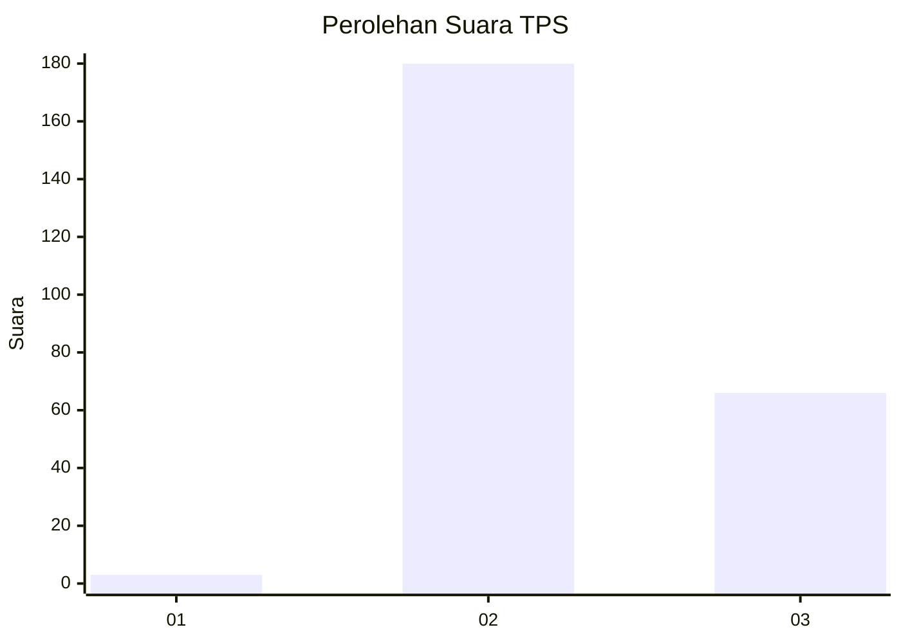
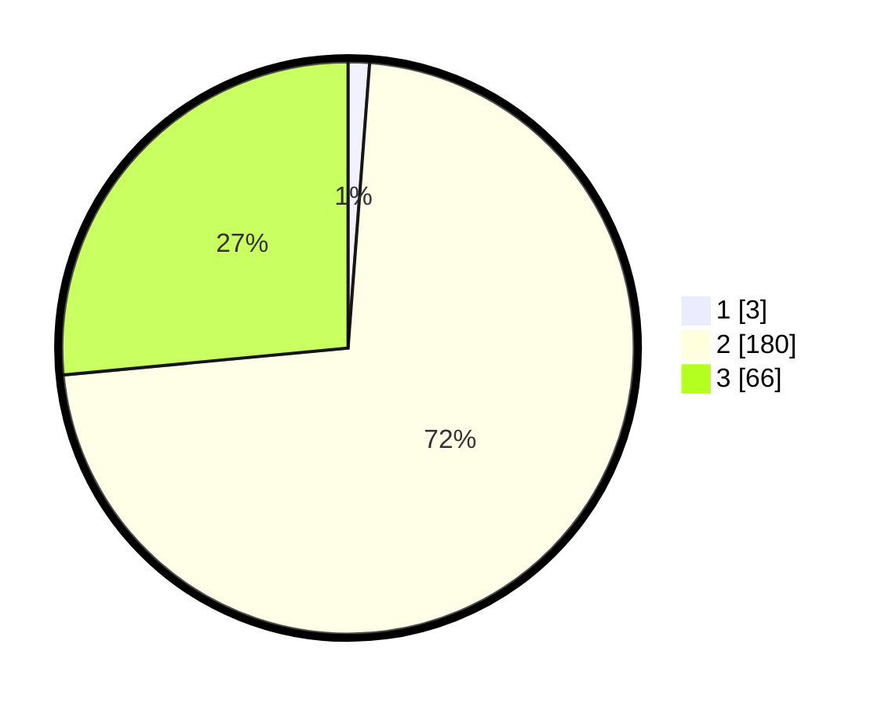

# Hasil

## Grafik

## Tabel

| No. | Nama Paslon    | Suara | Suara (raw) | Persentase |
|:--- |:-------------- | -----:| -----------:| ----------:|
| 1   | ANIES MUHAIMIN | 3     | [3][p-1]    | 1,20       |
| 2   | PRABOWO GIBRAN | 180   | [180][p-2]  | 72,29      |
| 3   | GANJAR MAHFUD  | 66    | [66][p-3]   | 26,51      |

[p-1]: https://github.com/gigit-pemilu/pemilu-2024-51-bali/blob/main/pilpres/hitung-suara/sub/51-bali/sub/05-klungkung/sub/02-banjarangkan/sub/2007-tihingan/sub/008-tps/sub/paslon-1.txt
[p-2]: https://github.com/gigit-pemilu/pemilu-2024-51-bali/blob/main/pilpres/hitung-suara/sub/51-bali/sub/05-klungkung/sub/02-banjarangkan/sub/2007-tihingan/sub/008-tps/sub/paslon-2.txt
[p-3]: https://github.com/gigit-pemilu/pemilu-2024-51-bali/blob/main/pilpres/hitung-suara/sub/51-bali/sub/05-klungkung/sub/02-banjarangkan/sub/2007-tihingan/sub/008-tps/sub/paslon-3.txt

## Foto C Plano

https://sirekap-obj-formc.kpu.go.id/ec4b/pemilu/ppwp/51/05/02/20/07/5105022007008-20240217-073241--998d8ca2-2146-4ebc-b9b9-3088b775284d.jpg

https://sirekap-obj-formc.kpu.go.id/ec4b/pemilu/ppwp/51/05/02/20/07/5105022007008-20240217-073250--672a0d56-17c6-408f-9f70-88f9afbfb2ee.jpg

https://sirekap-obj-formc.kpu.go.id/ec4b/pemilu/ppwp/51/05/02/20/07/5105022007008-20240217-083113--3ad24b11-4d12-43d2-9715-bc5eb1b2f077.jpg

## Metadata

| Key        | Value               |
| ---------- | ------------------- |
| Time Stamp | 2024-02-19 11:00:00 |

