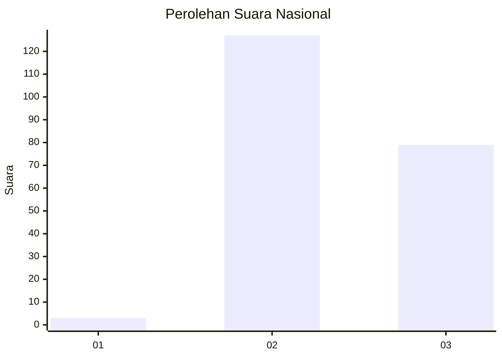
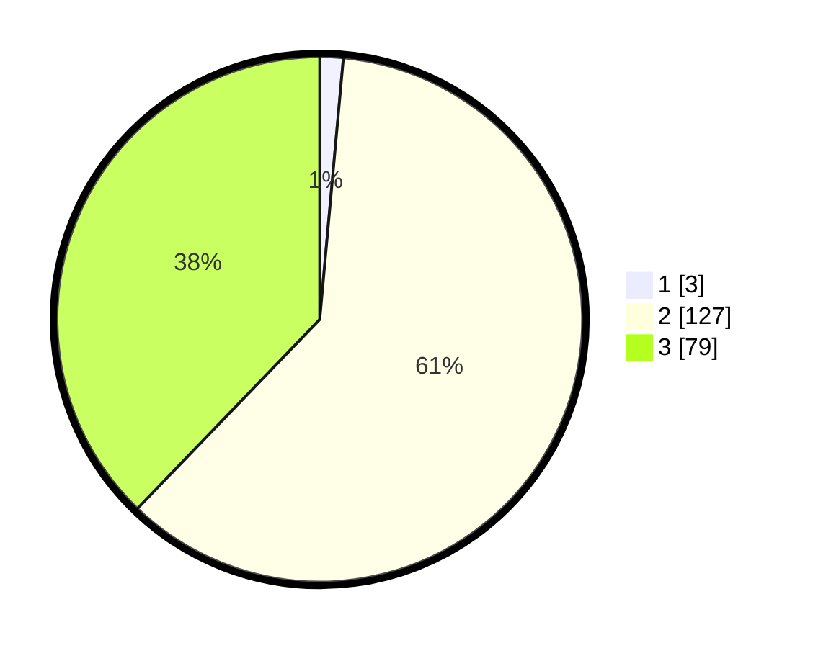

# Hasil

## Grafik

## Tabel

| No. | Nama Paslon    | Suara | Suara (raw) | Persentase |
|:--- |:-------------- | -----:| -----------:| ----------:|
| 1   | ANIES MUHAIMIN | 3     | [3][p-1]    | 1,44       |
| 2   | PRABOWO GIBRAN | 127   | [127][p-2]  | 60,77      |
| 3   | GANJAR MAHFUD  | 79    | [79][p-3]   | 37,80      |

[p-1]: https://github.com/gigit-pemilu/pemilu-2024/blob/main/pilpres/hitung-suara/sub/51-bali/sub/05-klungkung/sub/02-banjarangkan/sub/2007-tihingan/sub/009-tps/sub/paslon-1.txt
[p-2]: https://github.com/gigit-pemilu/pemilu-2024/blob/main/pilpres/hitung-suara/sub/51-bali/sub/05-klungkung/sub/02-banjarangkan/sub/2007-tihingan/sub/009-tps/sub/paslon-2.txt
[p-3]: https://github.com/gigit-pemilu/pemilu-2024/blob/main/pilpres/hitung-suara/sub/51-bali/sub/05-klungkung/sub/02-banjarangkan/sub/2007-tihingan/sub/009-tps/sub/paslon-3.txt

## Foto C Plano

https://sirekap-obj-formc.kpu.go.id/c9b1/pemilu/ppwp/51/05/02/20/07/5105022007009-20240214-141604--9b64562f-b417-4db8-9f8d-2fd92117060f.jpg

https://sirekap-obj-formc.kpu.go.id/c9b1/pemilu/ppwp/51/05/02/20/07/5105022007009-20240214-141746--9d83ddf5-f6ef-438d-8452-f575ef73c174.jpg

https://sirekap-obj-formc.kpu.go.id/c9b1/pemilu/ppwp/51/05/02/20/07/5105022007009-20240214-141900--23ce3029-c939-4993-a4e7-f63a6295f838.jpg

## Metadata

| Key        | Value               |
| ---------- | ------------------- |
| Time Stamp | 2024-02-15 19:00:26 |

