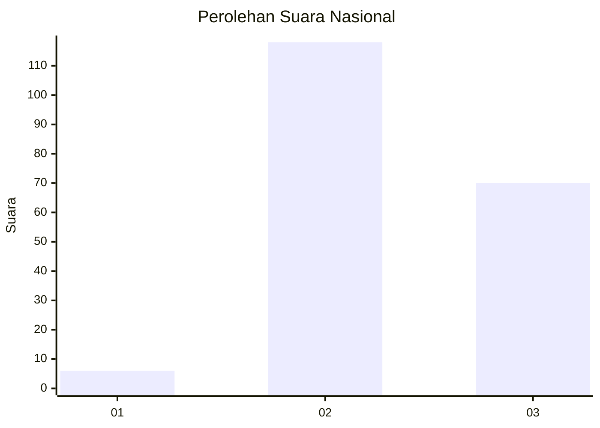
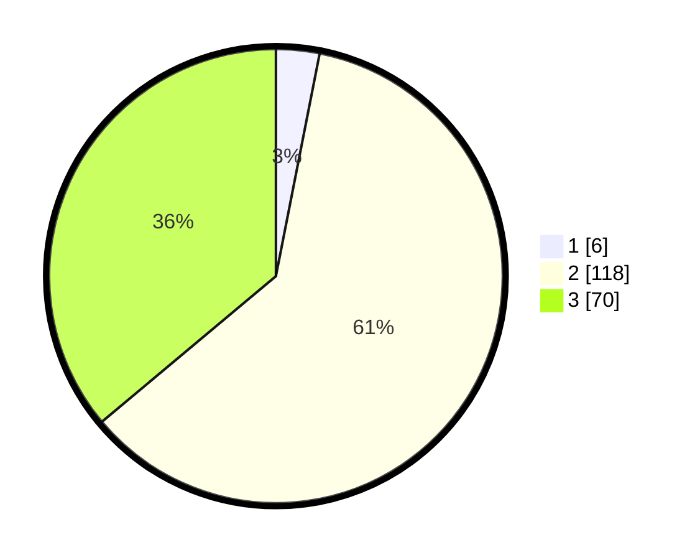

# Hasil

## Grafik

## Tabel

| No. | Nama Paslon    | Suara | Suara (raw) | Persentase |
|:--- |:-------------- | -----:| -----------:| ----------:|
| 1   | ANIES MUHAIMIN | 6     | [6][p-1]    | 3,09       |
| 2   | PRABOWO GIBRAN | 118   | [118][p-2]  | 60,82      |
| 3   | GANJAR MAHFUD  | 70    | [70][p-3]   | 36,08      |

[p-1]: https://github.com/gigit-pemilu/pemilu-2024/blob/main/pilpres/hitung-suara/sub/51-bali/sub/05-klungkung/sub/02-banjarangkan/sub/2007-tihingan/sub/011-tps/sub/paslon-1.txt
[p-2]: https://github.com/gigit-pemilu/pemilu-2024/blob/main/pilpres/hitung-suara/sub/51-bali/sub/05-klungkung/sub/02-banjarangkan/sub/2007-tihingan/sub/011-tps/sub/paslon-2.txt
[p-3]: https://github.com/gigit-pemilu/pemilu-2024/blob/main/pilpres/hitung-suara/sub/51-bali/sub/05-klungkung/sub/02-banjarangkan/sub/2007-tihingan/sub/011-tps/sub/paslon-3.txt

## Foto C Plano

https://sirekap-obj-formc.kpu.go.id/cbfd/pemilu/ppwp/51/05/02/20/07/5105022007011-20240215-122841--23e87fe9-d3fe-46c7-a652-bb188da7323f.jpg

https://sirekap-obj-formc.kpu.go.id/cbfd/pemilu/ppwp/51/05/02/20/07/5105022007011-20240215-122842--5a263c42-dc97-4933-99b7-65fdb83e1fe9.jpg

https://sirekap-obj-formc.kpu.go.id/cbfd/pemilu/ppwp/51/05/02/20/07/5105022007011-20240215-122841--ff6bda2a-81c4-4dc9-b98c-831d44532a2c.jpg

## Metadata

| Key        | Value               |
| ---------- | ------------------- |
| Time Stamp | 2024-02-15 15:00:29 |

## DATA PEMILIH TETAP

Jumlah pemilih dalam DPT: **249**.
 * L: **123**.
 * P: **126**.

## DATA PENGGUNA HAK PILIH

Jumlah pengguna hak pilih dalam DPT: **210**.
 * L: **101**.
 * P: **109**.

Jumlah pengguna hak pilih dalam DPTb: **1**.
 * L: **0**.
 * P: **1**.

Jumlah pengguna hak pilih dalam DPK: **0**.
 * L: **0**.
 * P: **0**.

Jumlah pengguna hak pilih: **211**.
 * L: **101**.
 * P: **110**.

## JUMLAH SUARA SAH DAN TIDAK SAH

JUMLAH SELURUH SUARA SAH: **194**.

JUMLAH SUARA TIDAK SAH: **17**.

JUMLAH SELURUH SUARA SAH DAN SUARA TIDAK SAH: **211**.

