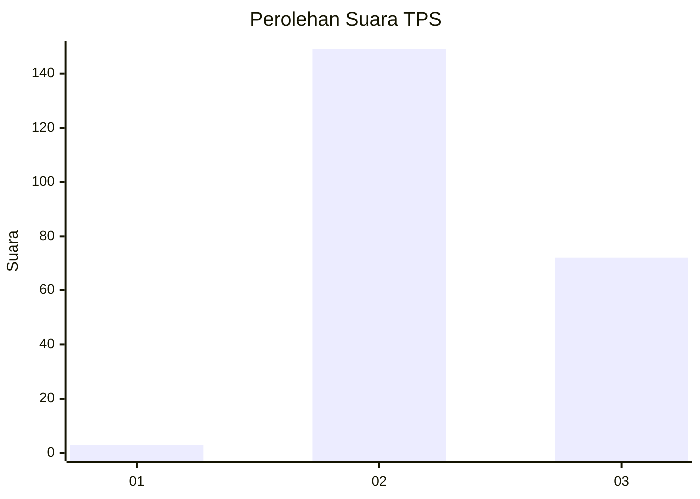
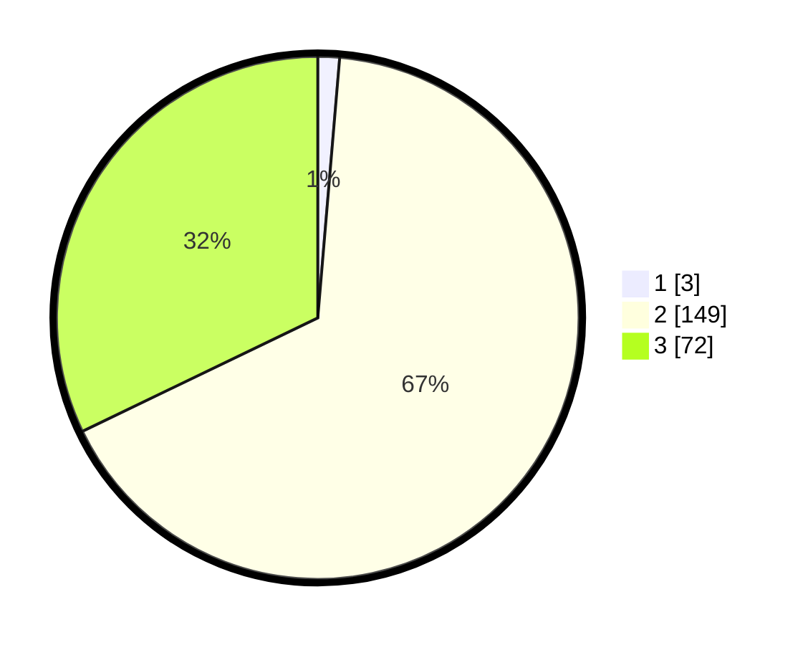

# Hasil

## Grafik

## Tabel

| No. | Nama Paslon    | Suara | Suara (raw) | Persentase |
|:--- |:-------------- | -----:| -----------:| ----------:|
| 1   | ANIES MUHAIMIN | 3     | [3][p-1]    | 1,34       |
| 2   | PRABOWO GIBRAN | 149   | [149][p-2]  | 66,52      |
| 3   | GANJAR MAHFUD  | 72    | [72][p-3]   | 32,14      |

[p-1]: https://github.com/gigit-pemilu/pemilu-2024-51-bali/blob/main/pilpres/hitung-suara/sub/51-bali/sub/05-klungkung/sub/02-banjarangkan/sub/2008-aan/sub/003-tps/sub/paslon-1.txt
[p-2]: https://github.com/gigit-pemilu/pemilu-2024-51-bali/blob/main/pilpres/hitung-suara/sub/51-bali/sub/05-klungkung/sub/02-banjarangkan/sub/2008-aan/sub/003-tps/sub/paslon-2.txt
[p-3]: https://github.com/gigit-pemilu/pemilu-2024-51-bali/blob/main/pilpres/hitung-suara/sub/51-bali/sub/05-klungkung/sub/02-banjarangkan/sub/2008-aan/sub/003-tps/sub/paslon-3.txt

## Foto C Plano

https://sirekap-obj-formc.kpu.go.id/953d/pemilu/ppwp/51/05/02/20/08/5105022008003-20240214-223852--5f300b81-8a4e-40ec-b6d2-df7bf732e99c.jpg

https://sirekap-obj-formc.kpu.go.id/953d/pemilu/ppwp/51/05/02/20/08/5105022008003-20240214-223901--60fc0a92-d50d-496d-95af-5cb3c444b3e5.jpg

https://sirekap-obj-formc.kpu.go.id/953d/pemilu/ppwp/51/05/02/20/08/5105022008003-20240214-223911--19eb7ad1-07f7-49c6-8e28-62116f390f59.jpg

## Metadata

| Key        | Value               |
| ---------- | ------------------- |
| Time Stamp | 2024-02-15 19:00:26 |

