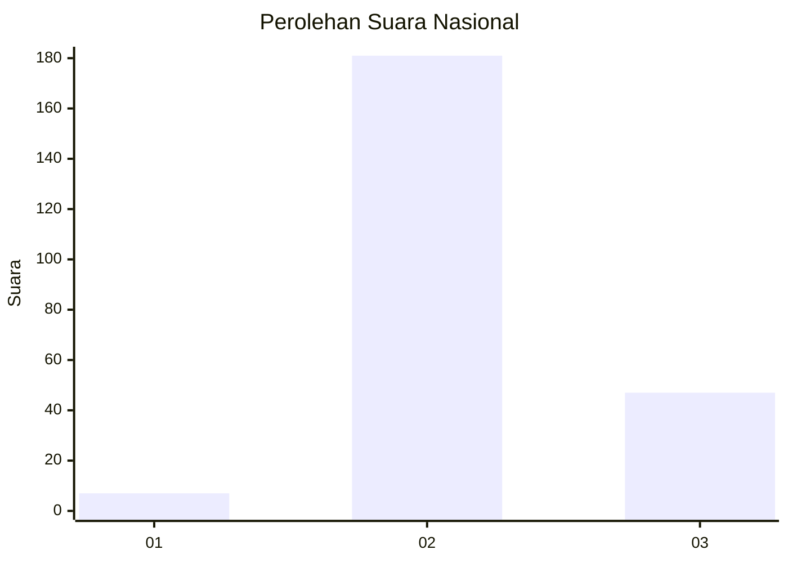

# Hasil

## Grafik

## Tabel

| No. | Nama Paslon    | Suara | Suara (raw) | Persentase |
|:--- |:-------------- | -----:| -----------:| ----------:|
| 1   | ANIES MUHAIMIN | 7     | [7][p-1]    | 2,98       |
| 2   | PRABOWO GIBRAN | 181   | [181][p-2]  | 77,02      |
| 3   | GANJAR MAHFUD  | 47    | [47][p-3]   | 20,00      |

[p-1]: https://github.com/gigit-pemilu/pemilu-2024/blob/main/pilpres/hitung-suara/sub/51-bali/sub/05-klungkung/sub/02-banjarangkan/sub/2008-aan/sub/006-tps/sub/paslon-1.txt
[p-2]: https://github.com/gigit-pemilu/pemilu-2024/blob/main/pilpres/hitung-suara/sub/51-bali/sub/05-klungkung/sub/02-banjarangkan/sub/2008-aan/sub/006-tps/sub/paslon-2.txt
[p-3]: https://github.com/gigit-pemilu/pemilu-2024/blob/main/pilpres/hitung-suara/sub/51-bali/sub/05-klungkung/sub/02-banjarangkan/sub/2008-aan/sub/006-tps/sub/paslon-3.txt

## Foto C Plano

https://sirekap-obj-formc.kpu.go.id/c1a6/pemilu/ppwp/51/05/02/20/08/5105022008006-20240216-142244--a5b2168e-294d-4248-a240-43d2204cbbfa.jpg

https://sirekap-obj-formc.kpu.go.id/c1a6/pemilu/ppwp/51/05/02/20/08/5105022008006-20240216-142245--c188eb7d-219c-4cae-8ccf-fc7fcd3a0a4c.jpg

https://sirekap-obj-formc.kpu.go.id/c1a6/pemilu/ppwp/51/05/02/20/08/5105022008006-20240216-142244--e9ddfaa0-fde2-4ade-bc71-c2a05f6679c2.jpg

## Metadata

| Key        | Value               |
| ---------- | ------------------- |
| Time Stamp | 2024-02-16 21:01:00 |

## DATA PEMILIH TETAP

Jumlah pemilih dalam DPT: **270**.
 * L: **132**.
 * P: **138**.

## DATA PENGGUNA HAK PILIH

Jumlah pengguna hak pilih dalam DPT: **250**.
 * L: **126**.
 * P: **124**.

Jumlah pengguna hak pilih dalam DPTb: **0**.
 * L: **0**.
 * P: **0**.

Jumlah pengguna hak pilih dalam DPK: **2**.
 * L: **1**.
 * P: **1**.

Jumlah pengguna hak pilih: **252**.
 * L: **127**.
 * P: **125**.

## JUMLAH SUARA SAH DAN TIDAK SAH

JUMLAH SELURUH SUARA SAH: **235**.

JUMLAH SUARA TIDAK SAH: **17**.

JUMLAH SELURUH SUARA SAH DAN SUARA TIDAK SAH: **252**.

