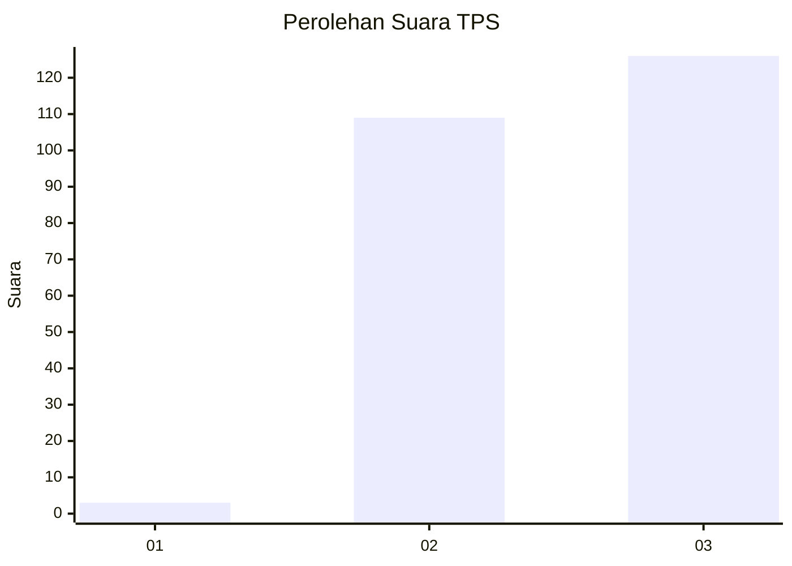
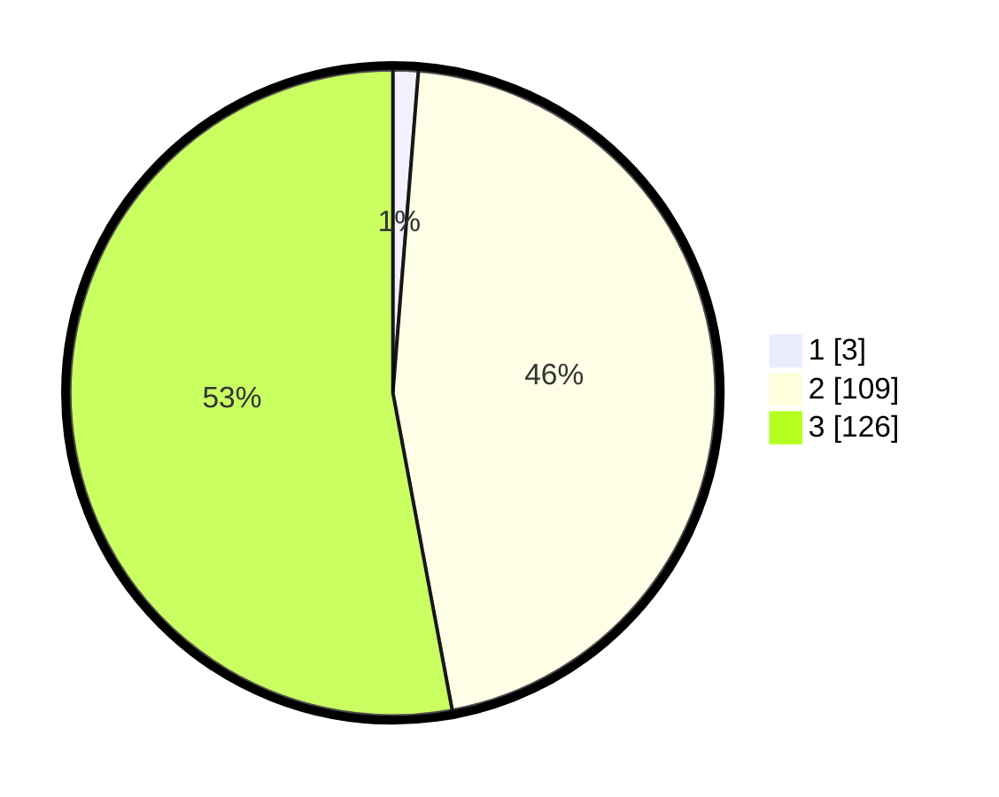

# Hasil

## Grafik

## Tabel

| No. | Nama Paslon    | Suara | Suara (raw) | Persentase |
|:--- |:-------------- | -----:| -----------:| ----------:|
| 1   | ANIES MUHAIMIN | 3     | [3][p-1]    | 1,26       |
| 2   | PRABOWO GIBRAN | 109   | [109][p-2]  | 45,80      |
| 3   | GANJAR MAHFUD  | 126   | [126][p-3]  | 52,94      |

[p-1]: https://github.com/gigit-pemilu/pemilu-2024-51-bali/blob/main/pilpres/hitung-suara/sub/51-bali/sub/05-klungkung/sub/02-banjarangkan/sub/2009-nyalian/sub/002-tps/sub/paslon-1.txt
[p-2]: https://github.com/gigit-pemilu/pemilu-2024-51-bali/blob/main/pilpres/hitung-suara/sub/51-bali/sub/05-klungkung/sub/02-banjarangkan/sub/2009-nyalian/sub/002-tps/sub/paslon-2.txt
[p-3]: https://github.com/gigit-pemilu/pemilu-2024-51-bali/blob/main/pilpres/hitung-suara/sub/51-bali/sub/05-klungkung/sub/02-banjarangkan/sub/2009-nyalian/sub/002-tps/sub/paslon-3.txt

## Foto C Plano

https://sirekap-obj-formc.kpu.go.id/c8bc/pemilu/ppwp/51/05/02/20/09/5105022009002-20240215-024255--f4581f69-18d9-4753-9a45-9f477e16871d.jpg

https://sirekap-obj-formc.kpu.go.id/c8bc/pemilu/ppwp/51/05/02/20/09/5105022009002-20240215-025005--aee857fa-a107-4f7e-8133-700d492c5456.jpg

https://sirekap-obj-formc.kpu.go.id/c8bc/pemilu/ppwp/51/05/02/20/09/5105022009002-20240215-025210--7942cbfd-3de0-46db-92aa-9eb91e28b097.jpg

## Metadata

| Key        | Value               |
| ---------- | ------------------- |
| Time Stamp | 2024-02-15 20:30:46 |

