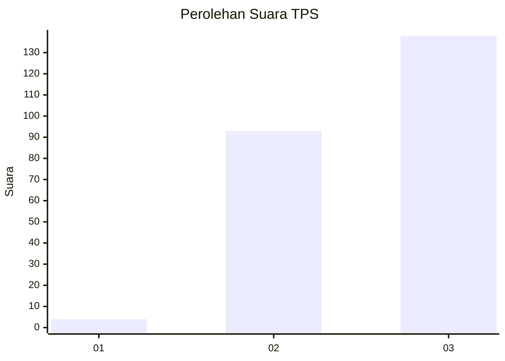
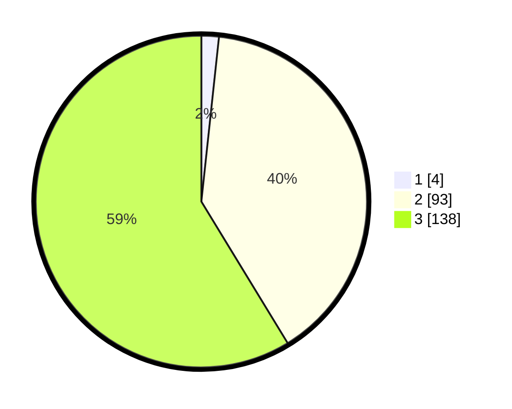

# Hasil

## Grafik

## Tabel

| No. | Nama Paslon    | Suara | Suara (raw) | Persentase |
|:--- |:-------------- | -----:| -----------:| ----------:|
| 1   | ANIES MUHAIMIN | 4     | [4][p-1]    | 1,70       |
| 2   | PRABOWO GIBRAN | 93    | [93][p-2]   | 39,57      |
| 3   | GANJAR MAHFUD  | 138   | [138][p-3]  | 58,72      |

[p-1]: https://github.com/gigit-pemilu/pemilu-2024-51-bali/blob/main/pilpres/hitung-suara/sub/51-bali/sub/05-klungkung/sub/02-banjarangkan/sub/2009-nyalian/sub/005-tps/sub/paslon-1.txt
[p-2]: https://github.com/gigit-pemilu/pemilu-2024-51-bali/blob/main/pilpres/hitung-suara/sub/51-bali/sub/05-klungkung/sub/02-banjarangkan/sub/2009-nyalian/sub/005-tps/sub/paslon-2.txt
[p-3]: https://github.com/gigit-pemilu/pemilu-2024-51-bali/blob/main/pilpres/hitung-suara/sub/51-bali/sub/05-klungkung/sub/02-banjarangkan/sub/2009-nyalian/sub/005-tps/sub/paslon-3.txt

## Foto C Plano

https://sirekap-obj-formc.kpu.go.id/d933/pemilu/ppwp/51/05/02/20/09/5105022009005-20240214-230516--915e4f76-469a-4c85-8184-b86820420b7a.jpg

https://sirekap-obj-formc.kpu.go.id/d933/pemilu/ppwp/51/05/02/20/09/5105022009005-20240214-230718--d63b79c8-2a51-4b96-8d13-860614d100e1.jpg

https://sirekap-obj-formc.kpu.go.id/d933/pemilu/ppwp/51/05/02/20/09/5105022009005-20240214-231040--c4623733-c899-4798-9f2e-75f422aab8c2.jpg

## Metadata

| Key        | Value               |
| ---------- | ------------------- |
| Time Stamp | 2024-02-15 19:00:26 |

