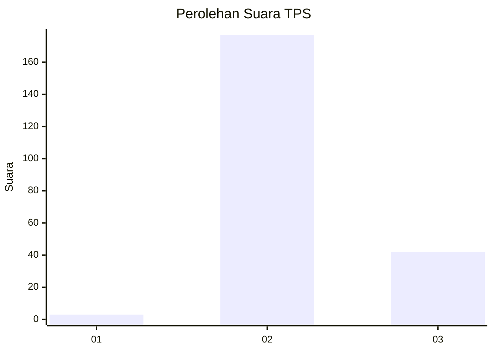
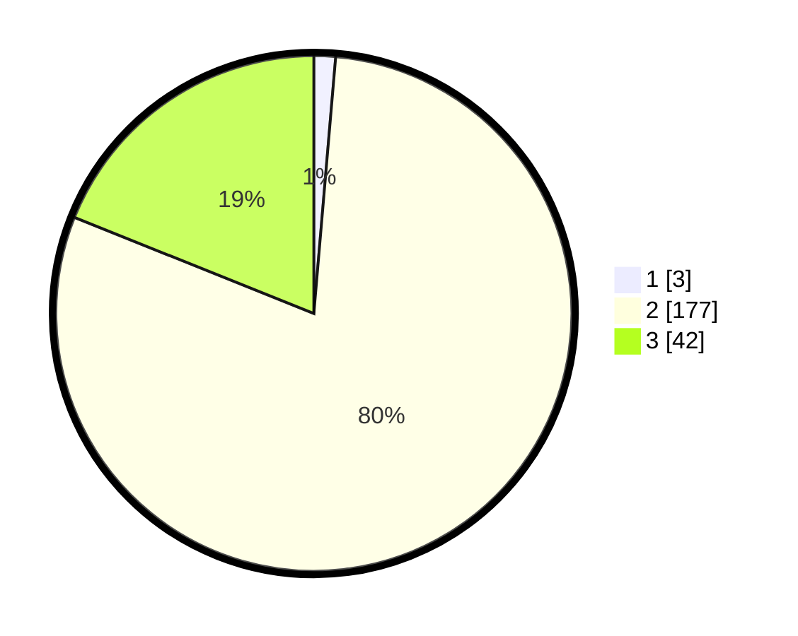

# Hasil

## Grafik

## Tabel

| No. | Nama Paslon    | Suara | Suara (raw) | Persentase |
|:--- |:-------------- | -----:| -----------:| ----------:|
| 1   | ANIES MUHAIMIN | 3     | [3][p-1]    | 1,35       |
| 2   | PRABOWO GIBRAN | 177   | [177][p-2]  | 79,73      |
| 3   | GANJAR MAHFUD  | 42    | [42][p-3]   | 18,92      |

[p-1]: https://github.com/gigit-pemilu/pemilu-2024-51-bali/blob/main/pilpres/hitung-suara/sub/51-bali/sub/05-klungkung/sub/02-banjarangkan/sub/2009-nyalian/sub/007-tps/sub/paslon-1.txt
[p-2]: https://github.com/gigit-pemilu/pemilu-2024-51-bali/blob/main/pilpres/hitung-suara/sub/51-bali/sub/05-klungkung/sub/02-banjarangkan/sub/2009-nyalian/sub/007-tps/sub/paslon-2.txt
[p-3]: https://github.com/gigit-pemilu/pemilu-2024-51-bali/blob/main/pilpres/hitung-suara/sub/51-bali/sub/05-klungkung/sub/02-banjarangkan/sub/2009-nyalian/sub/007-tps/sub/paslon-3.txt

## Foto C Plano

https://sirekap-obj-formc.kpu.go.id/b779/pemilu/ppwp/51/05/02/20/09/5105022009007-20240214-235154--7fcfc1de-a015-4463-9835-89936c28769b.jpg

https://sirekap-obj-formc.kpu.go.id/b779/pemilu/ppwp/51/05/02/20/09/5105022009007-20240214-203935--9779f822-ec97-4d78-942b-55bf340331b9.jpg

https://sirekap-obj-formc.kpu.go.id/b779/pemilu/ppwp/51/05/02/20/09/5105022009007-20240214-203216--65baeaff-e121-4ea0-8b62-ac806cd0322d.jpg

## Metadata

| Key        | Value               |
| ---------- | ------------------- |
| Time Stamp | 2024-02-15 04:00:24 |

