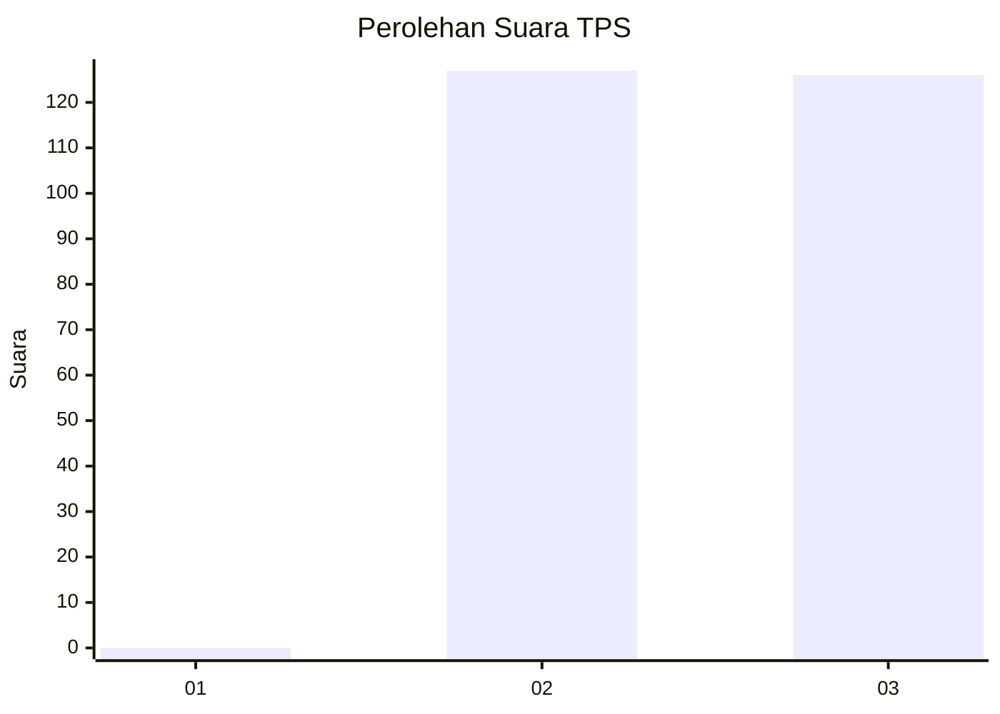
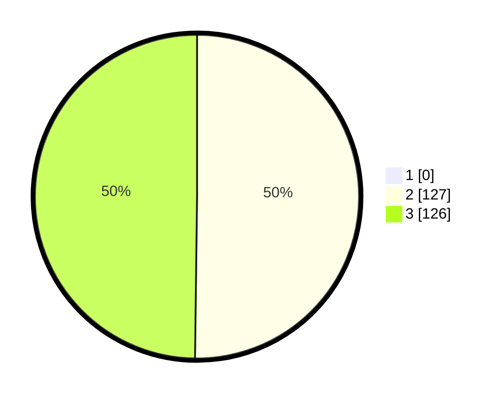

# Hasil

## Grafik

## Tabel

| No. | Nama Paslon    | Suara | Suara (raw) | Persentase |
|:--- |:-------------- | -----:| -----------:| ----------:|
| 1   | ANIES MUHAIMIN | 0     | [0][p-1]    | 0,00       |
| 2   | PRABOWO GIBRAN | 127   | [127][p-2]  | 50,20      |
| 3   | GANJAR MAHFUD  | 126   | [126][p-3]  | 49,80      |

[p-1]: https://github.com/gigit-pemilu/pemilu-2024-51-bali/blob/main/pilpres/hitung-suara/sub/51-bali/sub/05-klungkung/sub/02-banjarangkan/sub/2009-nyalian/sub/010-tps/sub/paslon-1.txt
[p-2]: https://github.com/gigit-pemilu/pemilu-2024-51-bali/blob/main/pilpres/hitung-suara/sub/51-bali/sub/05-klungkung/sub/02-banjarangkan/sub/2009-nyalian/sub/010-tps/sub/paslon-2.txt
[p-3]: https://github.com/gigit-pemilu/pemilu-2024-51-bali/blob/main/pilpres/hitung-suara/sub/51-bali/sub/05-klungkung/sub/02-banjarangkan/sub/2009-nyalian/sub/010-tps/sub/paslon-3.txt

## Foto C Plano

https://sirekap-obj-formc.kpu.go.id/7193/pemilu/ppwp/51/05/02/20/09/5105022009010-20240215-003148--ba37e2d6-7a81-4988-956d-b1d32c2a2ab9.jpg

https://sirekap-obj-formc.kpu.go.id/7193/pemilu/ppwp/51/05/02/20/09/5105022009010-20240215-003418--faabca87-d347-4aee-989d-f47818bafde6.jpg

https://sirekap-obj-formc.kpu.go.id/7193/pemilu/ppwp/51/05/02/20/09/5105022009010-20240215-003622--36e75ed9-04a0-4fb8-bf49-2a2eff0eaaea.jpg

## Metadata

| Key        | Value               |
| ---------- | ------------------- |
| Time Stamp | 2024-02-25 18:00:00 |

