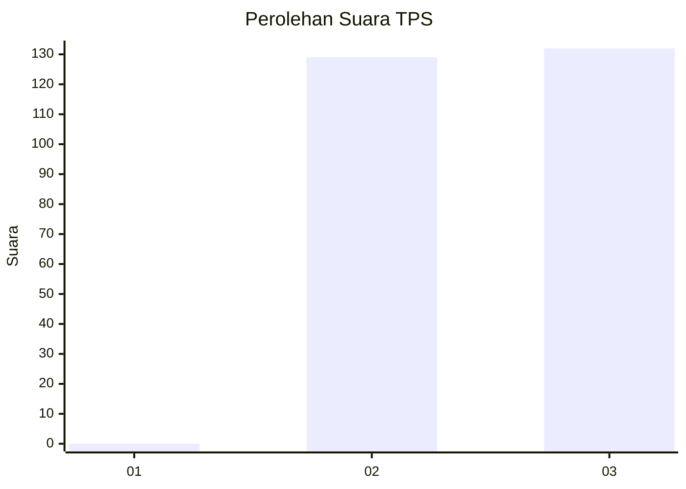
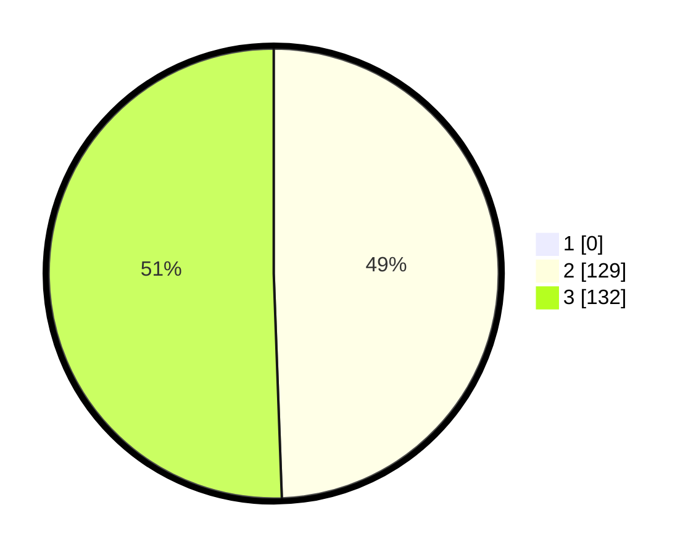

# Hasil

## Grafik

## Tabel

| No. | Nama Paslon    | Suara | Suara (raw) | Persentase |
|:--- |:-------------- | -----:| -----------:| ----------:|
| 1   | ANIES MUHAIMIN | 0     | [0][p-1]    | 0,00       |
| 2   | PRABOWO GIBRAN | 129   | [129][p-2]  | 49,43      |
| 3   | GANJAR MAHFUD  | 132   | [132][p-3]  | 50,57      |

[p-1]: https://github.com/gigit-pemilu/pemilu-2024-51-bali/blob/main/pilpres/hitung-suara/sub/51-bali/sub/05-klungkung/sub/02-banjarangkan/sub/2009-nyalian/sub/012-tps/sub/paslon-1.txt
[p-2]: https://github.com/gigit-pemilu/pemilu-2024-51-bali/blob/main/pilpres/hitung-suara/sub/51-bali/sub/05-klungkung/sub/02-banjarangkan/sub/2009-nyalian/sub/012-tps/sub/paslon-2.txt
[p-3]: https://github.com/gigit-pemilu/pemilu-2024-51-bali/blob/main/pilpres/hitung-suara/sub/51-bali/sub/05-klungkung/sub/02-banjarangkan/sub/2009-nyalian/sub/012-tps/sub/paslon-3.txt

## Foto C Plano

https://sirekap-obj-formc.kpu.go.id/e967/pemilu/ppwp/51/05/02/20/09/5105022009012-20240215-020729--13c70983-613f-42bf-9d03-0e07cd90cc90.jpg

https://sirekap-obj-formc.kpu.go.id/e967/pemilu/ppwp/51/05/02/20/09/5105022009012-20240215-021029--88371249-871d-43a3-a77b-107324cd4078.jpg

https://sirekap-obj-formc.kpu.go.id/e967/pemilu/ppwp/51/05/02/20/09/5105022009012-20240215-021137--97f704c1-c21d-4846-ba37-82a044272ab8.jpg

## Metadata

| Key        | Value               |
| ---------- | ------------------- |
| Time Stamp | 2024-02-15 19:00:26 |

