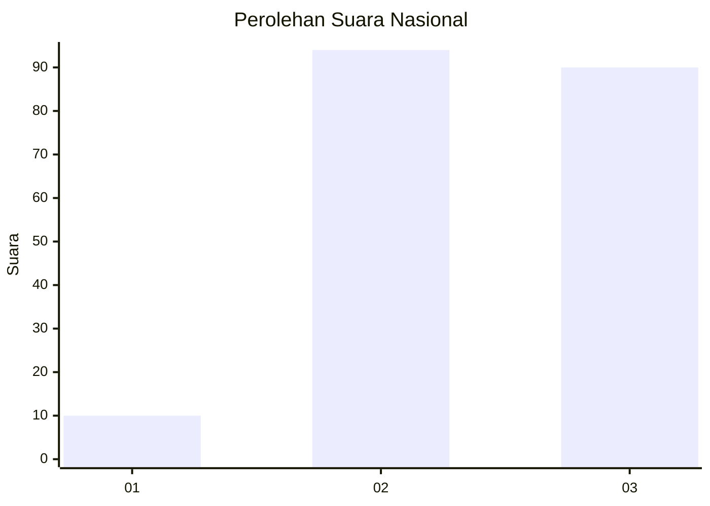
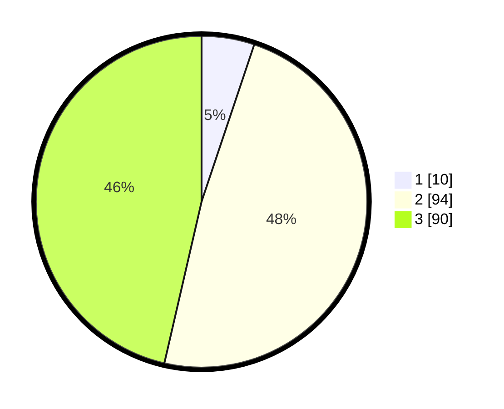

# Hasil

## Grafik

## Tabel

| No. | Nama Paslon    | Suara | Suara (raw) | Persentase |
|:--- |:-------------- | -----:| -----------:| ----------:|
| 1   | ANIES MUHAIMIN | 10    | [10][p-1]   | 5,15       |
| 2   | PRABOWO GIBRAN | 94    | [94][p-2]   | 48,45      |
| 3   | GANJAR MAHFUD  | 90    | [90][p-3]   | 46,39      |

[p-1]: https://github.com/gigit-pemilu/pemilu-2024/blob/main/pilpres/hitung-suara/sub/51-bali/sub/05-klungkung/sub/02-banjarangkan/sub/2011-timuhun/sub/003-tps/sub/paslon-1.txt
[p-2]: https://github.com/gigit-pemilu/pemilu-2024/blob/main/pilpres/hitung-suara/sub/51-bali/sub/05-klungkung/sub/02-banjarangkan/sub/2011-timuhun/sub/003-tps/sub/paslon-2.txt
[p-3]: https://github.com/gigit-pemilu/pemilu-2024/blob/main/pilpres/hitung-suara/sub/51-bali/sub/05-klungkung/sub/02-banjarangkan/sub/2011-timuhun/sub/003-tps/sub/paslon-3.txt

## Foto C Plano

https://sirekap-obj-formc.kpu.go.id/7aa3/pemilu/ppwp/51/05/02/20/11/5105022011003-20240214-230803--ee11d70c-587a-4917-9afd-d5f1424eab1e.jpg

https://sirekap-obj-formc.kpu.go.id/7aa3/pemilu/ppwp/51/05/02/20/11/5105022011003-20240214-230856--4b3c563b-d1d1-41f7-b81f-949e312620e2.jpg

https://sirekap-obj-formc.kpu.go.id/7aa3/pemilu/ppwp/51/05/02/20/11/5105022011003-20240214-230941--abde3084-661a-4296-a482-f5d455bc5167.jpg

## Metadata

| Key        | Value               |
| ---------- | ------------------- |
| Time Stamp | 2024-02-15 23:29:50 |

