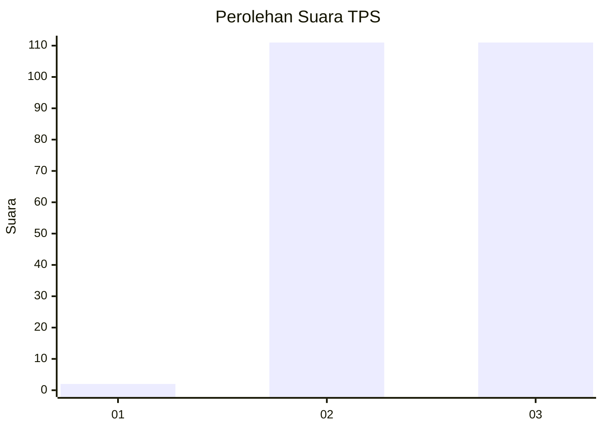
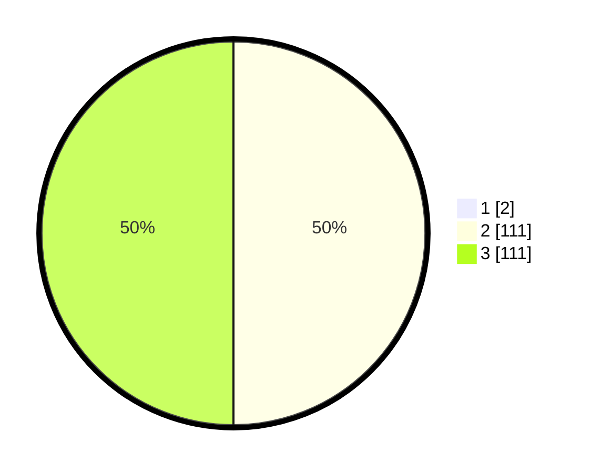

# Hasil

## Grafik

## Tabel

| No. | Nama Paslon    | Suara | Suara (raw) | Persentase |
|:--- |:-------------- | -----:| -----------:| ----------:|
| 1   | ANIES MUHAIMIN | 2     | [2][p-1]    | 0,89       |
| 2   | PRABOWO GIBRAN | 111   | [111][p-2]  | 49,55      |
| 3   | GANJAR MAHFUD  | 111   | [111][p-3]  | 49,55      |

[p-1]: https://github.com/gigit-pemilu/pemilu-2024-51-bali/blob/main/pilpres/hitung-suara/sub/51-bali/sub/05-klungkung/sub/02-banjarangkan/sub/2011-timuhun/sub/007-tps/sub/paslon-1.txt
[p-2]: https://github.com/gigit-pemilu/pemilu-2024-51-bali/blob/main/pilpres/hitung-suara/sub/51-bali/sub/05-klungkung/sub/02-banjarangkan/sub/2011-timuhun/sub/007-tps/sub/paslon-2.txt
[p-3]: https://github.com/gigit-pemilu/pemilu-2024-51-bali/blob/main/pilpres/hitung-suara/sub/51-bali/sub/05-klungkung/sub/02-banjarangkan/sub/2011-timuhun/sub/007-tps/sub/paslon-3.txt

## Foto C Plano

https://sirekap-obj-formc.kpu.go.id/e1ff/pemilu/ppwp/51/05/02/20/11/5105022011007-20240214-203805--5e749935-f1b6-4854-9158-2817f6db0eec.jpg

https://sirekap-obj-formc.kpu.go.id/e1ff/pemilu/ppwp/51/05/02/20/11/5105022011007-20240214-203934--b0d95bdc-3814-4b26-9de9-3f80a1bee798.jpg

https://sirekap-obj-formc.kpu.go.id/e1ff/pemilu/ppwp/51/05/02/20/11/5105022011007-20240214-204310--1fb5bffc-9aa0-4007-87d2-788795bce70e.jpg

## Metadata

| Key        | Value               |
| ---------- | ------------------- |
| Time Stamp | 2024-02-15 03:06:03 |

## DATA PEMILIH TETAP

Jumlah pemilih dalam DPT: **299**.
 * L: **132**.
 * P: **167**.

## DATA PENGGUNA HAK PILIH

Jumlah pengguna hak pilih dalam DPT: **228**.
 * L: **99**.
 * P: **129**.

Jumlah pengguna hak pilih dalam DPTb: **0**.
 * L: **0**.
 * P: **0**.

Jumlah pengguna hak pilih dalam DPK: **0**.
 * L: **0**.
 * P: **0**.

Jumlah pengguna hak pilih: **228**.
 * L: **99**.
 * P: **129**.

## JUMLAH SUARA SAH DAN TIDAK SAH

JUMLAH SELURUH SUARA SAH: **224**.

JUMLAH SUARA TIDAK SAH: **4**.

JUMLAH SELURUH SUARA SAH DAN SUARA TIDAK SAH: **228**.

