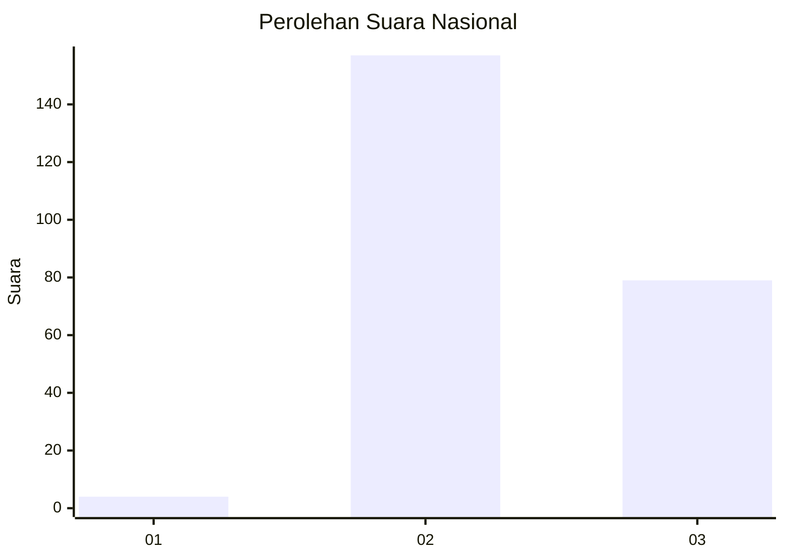
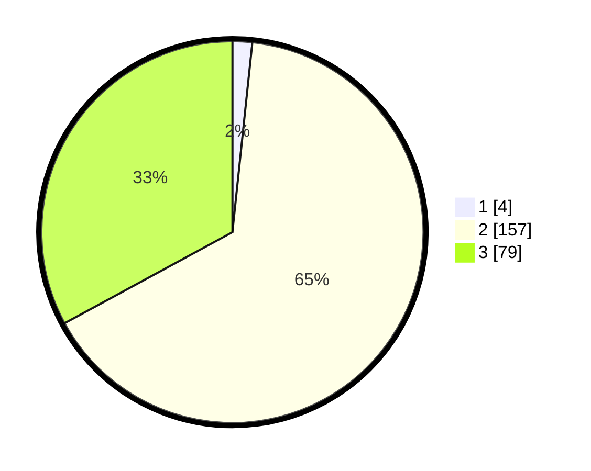

# Hasil

## Grafik

## Tabel

| No. | Nama Paslon    | Suara | Suara (raw) | Persentase |
|:--- |:-------------- | -----:| -----------:| ----------:|
| 1   | ANIES MUHAIMIN | 4     | [4][p-1]    | 1,67       |
| 2   | PRABOWO GIBRAN | 157   | [157][p-2]  | 65,42      |
| 3   | GANJAR MAHFUD  | 79    | [79][p-3]   | 32,92      |

[p-1]: https://github.com/gigit-pemilu/pemilu-2024/blob/main/pilpres/hitung-suara/sub/51-bali/sub/05-klungkung/sub/02-banjarangkan/sub/2011-timuhun/sub/008-tps/sub/paslon-1.txt
[p-2]: https://github.com/gigit-pemilu/pemilu-2024/blob/main/pilpres/hitung-suara/sub/51-bali/sub/05-klungkung/sub/02-banjarangkan/sub/2011-timuhun/sub/008-tps/sub/paslon-2.txt
[p-3]: https://github.com/gigit-pemilu/pemilu-2024/blob/main/pilpres/hitung-suara/sub/51-bali/sub/05-klungkung/sub/02-banjarangkan/sub/2011-timuhun/sub/008-tps/sub/paslon-3.txt

## Foto C Plano

https://sirekap-obj-formc.kpu.go.id/98a5/pemilu/ppwp/51/05/02/20/11/5105022011008-20240214-231747--750fad42-59c5-4154-b65d-9c11081c96aa.jpg

https://sirekap-obj-formc.kpu.go.id/98a5/pemilu/ppwp/51/05/02/20/11/5105022011008-20240214-231845--ee4117ff-ae6d-4530-b929-0ba638a998dd.jpg

https://sirekap-obj-formc.kpu.go.id/98a5/pemilu/ppwp/51/05/02/20/11/5105022011008-20240214-231921--1cd3a29b-4256-4ef0-aefb-9b22cc1f6c8f.jpg

## Metadata

| Key        | Value               |
| ---------- | ------------------- |
| Time Stamp | 2024-02-15 20:00:44 |

