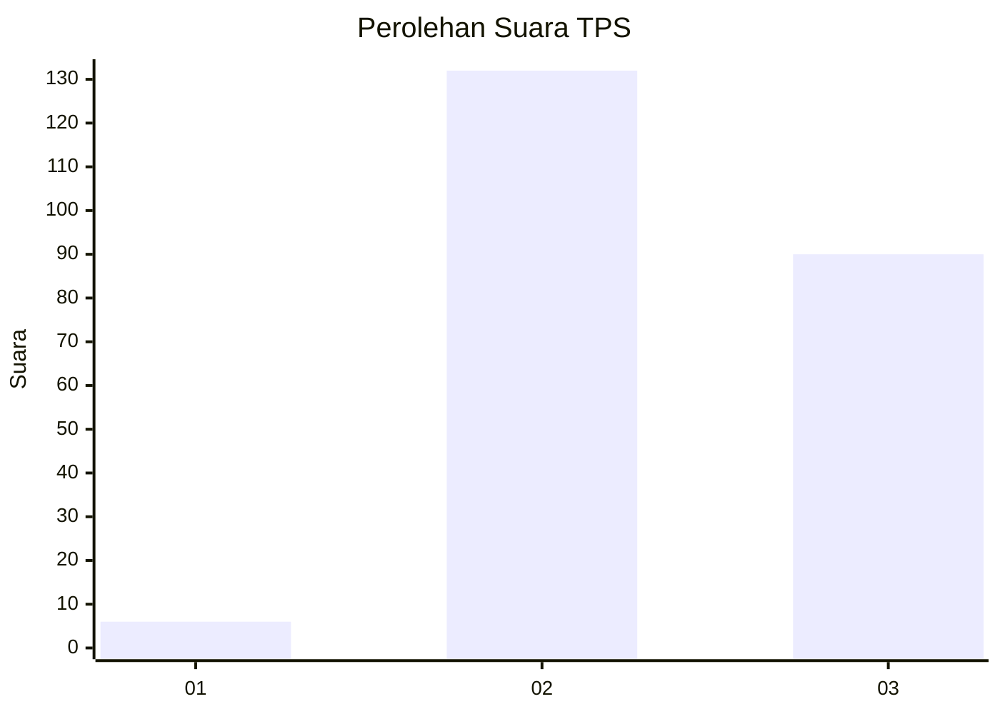
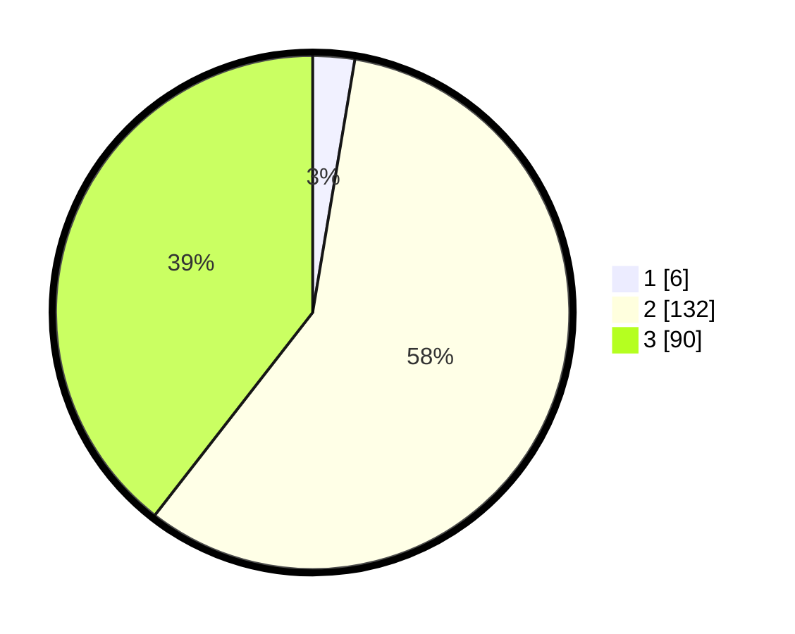

# Hasil

## Grafik

## Tabel

| No. | Nama Paslon    | Suara | Suara (raw) | Persentase |
|:--- |:-------------- | -----:| -----------:| ----------:|
| 1   | ANIES MUHAIMIN | 6     | [6][p-1]    | 2,63       |
| 2   | PRABOWO GIBRAN | 132   | [132][p-2]  | 57,89      |
| 3   | GANJAR MAHFUD  | 90    | [90][p-3]   | 39,47      |

[p-1]: https://github.com/gigit-pemilu/pemilu-2024-51-bali/blob/main/pilpres/hitung-suara/sub/51-bali/sub/05-klungkung/sub/02-banjarangkan/sub/2012-nyanglan/sub/002-tps/sub/paslon-1.txt
[p-2]: https://github.com/gigit-pemilu/pemilu-2024-51-bali/blob/main/pilpres/hitung-suara/sub/51-bali/sub/05-klungkung/sub/02-banjarangkan/sub/2012-nyanglan/sub/002-tps/sub/paslon-2.txt
[p-3]: https://github.com/gigit-pemilu/pemilu-2024-51-bali/blob/main/pilpres/hitung-suara/sub/51-bali/sub/05-klungkung/sub/02-banjarangkan/sub/2012-nyanglan/sub/002-tps/sub/paslon-3.txt

## Foto C Plano

https://sirekap-obj-formc.kpu.go.id/eb42/pemilu/ppwp/51/05/02/20/12/5105022012002-20240214-223559--b77e5f28-c777-4662-9e2b-b19311425a48.jpg

https://sirekap-obj-formc.kpu.go.id/eb42/pemilu/ppwp/51/05/02/20/12/5105022012002-20240214-210957--ee340fe0-4fdb-4291-af39-f19331b4431c.jpg

https://sirekap-obj-formc.kpu.go.id/eb42/pemilu/ppwp/51/05/02/20/12/5105022012002-20240214-223706--8cf90ca2-959e-4de5-aa7a-db78a2ee0c5b.jpg

## Metadata

| Key        | Value               |
| ---------- | ------------------- |
| Time Stamp | 2024-02-15 04:00:24 |

