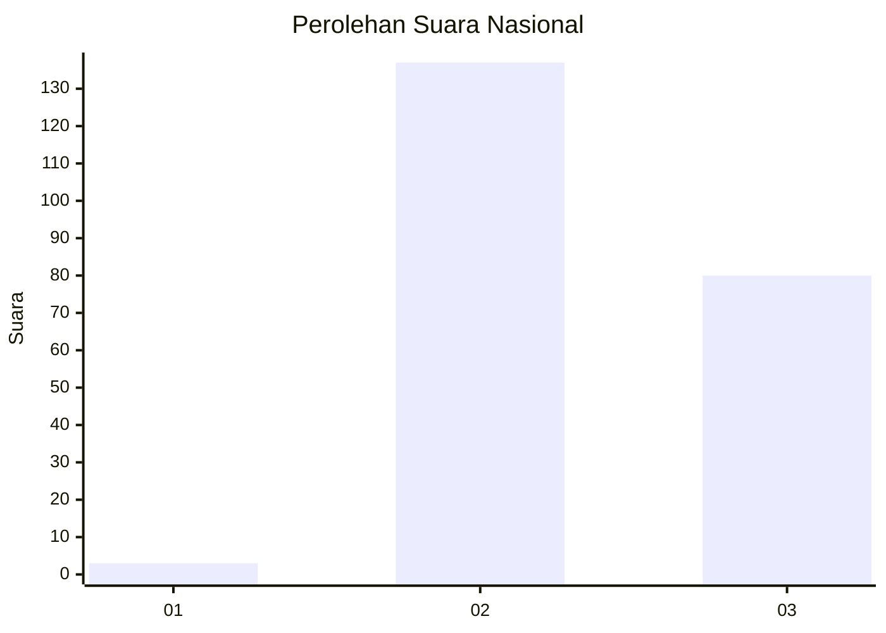
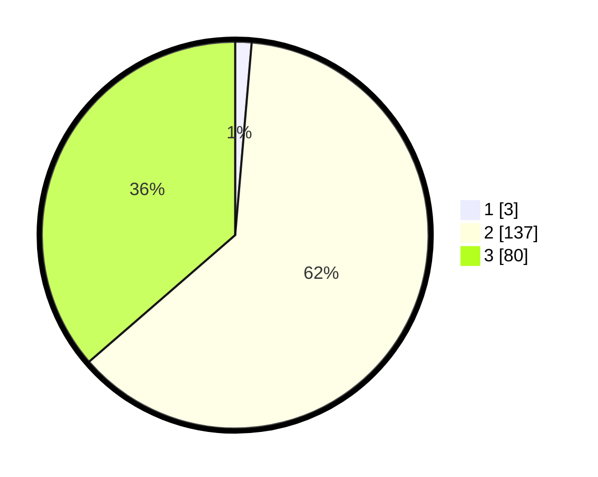

# Hasil

## Grafik

## Tabel

| No. | Nama Paslon    | Suara | Suara (raw) | Persentase |
|:--- |:-------------- | -----:| -----------:| ----------:|
| 1   | ANIES MUHAIMIN | 3     | [3][p-1]    | 1,36       |
| 2   | PRABOWO GIBRAN | 137   | [137][p-2]  | 62,27      |
| 3   | GANJAR MAHFUD  | 80    | [80][p-3]   | 36,36      |

[p-1]: https://github.com/gigit-pemilu/pemilu-2024/blob/main/pilpres/hitung-suara/sub/51-bali/sub/05-klungkung/sub/03-klungkung/sub/1008-semarapura-kaja/sub/001-tps/sub/paslon-1.txt
[p-2]: https://github.com/gigit-pemilu/pemilu-2024/blob/main/pilpres/hitung-suara/sub/51-bali/sub/05-klungkung/sub/03-klungkung/sub/1008-semarapura-kaja/sub/001-tps/sub/paslon-2.txt
[p-3]: https://github.com/gigit-pemilu/pemilu-2024/blob/main/pilpres/hitung-suara/sub/51-bali/sub/05-klungkung/sub/03-klungkung/sub/1008-semarapura-kaja/sub/001-tps/sub/paslon-3.txt

## Foto C Plano

https://sirekap-obj-formc.kpu.go.id/59fa/pemilu/ppwp/51/05/03/10/08/5105031008001-20240214-130546--8c301fa1-da4e-4e9f-b7ec-5460531b29bd.jpg

https://sirekap-obj-formc.kpu.go.id/59fa/pemilu/ppwp/51/05/03/10/08/5105031008001-20240214-130641--31f8420c-5d41-48bc-8173-269ce66db3a0.jpg

https://sirekap-obj-formc.kpu.go.id/59fa/pemilu/ppwp/51/05/03/10/08/5105031008001-20240214-130744--2829ccf3-5979-4d7f-b3b7-8424ddbd05f2.jpg

## Metadata

| Key        | Value               |
| ---------- | ------------------- |
| Time Stamp | 2024-02-15 09:00:24 |

## DATA PEMILIH TETAP

Jumlah pemilih dalam DPT: **256**.
 * L: **125**.
 * P: **131**.

## DATA PENGGUNA HAK PILIH

Jumlah pengguna hak pilih dalam DPT: **230**.
 * L: **115**.
 * P: **115**.

Jumlah pengguna hak pilih dalam DPTb: **3**.
 * L: **2**.
 * P: **1**.

Jumlah pengguna hak pilih dalam DPK: **1**.
 * L: **0**.
 * P: **1**.

Jumlah pengguna hak pilih: **234**.
 * L: **117**.
 * P: **117**.

## JUMLAH SUARA SAH DAN TIDAK SAH

JUMLAH SELURUH SUARA SAH: **220**.

JUMLAH SUARA TIDAK SAH: **14**.

JUMLAH SELURUH SUARA SAH DAN SUARA TIDAK SAH: **234**.

