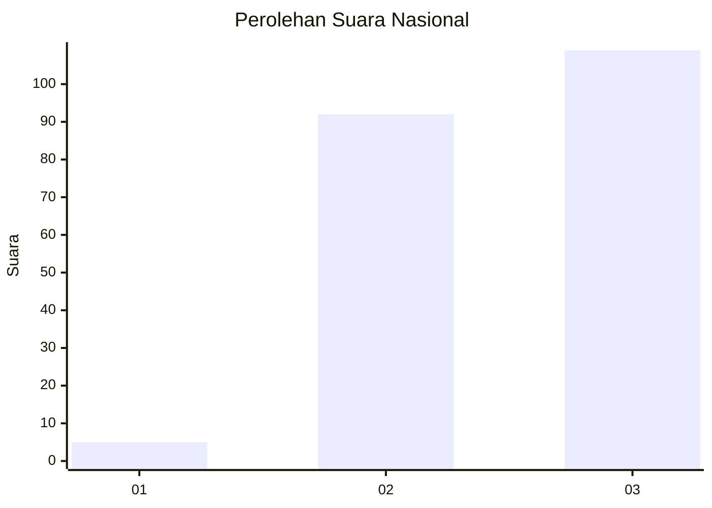
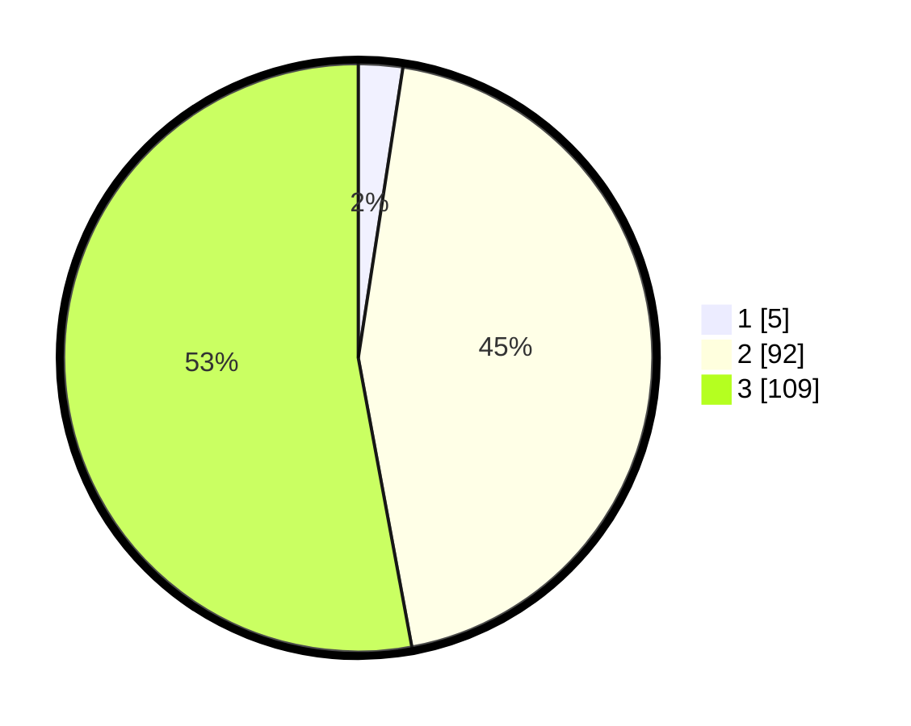

# Hasil

## Grafik

## Tabel

| No. | Nama Paslon    | Suara | Suara (raw) | Persentase |
|:--- |:-------------- | -----:| -----------:| ----------:|
| 1   | ANIES MUHAIMIN | 5     | [5][p-1]    | 2,43       |
| 2   | PRABOWO GIBRAN | 92    | [92][p-2]   | 44,66      |
| 3   | GANJAR MAHFUD  | 109   | [109][p-3]  | 52,91      |

[p-1]: https://github.com/gigit-pemilu/pemilu-2024/blob/main/pilpres/hitung-suara/sub/51-bali/sub/05-klungkung/sub/03-klungkung/sub/1008-semarapura-kaja/sub/003-tps/sub/paslon-1.txt
[p-2]: https://github.com/gigit-pemilu/pemilu-2024/blob/main/pilpres/hitung-suara/sub/51-bali/sub/05-klungkung/sub/03-klungkung/sub/1008-semarapura-kaja/sub/003-tps/sub/paslon-2.txt
[p-3]: https://github.com/gigit-pemilu/pemilu-2024/blob/main/pilpres/hitung-suara/sub/51-bali/sub/05-klungkung/sub/03-klungkung/sub/1008-semarapura-kaja/sub/003-tps/sub/paslon-3.txt

## Foto C Plano

https://sirekap-obj-formc.kpu.go.id/87e5/pemilu/ppwp/51/05/03/10/08/5105031008003-20240214-141418--6a1ba1c9-5f0b-479f-a71b-5bec817fe223.jpg

https://sirekap-obj-formc.kpu.go.id/87e5/pemilu/ppwp/51/05/03/10/08/5105031008003-20240214-141557--6b2fc144-83a4-4e71-8c39-3158a80fa61c.jpg

https://sirekap-obj-formc.kpu.go.id/87e5/pemilu/ppwp/51/05/03/10/08/5105031008003-20240214-141745--158fadf9-2d6c-4b00-a6f8-bc07faa66aee.jpg

## Metadata

| Key        | Value               |
| ---------- | ------------------- |
| Time Stamp | 2024-02-15 09:00:24 |

