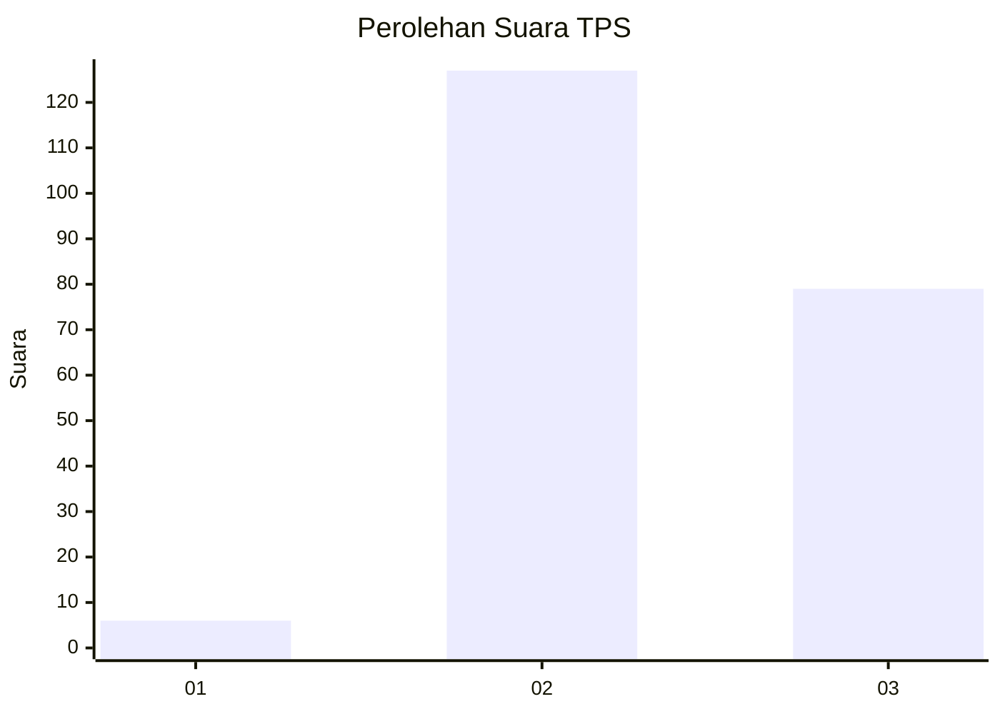
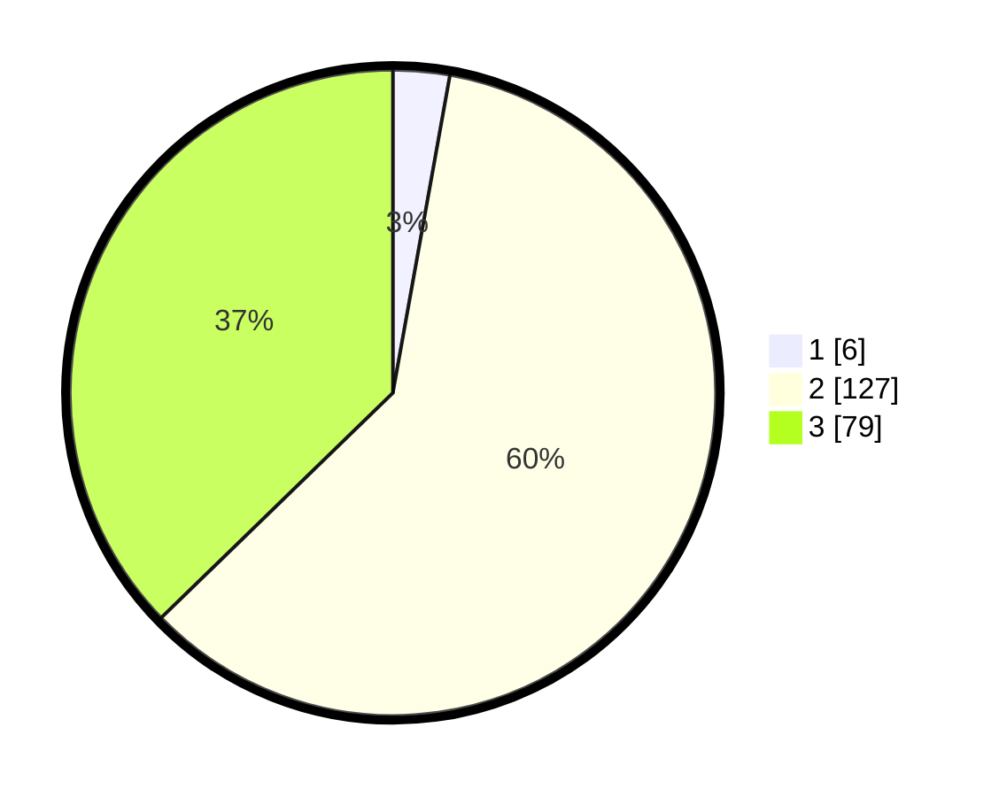

# Hasil

## Grafik

## Tabel

| No. | Nama Paslon    | Suara | Suara (raw) | Persentase |
|:--- |:-------------- | -----:| -----------:| ----------:|
| 1   | ANIES MUHAIMIN | 6     | [6][p-1]    | 2,83       |
| 2   | PRABOWO GIBRAN | 127   | [127][p-2]  | 59,91      |
| 3   | GANJAR MAHFUD  | 79    | [79][p-3]   | 37,26      |

[p-1]: https://github.com/gigit-pemilu/pemilu-2024-51-bali/blob/main/pilpres/hitung-suara/sub/51-bali/sub/05-klungkung/sub/03-klungkung/sub/1008-semarapura-kaja/sub/005-tps/sub/paslon-1.txt
[p-2]: https://github.com/gigit-pemilu/pemilu-2024-51-bali/blob/main/pilpres/hitung-suara/sub/51-bali/sub/05-klungkung/sub/03-klungkung/sub/1008-semarapura-kaja/sub/005-tps/sub/paslon-2.txt
[p-3]: https://github.com/gigit-pemilu/pemilu-2024-51-bali/blob/main/pilpres/hitung-suara/sub/51-bali/sub/05-klungkung/sub/03-klungkung/sub/1008-semarapura-kaja/sub/005-tps/sub/paslon-3.txt

## Foto C Plano

https://sirekap-obj-formc.kpu.go.id/8bb2/pemilu/ppwp/51/05/03/10/08/5105031008005-20240216-032613--e85b2caa-a6f9-4556-a13f-ca98ace902f5.jpg

https://sirekap-obj-formc.kpu.go.id/8bb2/pemilu/ppwp/51/05/03/10/08/5105031008005-20240216-032615--fe4c30af-1aa8-4528-b9a2-ce68259cf11f.jpg

https://sirekap-obj-formc.kpu.go.id/8bb2/pemilu/ppwp/51/05/03/10/08/5105031008005-20240216-032614--bc469f57-5fed-416a-a0e9-e35c5519d264.jpg

## Metadata

| Key        | Value               |
| ---------- | ------------------- |
| Time Stamp | 2024-02-16 13:30:32 |

## DATA PEMILIH TETAP

Jumlah pemilih dalam DPT: **247**.
 * L: **118**.
 * P: **129**.

## DATA PENGGUNA HAK PILIH

Jumlah pengguna hak pilih dalam DPT: **218**.
 * L: **103**.
 * P: **115**.

Jumlah pengguna hak pilih dalam DPTb: **1**.
 * L: **0**.
 * P: **1**.

Jumlah pengguna hak pilih dalam DPK: **0**.
 * L: **0**.
 * P: **0**.

Jumlah pengguna hak pilih: **219**.
 * L: **103**.
 * P: **116**.

## JUMLAH SUARA SAH DAN TIDAK SAH

JUMLAH SELURUH SUARA SAH: **212**.

JUMLAH SUARA TIDAK SAH: **7**.

JUMLAH SELURUH SUARA SAH DAN SUARA TIDAK SAH: **219**.

