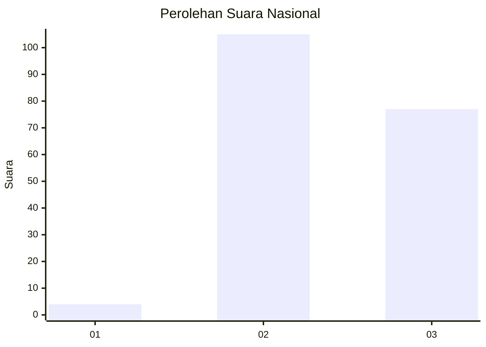
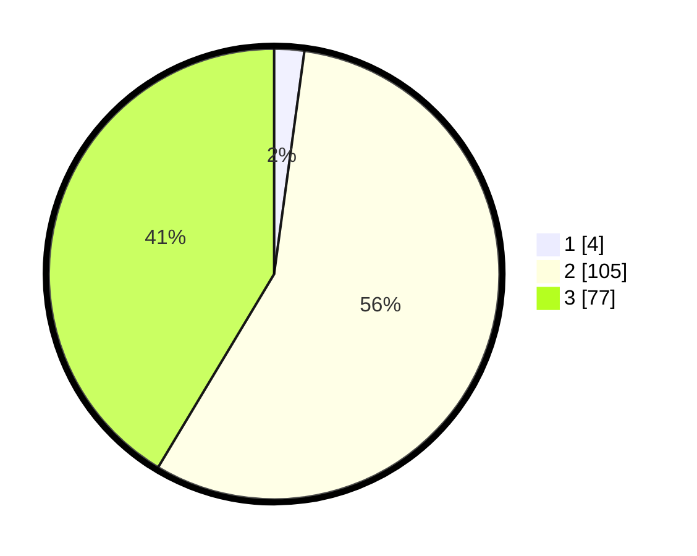

# Hasil

## Grafik

## Tabel

| No. | Nama Paslon    | Suara | Suara (raw) | Persentase |
|:--- |:-------------- | -----:| -----------:| ----------:|
| 1   | ANIES MUHAIMIN | 4     | [4][p-1]    | 2,15       |
| 2   | PRABOWO GIBRAN | 105   | [105][p-2]  | 56,45      |
| 3   | GANJAR MAHFUD  | 77    | [77][p-3]   | 41,40      |

[p-1]: https://github.com/gigit-pemilu/pemilu-2024/blob/main/pilpres/hitung-suara/sub/51-bali/sub/05-klungkung/sub/03-klungkung/sub/1009-semarapura-kauh/sub/004-tps/sub/paslon-1.txt
[p-2]: https://github.com/gigit-pemilu/pemilu-2024/blob/main/pilpres/hitung-suara/sub/51-bali/sub/05-klungkung/sub/03-klungkung/sub/1009-semarapura-kauh/sub/004-tps/sub/paslon-2.txt
[p-3]: https://github.com/gigit-pemilu/pemilu-2024/blob/main/pilpres/hitung-suara/sub/51-bali/sub/05-klungkung/sub/03-klungkung/sub/1009-semarapura-kauh/sub/004-tps/sub/paslon-3.txt

## Foto C Plano

https://sirekap-obj-formc.kpu.go.id/774e/pemilu/ppwp/51/05/03/10/09/5105031009004-20240216-114546--fe018086-8033-4756-9a13-b075290fe7bb.jpg

https://sirekap-obj-formc.kpu.go.id/774e/pemilu/ppwp/51/05/03/10/09/5105031009004-20240216-114548--c67b4e91-d03f-4375-8098-087f3f9b9710.jpg

https://sirekap-obj-formc.kpu.go.id/774e/pemilu/ppwp/51/05/03/10/09/5105031009004-20240216-114547--c73af8ee-5123-44ba-9bb2-2394369864e9.jpg

## Metadata

| Key        | Value               |
| ---------- | ------------------- |
| Time Stamp | 2024-02-16 13:30:32 |

## DATA PEMILIH TETAP

Jumlah pemilih dalam DPT: **228**.
 * L: **108**.
 * P: **120**.

## DATA PENGGUNA HAK PILIH

Jumlah pengguna hak pilih dalam DPT: **193**.
 * L: **92**.
 * P: **101**.

Jumlah pengguna hak pilih dalam DPTb: **0**.
 * L: **0**.
 * P: **0**.

Jumlah pengguna hak pilih dalam DPK: **0**.
 * L: **0**.
 * P: **0**.

Jumlah pengguna hak pilih: **193**.
 * L: **92**.
 * P: **101**.

## JUMLAH SUARA SAH DAN TIDAK SAH

JUMLAH SELURUH SUARA SAH: **186**.

JUMLAH SUARA TIDAK SAH: **7**.

JUMLAH SELURUH SUARA SAH DAN SUARA TIDAK SAH: **193**.

