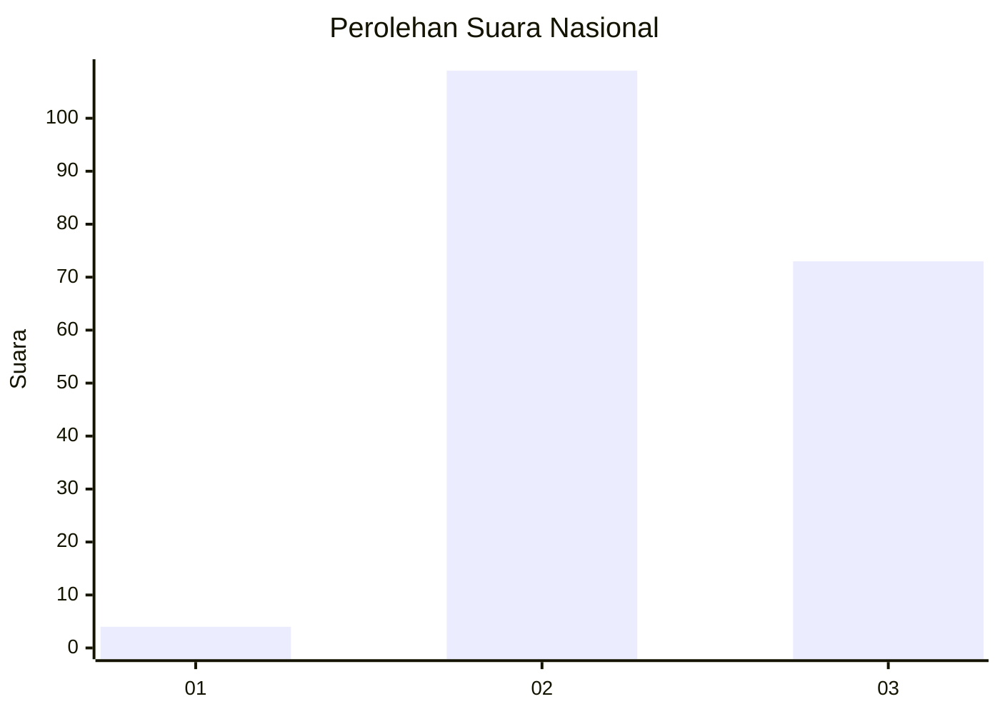
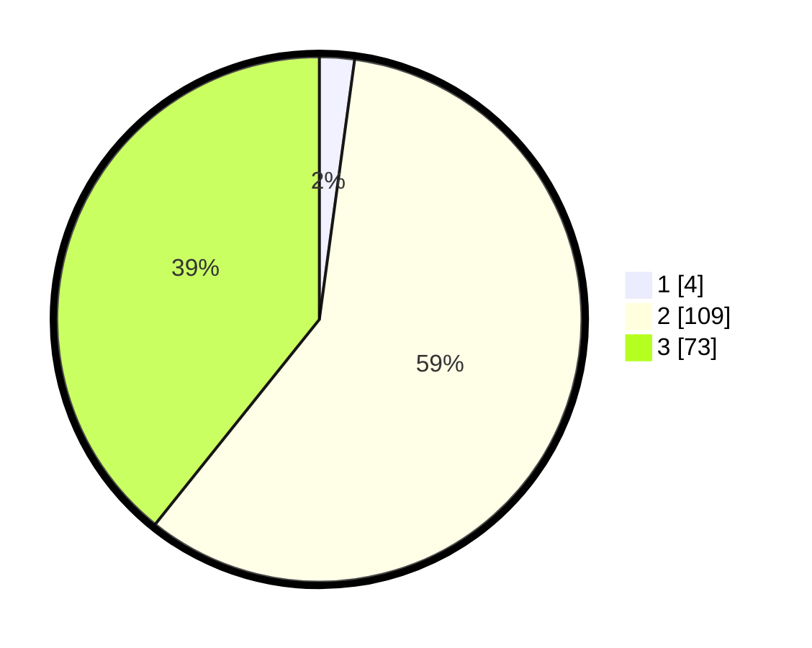

# Hasil

## Grafik

## Tabel

| No. | Nama Paslon    | Suara | Suara (raw) | Persentase |
|:--- |:-------------- | -----:| -----------:| ----------:|
| 1   | ANIES MUHAIMIN | 4     | [4][p-1]    | 2,15       |
| 2   | PRABOWO GIBRAN | 109   | [109][p-2]  | 58,60      |
| 3   | GANJAR MAHFUD  | 73    | [73][p-3]   | 39,25      |

[p-1]: https://github.com/gigit-pemilu/pemilu-2024/blob/main/pilpres/hitung-suara/sub/51-bali/sub/05-klungkung/sub/03-klungkung/sub/1009-semarapura-kauh/sub/005-tps/sub/paslon-1.txt
[p-2]: https://github.com/gigit-pemilu/pemilu-2024/blob/main/pilpres/hitung-suara/sub/51-bali/sub/05-klungkung/sub/03-klungkung/sub/1009-semarapura-kauh/sub/005-tps/sub/paslon-2.txt
[p-3]: https://github.com/gigit-pemilu/pemilu-2024/blob/main/pilpres/hitung-suara/sub/51-bali/sub/05-klungkung/sub/03-klungkung/sub/1009-semarapura-kauh/sub/005-tps/sub/paslon-3.txt

## Foto C Plano

https://sirekap-obj-formc.kpu.go.id/60fe/pemilu/ppwp/51/05/03/10/09/5105031009005-20240216-061708--40fe4ab2-3dca-4ac6-8263-49b23d9dd3e9.jpg

https://sirekap-obj-formc.kpu.go.id/60fe/pemilu/ppwp/51/05/03/10/09/5105031009005-20240216-053419--a6dac887-e02d-4583-bd14-42359306835c.jpg

https://sirekap-obj-formc.kpu.go.id/60fe/pemilu/ppwp/51/05/03/10/09/5105031009005-20240216-053408--dda3f12e-d547-47a9-bd8e-6cd3399e7b0a.jpg

## Metadata

| Key        | Value               |
| ---------- | ------------------- |
| Time Stamp | 2024-02-16 13:30:32 |

## DATA PEMILIH TETAP

Jumlah pemilih dalam DPT: **210**.
 * L: **100**.
 * P: **110**.

## DATA PENGGUNA HAK PILIH

Jumlah pengguna hak pilih dalam DPT: **188**.
 * L: **90**.
 * P: **98**.

Jumlah pengguna hak pilih dalam DPTb: **2**.
 * L: **1**.
 * P: **1**.

Jumlah pengguna hak pilih dalam DPK: **1**.
 * L: **1**.
 * P: **0**.

Jumlah pengguna hak pilih: **191**.
 * L: **92**.
 * P: **99**.

## JUMLAH SUARA SAH DAN TIDAK SAH

JUMLAH SELURUH SUARA SAH: **186**.

JUMLAH SUARA TIDAK SAH: **5**.

JUMLAH SELURUH SUARA SAH DAN SUARA TIDAK SAH: **191**.

