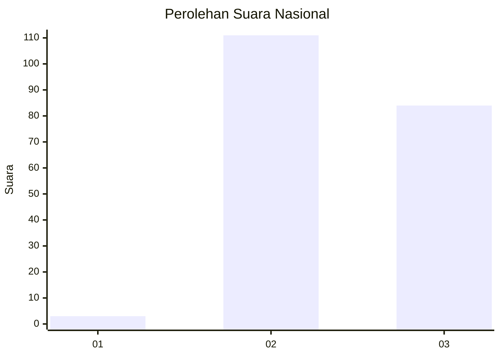
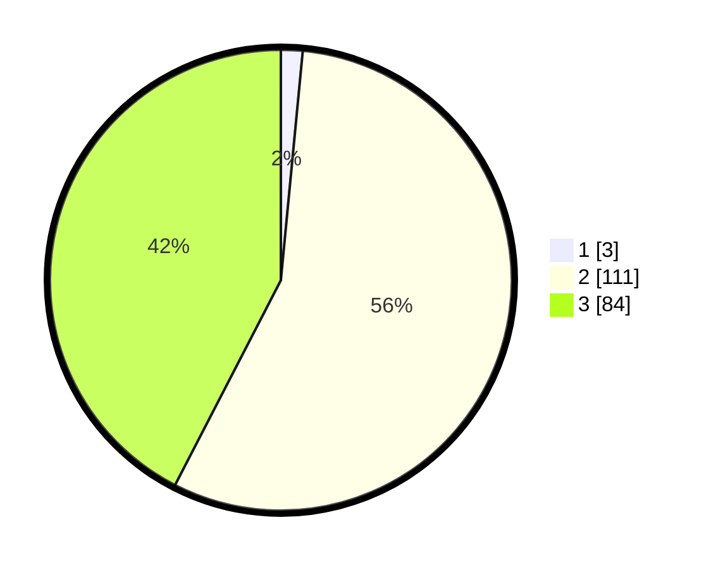

# Hasil

## Grafik

## Tabel

| No. | Nama Paslon    | Suara | Suara (raw) | Persentase |
|:--- |:-------------- | -----:| -----------:| ----------:|
| 1   | ANIES MUHAIMIN | 3     | [3][p-1]    | 1,52       |
| 2   | PRABOWO GIBRAN | 111   | [111][p-2]  | 56,06      |
| 3   | GANJAR MAHFUD  | 84    | [84][p-3]   | 42,42      |

[p-1]: https://github.com/gigit-pemilu/pemilu-2024/blob/main/pilpres/hitung-suara/sub/51-bali/sub/05-klungkung/sub/03-klungkung/sub/1009-semarapura-kauh/sub/006-tps/sub/paslon-1.txt
[p-2]: https://github.com/gigit-pemilu/pemilu-2024/blob/main/pilpres/hitung-suara/sub/51-bali/sub/05-klungkung/sub/03-klungkung/sub/1009-semarapura-kauh/sub/006-tps/sub/paslon-2.txt
[p-3]: https://github.com/gigit-pemilu/pemilu-2024/blob/main/pilpres/hitung-suara/sub/51-bali/sub/05-klungkung/sub/03-klungkung/sub/1009-semarapura-kauh/sub/006-tps/sub/paslon-3.txt

## Foto C Plano

https://sirekap-obj-formc.kpu.go.id/f06d/pemilu/ppwp/51/05/03/10/09/5105031009006-20240216-071030--7ea07ee4-0dc6-44d4-8d6a-8ba6229c4e40.jpg

https://sirekap-obj-formc.kpu.go.id/f06d/pemilu/ppwp/51/05/03/10/09/5105031009006-20240216-071038--51ddbe29-86a4-44ce-ad05-90c1d695966d.jpg

https://sirekap-obj-formc.kpu.go.id/f06d/pemilu/ppwp/51/05/03/10/09/5105031009006-20240216-071033--0837ac0f-e9c2-4364-bf5f-3fefca71197f.jpg

## Metadata

| Key        | Value               |
| ---------- | ------------------- |
| Time Stamp | 2024-02-16 13:30:32 |

## DATA PEMILIH TETAP

Jumlah pemilih dalam DPT: **232**.
 * L: **101**.
 * P: **131**.

## DATA PENGGUNA HAK PILIH

Jumlah pengguna hak pilih dalam DPT: **196**.
 * L: **81**.
 * P: **115**.

Jumlah pengguna hak pilih dalam DPTb: **4**.
 * L: **4**.
 * P: **0**.

Jumlah pengguna hak pilih dalam DPK: **1**.
 * L: **0**.
 * P: **1**.

Jumlah pengguna hak pilih: **201**.
 * L: **85**.
 * P: **116**.

## JUMLAH SUARA SAH DAN TIDAK SAH

JUMLAH SELURUH SUARA SAH: **198**.

JUMLAH SUARA TIDAK SAH: **3**.

JUMLAH SELURUH SUARA SAH DAN SUARA TIDAK SAH: **201**.

